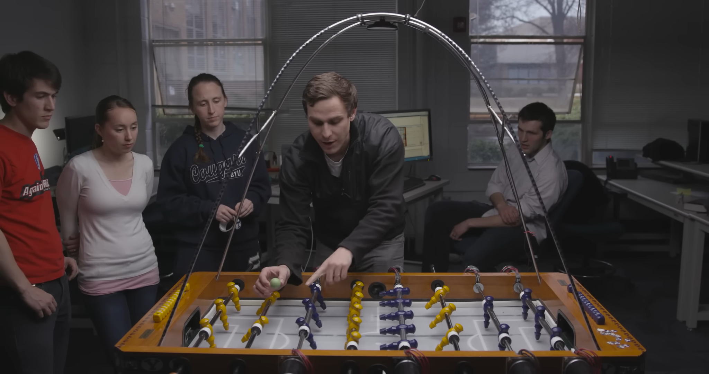
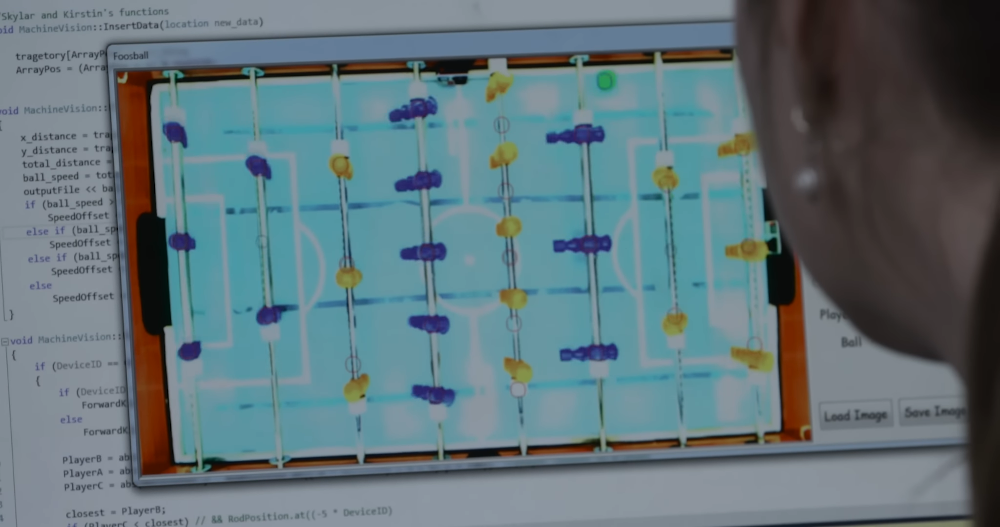
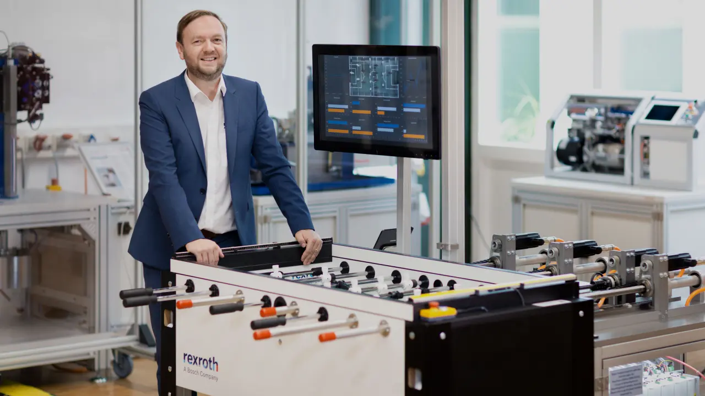
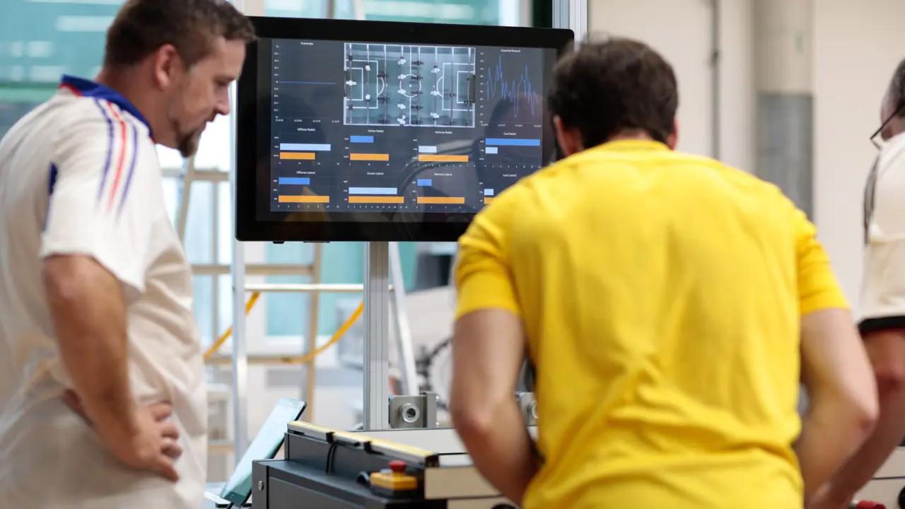

# Aufgabenstellung
\textauthor{Nikita Schaar}

## Auftraggeber
Die Diplomarbeit "DigiKicker - Digitalisierung eines Tischfußballtisches" findet in Zusammenarbeit mit der HTL Leoben statt. Sie wird betreut von Ing. DI(FH) Günther Hutter, Msc. in der Rolle des Hauptbetreuers, sowie DI Dr. mont Thomas Messner als Zweitbetreuer.

## Ausgangssituation

Die grundlegende Aufgabenstellung ist die Verwirklichung einer "Digitalversion" von einem Tischfußballtisch. Die Motivation dafür kommt hierbei aus dem Interesse, ob ein solches Projekt zuverlässig funktionieren kann und in welchen Hinsichten sich so ein Abbild eines Tischfußballtisches von dem Original unterscheidet. Bei der Erstellung eines physischen Controllers für die Steuerung von dieser Simulation soll Wert darauf gelegt werden, das Spielgefühl dem eines echten Tisches anzunähern. 

* Was ist die derzeitige Situation?

    Nach einiger Recherche in der Themenfindungsphase fanden wir heraus, dass zwar technologisch unterstützte Tischfußballtische mit eingebauter Gegner-KI und weiteren autonomen Eigenschaften existieren, ein Projekt nach unserer Vision jedoch noch von keinem entwickelt wird. Beispiele für bereits existierende Projekte, welche Tische mit eingebauten KI-Gegnern realisieren wären z. B.:
    * A.I. Foosball - Brigham Young University [@ai-foosball-brigham-young-university]:

        Hierbei werden 4 Stäbe des Tisches von Menschen gesteuert, während die anderen 4 mithilfe von Motoren angesteuert werden. Die Entscheidungen werden von einer KI getroffen, welche durch eine Kamera den Tisch von oben sieht und mittels Objekterkennung den Überblick über die Spielsituation bewahrt. Anhand von den erfassten Daten kann die künstliche Intelligenz schneller reagieren als ein menschlicher Spieler. Die Abbildungen \ref{fig:ai-foosball-byu-camera-setup} und \ref{fig:ai-foosball-byu-machine-vision} zeigen das Projekt und seinen Aufbau.

        

        

    * Bend it like Bosch [@bend-it-like-bosch]:

        Dieses Projekt ist auf funktioneller Ebene relativ ident zu dem vorherigen, da bei ihm auch mittels Kamera die Spielsituation erkannt und anhand von algorithmisch errechneten Ergebnissen die Motoren angesteuert werden. Wie in den Abbildungen \ref{fig:bend-it-like-bosch-foosball} & \ref{fig:bend-it-like-machine-vision} ersichtlich, ist der Tisch höher technologisiert als bei der BYU, aber grundsätzlich sehr ähnlich.

        

        

