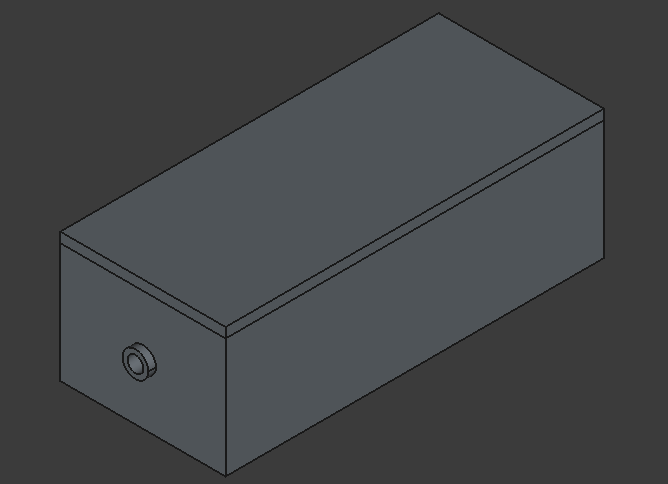

# Teilaufgabe Schüler Schaar
\textauthor{Nikita Schaar}

## Theorie

Kurzbeschreibung

### Projektmanagement

Kurzbeschreibung Projektmanagement, später längerer Teil.

### Mikrocontrollerauswahl

Um die Leistung der verschiedenen Mikrocontroller vergleichbar zu machen, müssen vorerst Kriterien festgelegt werden, anhand von denen die verschiedenen Optionen verglichen werden. Diese sollten bestmöglich messbar und objektiv vergleichbar sein, um eine gute Basis für die Auswahl zu schaffen. Mithilfe dieser Kriterien werden Punkte vergeben, anhand von denen eine Wahl getroffen wird.

Eine gut vergleichbare Eigenschaft sind die Kosten, bei denen eine Reduktion sowohl für das Entwicklerteam als auch für Endbenutzer, welche das Projekt zu Hause replizieren wollen, vorteilhaft ist. Um die Kosten in direkter Relation zu vergleichen, wird die Formel $Punkte = min(30, \frac{50}{Kosten})$ zur Bewertung verwendet.

Für ein angenehmes Spielerlebnis ist eine schnelle und zuverlässige Übertragung der Eingaben wichtig. Daher werden die Prozessorleistung zur Verarbeitung der Eingaben sowie die Übertragungszeiten für den Austausch der Daten als weitere Vergleichsbasis verwendet.

Damit nachhaltige Hardwareentwicklung mit einem Fokus auf Kostenminimierung möglich wird, muss ein Augenmerk auf den Stromverbrauch der Mikrocontroller gelegt werden. Aufgrund von geringen Spannungsgrößen wird diesem Verbrauch in der endgültigen Entscheidung ein im Vergleich zu den anderen Eigenschaften kleinerer Stellenwert beigemessen.

Da das Design mehrere Sensoren beinhaltet, ist ein Mikrocontroller mit mehreren Pins zur Übertragung vorteilhaft. Wenn ein Controller mit einer ausreichenden Pinzahl gewählt wird, wäre eine Reduktion der gesamten Anzahl an Mikrocontrollern möglich.

Ein Punkt, dessen Wichtigkeit nur auf subjektiver Basis ermessen werden kann, sind zusätzliche Features der Optionen. Der ESP32 unterstützt z. B. das ESP Now Protokoll (siehe offizielle Website [@esp-now-protocol]), welches drahtlose Datenübertragung erlaubt, wozu aber bei der individuellen Bewertung des ESP32 mehr kommt.

Für die Gesamtbewertung werden vorerst für die Kosten Punkte zwischen 1 und 30 vergeben, welche anhand von der oben erklärten Formel errechnet werden. Die Punkte der anderen Kategorien werden relativ zu den anderen Optionen vergeben - Platz 1, 2 und 3 erhalten so 9, 6 und 3 Punkte - und danach mit einer prozentuellen Gewichtung zur finalen Punkteanzahl addiert.

#### Arduino Nano

Teurer, geringere Leistung

#### ESP32

Billiger, bessere Leistung

#### Raspberry Pi Pico

raspi pico

#### Vergleich der Optionen & Entscheidung

Direkter Vergleich (mit Diagrammen, etc.)

### Sensorenauswahl

Kriterien

#### Maussensor

Billig, leicht nachzumachen

#### MPU6050

Potentiell genauer, Komplexer für Nachbau, teurer

#### HC-SR04 + Potentiometer

Warum eher nicht? (Schleifring) 

### Datenaustausch

Kriterien

#### ESP-Now

Großteils kabellose Datenübertragung möglich

#### Serielle Schnittstelle

Übertragung von Daten zwischen Microcontroller/Godot mithilfe von serieller Schnittstelle mit Code in C#

### Erstellung der Nachbauanleitung

Herangehensweise der Erstellung, Open-Source-Bereitstellung der Anleitung

## Praktischer Teil

Kurzbeschreibung

### Prototyping

In diesem Kapitel wird es um Unverwendete Prototypen und Ansätze, Demos und andere Entwicklungsschritte gehen, welche sich im Laufe der Arbeit am Controller ergeben haben. Anhand von ihnen werden der Entwicklungsprozess und verschiedene Iterationen dargestellt.

#### Arduino <-> Godot Kommunikations-Demo

Für die Erstpräsentation unserer Arbeit haben wir eine Demo erstellt, anhand von der die Kommunikation zwischen einem Arduino und der Godot Engine veranschaulicht wird. Die Grundstruktur dieser Demo wurde aus einem Youtube-Video genommen [@connect-godot-arduino], in dem die serielle Übertragung der Daten erklärt und beispielhaft dargestellt wird.

Am Arduino werden die Signale von einem MPU6050-Sensor eingelesen und über die Serielle Schnittstelle übertragen.

```c++
// ...

Adafruit_MPU6050 mpu;

void setup(void) {
  Serial.begin(9600);
  while (!Serial)
    delay(10);

  Serial.println("Adafruit MPU6050 test!");
  if (!mpu.begin()) {
    Serial.println("Failed to find MPU6050 chip");
    while (1) {
      delay(10);
    }
  }
  Serial.println("MPU6050 Found!");

  // ...
}

void loop() {
  sensors_event_t a, g, temp;
  mpu.getEvent(&a, &g, &temp);

  // ...

  Serial.print("Rotation X: ");
  Serial.print(g.gyro.x);
  Serial.print(", Y: ");
  Serial.print(g.gyro.y);
  Serial.print(", Z: ");
  Serial.print(g.gyro.z);
  Serial.println(" rad/s");

  // ...

  Serial.println("");
  delay(500);
}
```

In Godot wird das ganze über ein C#-Skript aufgenommen und ein 3D-Würfel wird anhand von den übernommenen Rotationswerten korrekt gedreht, obwohl hierbei teilweise noch Kalibrationsfehler vorkommen.

```c#
using Godot;
using System;
using System.IO.Ports;

public partial class Arduino : Node3D
{
    // ...
	public override void _Ready()
	{
        // ...
		serialPort = new SerialPort(
            "COM6", 9600, Parity.None, 8, StopBits.One
        );
		serialPort.DtrEnable = true;
		serialPort.RtsEnable = true;
		serialPort.Open();
	}

	public override void _Process(double delta)
	{
        // ...
		
		string serialMessage = serialPort.ReadLine().Replace('.', ',');
		
		coords = serialMessage.Split(' ');
		
		x = (float) (Convert.ToDouble(coords[2])*delta);
		y = (float) (Convert.ToDouble(coords[4])*delta);
		z = (float) (Convert.ToDouble(coords[6])*delta);
        
		cube.RotateX(x);
		cube.RotateY(y);
		cube.RotateZ(z);

        // ...
	}
}
```

Kommentare mit drei Punkten stellen hierbei zusätzlichen Code dar, welcher für die Erklärung des Kernprozesses keine Wichtigkeit hat und meist aus Variablendeklarationen besteht.

Mithilfe des Arduino-Codes, welcher vom Sensor die Rotationsdaten nimmt und sie im richtigen Format an die Serielle Schnittstelle schickt und dem C#-Code welcher diese Werte annimmt und zur Drehung eines Würfels verwendet ist schlussendlich diese Demo entstanden, welche die Verbindung zwischen einem Mikrocontroller und der Godot Engine und die sich daraus ergebenden Möglichkeiten darstellt.

Mithilfe des Arduino-Codes, werden die Rotationsdaten des MPU6050 [@arduino-guide-mpu6050] an die Serielle Schnittstelle gesendet. Der C#-Code nimmt diese Werte an und dreht anhand von ihnen ein Würfel-Objekt. Durch diese Verbindung werden die Möglichkeiten für dieses Projekt simpel und effektiv dargestellt.

### Design des Controllers

#### Case Design

Dieses Kapitel handelt von den verschiedenen Iterationen der Hülle des Controllers, sowie von den Entscheidungen, welche bei der Entwicklung getroffen worden sind.

Zu Beginn war die Zurechtfindung in der neu gewählten CAD-Umgebung "FreeCAD" ungewöhnlich, jedoch war es nicht schwierig sich daran anzupassen. Die Wahl für FreeCAD entstand, da das ganze Projekt so gut es geht mit Open Source Software realisiert werden sollte.

Zuallererst wurde ein Prototyp entwickelt, der nur zur Bestimmung der grundlegenden Abmessungen des Controllers diente und deshalb nichts außer einer vagen Ähnlichkeit zu einem Tischfußballtisch hat.



Für die ersten Prototypen ist das Design auf einen Drehstab reduziert, da dieser sich für Testzwecke besser eignet und das endgültige Design hochskaliert werden kann.

#### Internes Design

Anforderungen, Iterationen, (möglicherweise) Entwicklung spezialisierter Platinen, etc.

### Verbindung - Hardware & Software

Technischere Details und Beschreibung für Schnittstelle(n) auf der Hardware-Seite

### Debugging/Bug-Fixing

Aufgetretene Fehler, Lösungsansätze

### Finaler Controller