# Teilaufgabe Schüler Schaar
\textauthor{Nikita Schaar}

## Theoretischer Teil

Der folgende Teil befasst sich mit jeglicher Theorie rund um diese Diplomarbeit. Beschrieben werden jegliche Bauteile und wichtige Hardware, welche verwendet bzw. in Betracht gezogen wurden.

### Projektmanagement

Die Zuständigkeit für das Projektmanagement der Arbeit "DigiKicker - Digitalisierung eines Tischfußballtisches" lag bei dem Schüler Schaar. Der Ansatz des Managements war hierbei agil mit regelmäßigen Besprechungen über den Projektstand. Für die detailreiche Dokumentation des Projektmanagements wird auf den Abschnitt "Projekthandbuch" auf Seite \pageref{project-documentation} verwiesen.

### Mikrocontroller

In diesem Kapitel wird der Begriff Mikrocontroller erklärt und die Unterschiede zu Mikroprozessoren werden aufgezeigt. Darauf folgend werden drei verschiedene Mikrocontroller-Optionen betrachtet und anhand von ihren Eigenschaften und technischen Spezifikationen verglichen.

#### Was sind Mikrocontroller?

Um Mikrocontroller [@microcontroller-definition] zu erklären, muss erst ihr Unterschied zu Mikroprozessoren beleuchtet werden. Mikroprozessoren sind so wie die "größeren" Prozessoren - in diesem Fall sowohl auf physikalische Größe als auch auf Leistung bezogen - die Recheneinheit eines Systems. Während Mikroprozessoren ausschließlich rechnerische Aufgaben bearbeiten und für andere Funktionen separate Teile (RAM, ROM, Timer-Module, etc.) benötigen, fungieren Mikrocontroller als ein fertiges Paket, welches die verschiedenen Teile verbaut hat.

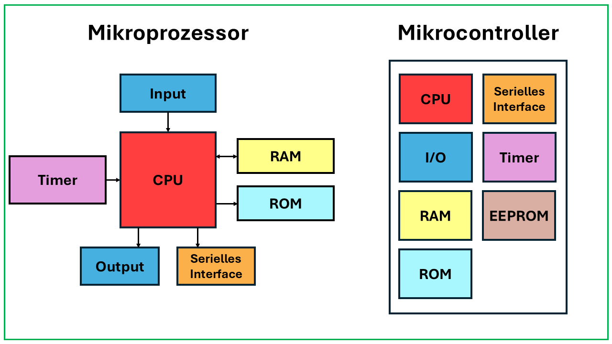

Wie in Abbildung \ref{fig:microcontroller-microprocessor} [@microcontroller-microprocessor] ersichtlich, ist links der Mikroprozessor bzw. die CPU (Central Processing Unit) zentral, benötigt jedoch extern verbundene Teile, sodass alle Aufgaben ausgeführt werden können. Ihm gegenübergestellt wird der Mikrocontroller, bei dem veranschaulicht wird, dass es sich hierbei um ein fertiges System handelt, bei dem alle Teile in diesem Ökosystem fest verbaut sind. Um eine Analogie zum menschlichen Körper zu bilden wäre in diesem Fall der Mikroprozessor das Gehirn alleine und der Mikrocontroller ein vollständiger Körper, welcher zur Funktion auf keine zusätzlichen Hilfsmittel angewiesen ist.

Tendenziell sind Mikroprozessoren für leistungsintensivere Anwendungszwecke angedacht als Mikrocontroller (z. B. grafische Berechnungen, Multitasking). Mikrocontroller sind durch ihre autonome Struktur in puncto Kosten, Stromverbrauch und Größe beliebt und bringen viele Möglichkeiten mit ohne unnötig hohe Komplexität. Aufgrund von diesen Faktoren werden Mikrocontroller sehr gerne in eingebetteten Systemen (Embedded Systems) [@embedded-systems] verwendet. 

Dieser Begriff bezeichnet Systeme, welche für einen speziellen Zweck entwickelt und optimiert sind, im Gegensatz zu herkömmlichen Mikroprozessoren, welche für viele Anwendungszwecke existieren. Diese Systeme bilden sich aus einem Zusammenhang zwischen Software und Hardware und können eigenständig verwendet werden, wobei sie jedoch meist eher als Teil eines größeren Systems eine Aufgabe erledigen, wie z. B. in einem Auto oder einer Spielekonsole. Den Namen haben die Embedded Systems genau dieser Eigenschaft der "Einbettung" in andere Systeme zu verdanken.

Mikrocontroller sind in den verschiedensten Systemen zu zahlreichen Zwecken verbaut und erfüllen in jedem eine eigene Aufgabe. Heute gibt es Mikrocontroller in jeder erdenklichen Ausführung, weshalb sie für jegliche Anwendungszwecke von Hobbyprojekten bis zu Raketenwissenschaften nicht mehr wegzudenken sind.

#### Auswahlkriterien für Mikrocontroller

Um die Leistung der verschiedenen Mikrocontroller vergleichbar zu machen, müssen vorerst Kriterien festgelegt werden, anhand von denen die verschiedenen Optionen verglichen werden. Diese sollten bestmöglich messbar und objektiv vergleichbar sein, um eine gute Basis für die Auswahl zu schaffen. Mithilfe dieser Kriterien werden Punkte vergeben, anhand von denen eine Wahl getroffen wird.

Eine gut vergleichbare Eigenschaft sind die Kosten, bei denen eine Reduktion sowohl für das Entwicklerteam als auch für Endbenutzer, welche das Projekt zu Hause replizieren wollen, vorteilhaft ist. Um die Kosten in direkter Relation zu vergleichen, wird die Formel $Punkte = min(20, ceil(\frac{100}{Kosten}))$ zur Bewertung verwendet. Mit ihr wird 100 durch die Kosten dividiert und das Ergebnis gerundet, sodass eine Punktezahl herauskommt. Danach wird dieser Wert auf maximal 20 gesetzt, sodass nicht mehr Punkte möglich sind, auch wenn niedrigere Kosten bestehen. Dieser Ansatz wurde gewählt, da er simpel zu berechnen ist und Kostenunterschiede in der Punktzahl sichtbar macht.

Für ein angenehmes Spielerlebnis ist eine schnelle und zuverlässige Übertragung der Eingaben wichtig. Daher werden die Prozessorleistung zur Verarbeitung der Eingaben sowie die Übertragungszeiten für den Austausch der Daten als weitere Vergleichsbasis verwendet.

Damit nachhaltige Hardwareentwicklung mit einem Fokus auf Kostenminimierung ermöglicht wird, muss ein Augenmerk auf den Stromverbrauch der Mikrocontroller gelegt werden. Aufgrund von geringen Spannungsgrößen wird diesem Verbrauch in der endgültigen Entscheidung ein im Vergleich zu den anderen Eigenschaften kleinerer Stellenwert beigemessen.

Für die Gesamtbewertung werden vorerst für die Kosten Punkte zwischen 1 und 30 vergeben, welche anhand von der oben erklärten Formel errechnet werden. Die Punkte der anderen Kategorien werden relativ zu den anderen Optionen vergeben - Platz 1, 2 und 3 erhalten so 9, 6 und 3 Punkte (Kategorie Stromverbrauch: 3, 2, 1 Punkte) - und danach zur finalen Punkteanzahl addiert.

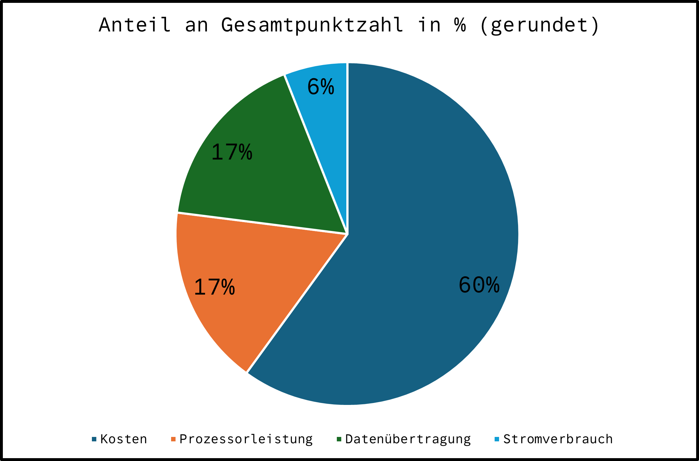

In Abbildung \ref{fig:point_weights} (erstellt in Microsoft Excel) sind die Anteile der Bewertungskategorien an der finalen Punktezahl visuell dargestellt. Wie man erkennt, machen die Kosten hierbei den größten Anteil aus, während die Eigenschaften, welche sich auf die Übertragung der Eingaben beziehen, mit jeweils 22 % auch eine relativ hohe Gewichtung besitzen. Da wie bereits erwähnt die Stromversorgung vernachlässigbar ist, macht sie mit 7 % keinen allzu großen Anteil an der Gesamtpunktzahl aus. Bei diesen Anteilen wird für alle Kategorien vom theoretisch maximalen Ergebnis an Punkten ausgegangen (41 Punkte bei perfekter Bewertung in allen Kategorien).

### Arduino Nano ESP32

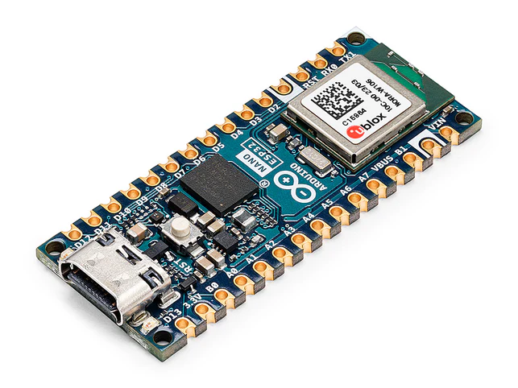

Der erste Mikrocontroller, welcher im Zuge dieser Arbeit bewertet wird, ist der Arduino Nano ESP32 (siehe Abbildung \ref{fig:arduino_nano_esp32} [@arduino-nano-esp32-image]). Er ist ein Controller mit überschaubarer Komplexität, bietet jedoch trotzdem zahlreiche Funktionen für alle möglichen Zwecke, welche dank offiziellen Dokumentationen und Tutorials verständlich gemacht werden [@arduino-docs]. Wie schon am Namen ersichtlich beinhaltet dieser Controller auch einen ESP32, gleich wie das ESP-32 DevKit C, ein anderer behandelter Controller in dieser Arbeit, jedoch ist hierbei ein ESP32-S3 verbaut und kein ESP32-WROOM-32. Zum DevKit C bestehen auch Unterschiede, was technische Daten sowie den Kostenpunkt angeht. Im Detail folgen diese Unterschiede in der Auflistung der technischen Daten.

Während die primäre Programmiersprache des Arduino Nano ESP32 zwar eine simplifizierte Version von C bzw. C++ (Arduino Language) ist, gibt es bei dieser Ausführung des Nano die Möglichkeit, in MicroPython [@micropython] zu programmieren, da diese Sprache auf allen ESP32-basierten Controllern funktioniert. Bei MicroPython handelt es sich ähnlich wie bei der Arduino Language selbst um eine schlankere Version und effizientere Version von Python. Sie hat einen Teil der Funktionalitäten der Python Standard Library und ist für die Verwendung auf Mikrocontrollern optimiert. Die genauen Unterschiede zum standardmäßigen CPython sind zahlreich und reichen von Syntax-Unterschieden bis zu entfernten Core-Funktionen.

Beispiel:  Einzelne Array-Elemente können nicht wie in CPython gelöscht werden.

```{caption="Beispiel für Unterschied zwischen Micro- und CPython - Array" .py}
a = array.array("b", (1, 2, 3))
del a[1]
```

Während dieser Ausdruck in CPython zu einer Löschung des Elements am Index 1 geführt hätte bekommt man in MicroPython einen Error.

```{caption="Error-Message | Beispiel für Unterschied zwischen Micro- und CPython - Array" .txt}
Traceback (most recent call last):
  File "<stdin>", line 11, in <module>
TypeError: 'array' object doesn't support item deletion
```

Dies war nur ein Beispiel für die vielen kleinen Änderungen von MicroPython, welche die Sprache dazu bringen so hochoptimiert und effizient auf vergleichsweise leistungsschwacher Hardware zu funktionieren.

#### Firma - Arduino

Der Arduino Nano ist ein Produkt von der Firma Arduino [@arduino-about] [@arduino-linkedin], einer Tochterfirma von Qualcomm. Arduino befasst sich mit dem Design, der Herstellung und der Weiterentwicklung von Mikrocontrollern. Die offizielle "Mission & Vision" der Firma ist die Erweiterung und Erleichterung des Zugangs zu Elektronik und digitalen Technologien. Für diese Vision arbeitet die Arduino-Community, welche sich weltweit aus Menschen von Hobbyist:innen über Schüler:innen bis hin zu professionellen Entwickler:innen zusammensetzt.

Die Firma wurde im Jahr 2005 in Italien gegründet und hat vier Co-Gründer, welche im folgenden Abschnitt kurz aufgelistet werden:

**1. Massimo Banzi**

- Ursprünglich arbeitete er als Softwarearchitekt, befasste sich später jedoch weitaus mehr mit der Elektrotechnik. Heutzutage lehrt er sowohl an der USI Universität sowie an der SUPSI in der Schweiz. 
Zusätzlich zu diesen Errungenschaften ist er der Autor des Buchs "Getting Started with Arduino" [@getting-started-with-arduino], in welchem er die Leser:innen an die Entwicklung mit Arduinos heranführt und über persönliche Erfahrungen berichtet.

**2. David Cuartielles**

- So wie Banzi lehrt auch er an einer Uni, wobei es bei ihm die Malmö-Universität in Schweden ist, an der er seit dem Jahr 2000 unterrichtet. Er hat sowohl einen MSc. als auch einen Doktortitel, war an verschiedenen Unis von Europa über Amerika bis Asien und spricht öffentlich über Open-Source-Hardware und STEAM-Unterricht [@steam-education].

**3. Tom Igoe**

- Seine Forschung umfasst verschiedene Themen von Netzwerken über Belichtungsdesign und die Auswirkungen von technologischer Entwicklung auf die Umwelt. Er hat für mehrere Museen und Design-Firmen als Berater gewirkt sowie 4 Bücher und zahlreiche Artikel verfasst, welche sich mit Elektronik befassen.

**4. David Mellis**

- Er arbeitet als Softwareentwickler bei der Firma Autodesk, wo es sein Ziel ist, Menschen für die kreative bzw. DIY-Nutzung von elektronischen Bauteilen zu inspirieren. Wie seine Mitgründer hat auch er mehrere Titel (MSc., PhD.) und unterrichtete ebenfalls an Universitäten wie dem Copenhagen Institute of Interaction Design (Dänemark).

#### Technische Daten

Alle hier tabellarisch angegebenen Spezifikationen stammen aus dem offiziellen Arduino-Nano-ESP32-Datenblatt [@arduino-nano-datasheet]. Die Daten beziehen sich hierbei auf einen Teil der zu bewertenden Kategorien, welche für die Entscheidung eines Mikrocontrollers herangenommen werden. Für die exakten Daten, die für die Entscheidungen herangenommen werden, wird auf die Datenblätter im Anhang dieser Arbeit verwiesen.

| Controllereigenschaft         | Wert / Größe                                        |
|------------------------------:|:----------------------------------------------------|
| Taktfrequenz                  | 240 MHz                                             |
| Busbreite                     | 32 Bit                                              |
| SRAM                          | 512 kB                                              |
| Wi-Fi-Geschwindigkeiten       | Bis zu 150 Mbit/s bei 40 MHz                        |
| Flash-Speicher                | 16 MB                                               |
| VIN (Eingangsspannung) Rating | 6-21 V                                              |

: Arduino Nano ESP32 - Eigenschaften

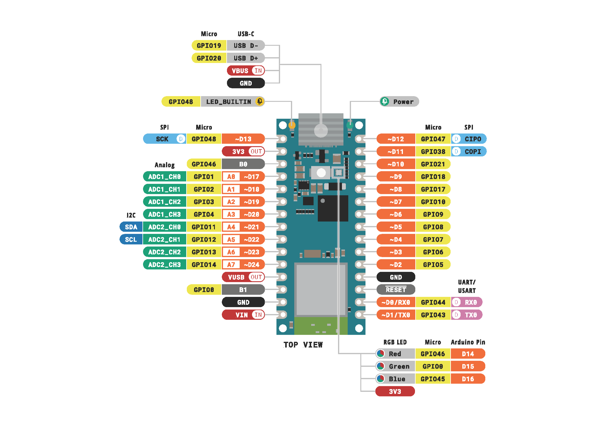

Abbildung \ref{fig:arduino-nano-esp32-pinout} [@arduino-nano-pinout] stellt das Pin-Layout eines Arduino Nano ESP32 dar.

### ESP-32 DevKit C

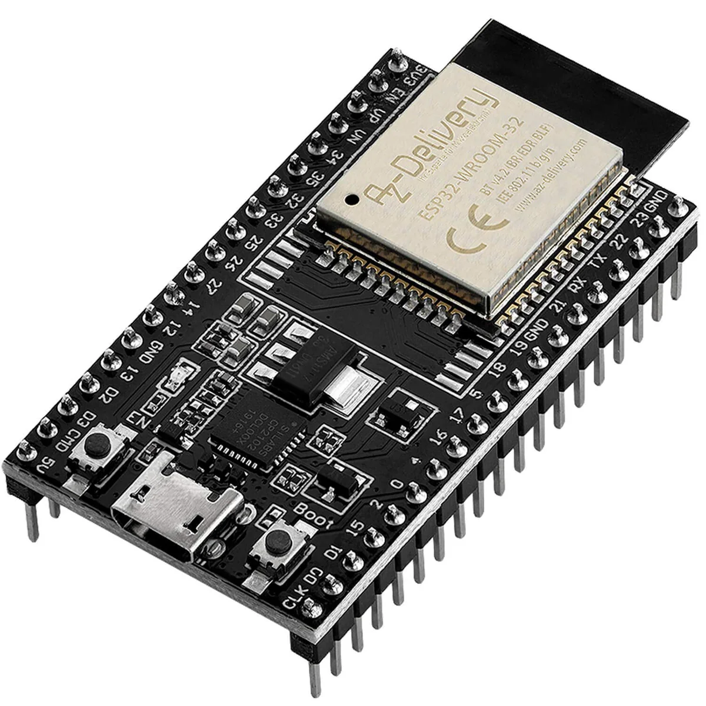

Der nächste Mikrocontroller ist das ESP-32 Dev Kit C V4 [@esp32-data] (siehe Abbildung \ref{fig:esp32-devkit-c} [@esp32-devkit-c-image]), welcher wie der zuvor betrachtete Mikrocontroller auf einem ESP32 - genauer gesagt, einem ESP32-WROOM-32 - basiert ist, weshalb für die Programmierung die Arduino Language sowie MicroPython verwendet werden kann. Wie allen ESP32-basierten Controllern ist es auch diesem möglich, von dem Protokoll "ESP-Now" Gebrauch zu machen. 

#### ESP-NOW-Protokoll

Bei ESP-Now handelt es sich um ein eigens entwickeltes Protokoll von Espressif Systems, welches es mehreren Geräten erlaubt, sich untereinander zu verständigen. Das Protokoll [@esp-now-protocol] [@esp-now-introduction] ist auf dem 802.11 Wi-Fi Standard basiert, benötigt jedoch keinen zusätzlichen Access Point für die Kommunikation. Die maximale "Payload-Größe" beträgt hierbei 250 Bytes, wobei die Datenübertragung jedoch sinngemäß schneller ist, je kleiner die Payload ist.

TechTerms.com, eine Website für so gut wie alle technischen Begriffe rund um IT, definiert den Begriff Payload [@payload-definition] wie folgt:

> The term "payload" in computing terms can mean several different things. 
> 1) In computer networking, a payload is the part of a data packet containing the transmitted data.
>
> 2) In computer security, a payload is the part of a computer virus or other malware containing the code that carries out the virus's harmful activity.

Payload hat in dem hier verwendeten Kontext jedoch nichts mit der zweiten Definition zu tun, sondern bezieht sich auf die tatsächliche Datengröße versendeter Pakete.

> A payload is the part of a protocol data unit (PDU) that contains the transmitted data or message. When one device sends data over a network, it needs to combine that data with a header into a packet.

Der "Header" einer Dateneinheit beinhaltet Daten über die Herkunft bzw. das Ziel dieser sowie die Reihenfolge, in der die versendeten Pakete rekonstruiert werden müssen. Bei ihm geht es also nur um Informationen zur Route einer PDU und nicht um ihren Inhalt.

Da die maximale Größe dieser Payload 250 Bytes beträgt, wird dieses Protokoll nicht für die Übertragung größerer Dateimengen verwendet, eignet sich aber sehr gut für das Senden kleinerer Daten, wie z. B. von Sensoren. Aus diesem Grund eignet sich das Protokoll für die Realisierung dieser Arbeit gut, da hierbei nur kleine Daten zu Dreh- und Schiebebewegungen versendet werden müssen.

ESP-Now ermöglicht Master-Slave-Beziehungen zwischen Boards, für Kommunikation in eine Richtung, aber auch Kommunikation zwischen zwei oder mehreren Boards in beide Richtungen.

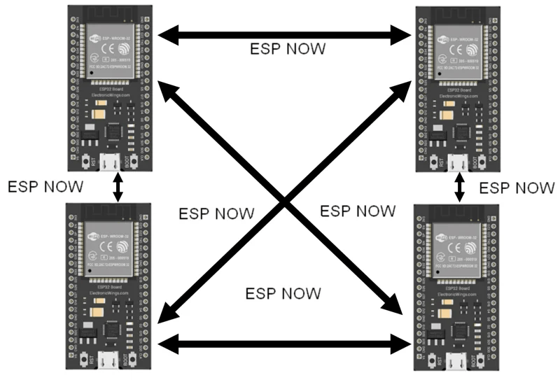

In Abbildung \ref{fig:esp-now-communication} [@esp-now-introduction] wird die Kommunikation mehrerer ESP-32-Controller in beide Richtungen dargestellt. Dies ist zwar nur eine simple Visualisierung, zeigt jedoch dass die Verbindung vieler Mikrocontroller dadurch einfach ermöglicht wird. Dadurch ergeben sich zahlreiche Möglichkeiten für zusammenhängende Systeme, wie z. B. die Messung und Übermittlung verschiedener Sensordaten in einem Smart Home.

Hier folgen nun beispielhafte Code-Snippets [@esp-now-introduction] zur Realisierung des ESP-Now-Protokolls (One-Way-Form) in C-Code, so wie er auf einem Mikrocontroller laufen würde:

```{caption="Beispiel ESP-Now One Way Kommunikation - Ermittlung der MAC-Adresse" .c}
#include "WiFi.h"

void setup(){
 Serial.begin(115200);
 WiFi.mode(WIFI_MODE_STA);
 Serial.println(WiFi.macAddress());
}

void loop(){}
```

Mit diesem Code wird mithilfe der WiFi-Library die MAC-Adresse des Empfänger-Gerätes ermittelt, welche im folgenden Code verwendet wird. Gehen wir nun beispielhaft davon aus, dass hierbei die Adresse **66:94:6B:59:97:35** herauskommt. Diese Adresse wird nun zur weiteren Verwendung im folgenden Code in ein Array gespeichert.

```{caption="Beispiel ESP-Now One Way Kommunikation - Sender-Code" .c}
#include <esp_now.h>
#include <WiFi.h>

/* 
  Die hier eingetragenen Werte entsprechen der
  ermittelten MAC-Adresse aus dem vorherigen Snippet
*/
uint8_t broadcastAddress[] = {0x66, 0x94, 0x6B, 0x59, 0x97, 0x35};

char msg[] = "Hello World!";

esp_now_peer_info_t peerInfo;

void OnDataSent(const uint8_t *mac_addr, esp_now_send_status_t status) {
  Serial.print("\r\nDelivery Status: ");
  Serial.println(status == ESP_NOW_SEND_SUCCESS ? "Delivered Successfully" : "Delivery Fail");
}
 
void setup() {
  Serial.begin(115200);
  WiFi.mode(WIFI_STA);
  if (esp_now_init() != ESP_OK) {
    Serial.println("Error initializing ESP-NOW");
    return;
  }

  esp_now_register_send_cb(OnDataSent);
  memcpy(peerInfo.peer_addr, broadcastAddress, 6);
  peerInfo.channel = 0; 
  peerInfo.encrypt = false;
         
  if (esp_now_add_peer(&peerInfo) != ESP_OK){
    Serial.println("Failed to add peer");
    return;
  }
}
 
void loop() {
  esp_err_t result = esp_now_send(broadcastAddress, (uint8_t *) &msg, sizeof(msg));

  if (result == ESP_OK) {
    Serial.println("Sent Successfully");
  }
  else {
    Serial.println("Error while sending data");
  }
  delay(1000);
}
```

Dieser Code wird auf dem Mikrocontroller aufgerufen, der die Message - in diesem Fall ein ganz simples "Hello World!" - im Sekundentakt versendet. Hierbei werden die Daten verschickt und es wird eine Erfolgs- bzw. Fehlernachricht je nach Ergebnis ausgegeben. In der ```esp_now_peer_info_t```-Variable werden die Informationen zu "Peers" - bezeichnet die zusammenhängenden Mikrocontroller, welche die versendeten Informationen erhalten - gespeichert.

```{caption="Beispiel ESP-Now One Way Kommunikation - Empfänger-Code" .c}
#include <esp_now.h>
#include <WiFi.h>

typedef struct struct_message {
    char a[32];
} struct_message;

struct_message myData;

void OnDataRecv(const uint8_t * mac, const uint8_t *incomingData, int len) {
  memcpy(&myData, incomingData, sizeof(myData));
  Serial.println(myData.a);
}


void setup() {
  Serial.begin(115200);
  WiFi.mode(WIFI_STA);
  if (esp_now_init() != ESP_OK) {
    Serial.println("Error initializing ESP-NOW");
    return;
  }
  esp_now_register_recv_cb(OnDataRecv);
}
 
void loop() {}
```

Dieses kurze Snippet ist alles, was auf der Seite des Empfängers laufen muss, damit dieser die Nachrichten vom Sender empfangen kann. Zuerst wird eine Datenstruktur mit ```struct_message myData;``` erstellt, in der die empfangenen Daten gespeichert werden. Sobald per ESP-Now Informationen eingelangen wird die ```void OnDataRecv(const uint8_t * mac, const uint8_t *incomingData, int len)```-Methode aufgerufen, welche zuerst die eingehenden Daten in die erstellte Variable speichert und diese danach ausgibt.

Auch wenn dieses kurze Beispiel keine komplexe Aufgabe erledigt, wird trotzdem veranschaulicht, dass es nicht sehr aufwendig ist mithilfe von ESP-Now Daten zwischen Mikrocontrollern zu versenden.


#### Firma - Espressif Systems

Das ESP-32 DevKit C ist Teil der großen ESP32-Familie an Mikrocontrollern, welche von Espressif Systems [@espressif-about] entwickelt wird. Die Firma arbeitet an innovativen Lösungen rund um IoT und arbeitet in den letzten Jahren mehr und mehr an KI-Integration für Mikrocontroller. Sie veröffentlichen ihre Ressourcen und Modelle Open-Source und tragen damit maßgeblich zur globalen Weiterentwicklung von Mikrocontrollern, Embedded Systems und IoT bei. Ihre Produktlösungen umfassen Smart Home Systeme, IoT Security, Machine Vision, Deep Learning, Speech AI und viele weitere Anwendungen. 

Teo Swee Ann hat die Firma im Jahr 2008 in Shanghai gegründet und ist bis heute der CEO bei Espressif Systems. 2016 wird dann der originale ESP32-Mikrocontroller veröffentlicht, welcher durch seine WLAN- & Bluetooth-Kapazitäten revolutionär ist. Seither wurden der Familie allerlei neue und spezialisierte Mikrocontroller hinzugefügt, wodurch für Projekte verschiedenster Größenordnungen Optionen existieren.

Espressif Systems bemühen sich durch verschiedene Projekte umweltfreundlicher zu sein. Durch konstante Forschung versuchen sie den Energieverbrauch ihrer Produkte sowie den produktionsbedingten Materialverlust zu minimieren. Außerdem haben sie ein Wildlife Protection Programm gestartet, um die Leben von bedrohten Tierarten zu wahren.

#### Technische Daten

Alle hier tabellarisch angegebenen Spezifikationen kommen aus dem offiziellen ESP32-WROOM-32-Datenblatt [@esp32-datasheet]. Die Daten beziehen sich hierbei auf einen Teil der zu bewertenden Kategorien, welche für die Entscheidung eines Mikrocontrollers herangenommen werden. Für die exakten Daten, die für die Entscheidungen herangenommen werden, wird auf die Datenblätter im Anhang dieser Arbeit verwiesen.

| Controllereigenschaft         | Wert / Größe                                        |
|------------------------------:|:----------------------------------------------------|
| Taktfrequenz                  | 240 MHz                                             |
| Busbreite                     | 32 Bit                                              |
| SRAM                          | 520 kB                                              |
| Wi-Fi-Geschwindigkeiten       | Bis zu 150 Mbit/s                                   |
| Flash-Speicher                | 4/8/16 MB                                           |
| VIN (Eingangsspannung) Rating | 3.0-3.6 V                                           |

: ESP32-WROOM-32 - Eigenschaften

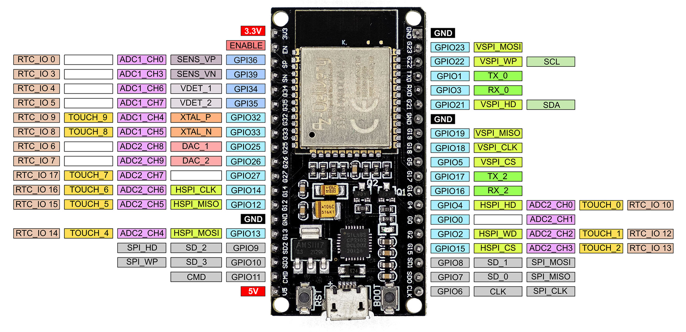

In Abbildung \ref{fig:esp32-wroom-32-pinout} [@esp32-pinout] werden die Pin-Belegungen eines ESP32-WROOM-32 dargestellt.

### Raspberry Pi Pico 2W

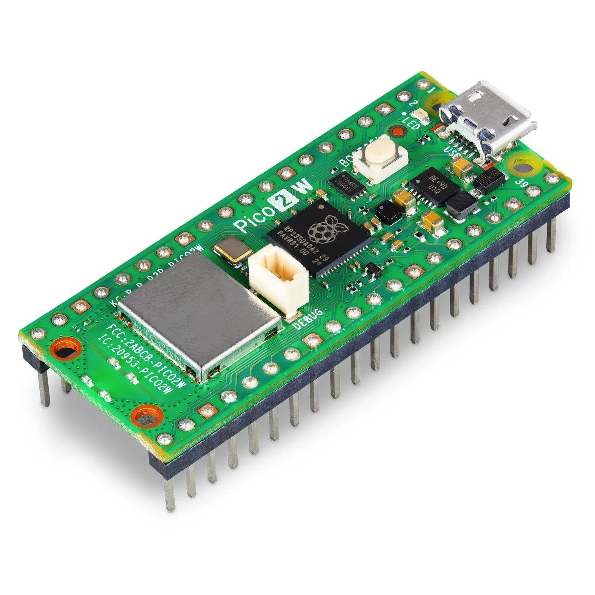

Der letzte Mikrocontroller, der in dieser Arbeit betrachtet wird, ist der Raspberry Pi Pico 2W [@raspberry-pi-pico-documentation] (siehe Abbildung \ref{fig:raspberry-pi-pico-2w} [@raspberry-pi-pico-2w-image]). Dieser Controller verwendet keinen ESP-32 basierten Chip für kabellose Datenübertragung, sondern einen Infineon CYW43439 in Kombination mit einer ABRACON-lizensierten Antenne.

Für die Programmierung eines Pi Pico kann sowohl C/C++ als auch MicroPython verwendet werden, gleich wie bei den vorherigen Mikrocontrollern auch. Während bei den anderen beiden jedoch vorwiegend C/C++ verwendet wird, werden Programme auf dem Pi Pico primär in MicroPython geschrieben, was vorwiegend daran liegt, dass die Programmiersprache nativ auf dem Controller läuft. Für C/C++ ist eine robuste SDK verfügbar, die eher für erfahrenere Entwickler gedacht ist, aber trotzdem alle Funktionen des Pico nutzbar macht.

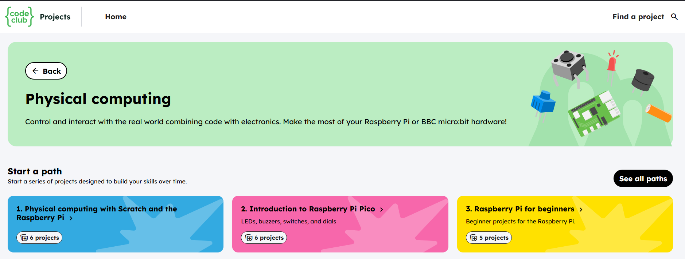

Da (Micro-)Python als Programmiersprache weitaus einsteigerfreundlicher als andere Sprachen ist, wird der Raspberry Pi Pico gerne für den Einstieg in die Hardware-Programmierung genommen. Dafür gibt es auf der offiziellen Raspberry Pi Code Club Seite [@raspberry-pi-code-club] viele Projekte, welche wichtige Kernkonzepte der Low-Level-Programmierung erklären (siehe Abbildung \ref{fig:raspberry-pi-code-club} [@raspberry-pi-code-club]).

Dank der ```gpiozero```/```picozero```-Library [@gpiozero-library] [@picozero-library] - ```picozero``` ist hierbei eine abgeänderte Version der ```gpiozero```-Library, welche ihre grundlegende Struktur wiederverwendet, aber für den Raspberry Pi Pico optimiert ist - wird das Interfacing verschiedener GPIO-Geräte mit dem Raspberry Pi Pico ein leichtes. Diese Library hat viele Funktionen für die verschiedensten Input-/Output-Teile, welche die Nutzung dieser auch für unerfahrene Programmierer:innen ermöglichen und bei der Entwicklung viel Code ersparen.

```{caption="LED steuern mithilfe von picozero-Library" .py}
from picozero import RGBLED
from time import sleep

rgb = RGBLED(red=1, green=2, blue=3) # Pin numbers

def pop():
    rgb.color = (255, 0, 255) # Purple
    sleep(2)
    rgb.off()

pop() # Call the pop function
```

Dieses simple Beispiel von der Raspberry Pi Code Club Website [@raspberry-pi-code-club] zeigt, wie einfach es ist, mithilfe der Library eine LED in der Farbe lila zum Leuchten zu bringen. Man muss nur eine Variable als LED initialisieren, indem man die dazugehörigen Pins für jede Farbe angibt und daraufhin ihre Farbe eingeben und sie wieder ausschalten.

```{caption="Steuerung Bewegungssensor mit picozero-Library" .py}
from picozero import MotionSensor

pir = MotionSensor(4)

pir.wait_for_motion()
print("Motion detected!")
```

Das vorherige Beispiel war für eine LED, also ein Output-Bauteil, während dieses für einen Bewegungsmelder ist, der auf ein Signal wartet. Da dieser Code ohne Leerzeilen nur 4 Zeilen lang ist, wird klar, dass mit dieser Library viele Projekte ohne allzu viel eigene Tüftelarbeit realisierbar sind. Bei diesem Beispiel wird nur der Pin des Sensors initialisiert und danach eine Methode aufgerufen, die das Programm stoppt, bis eine Bewegung wahrgenommen wird und danach eine Nachricht ausgibt.

```{caption="Verwendung eines Ultraschallsensors in C (Arduino Language)" .c}
const int trigPin = 17;
const int echoPin = 18;

double duration, cm;

void setup(void) {
  Serial.begin(9600);

  pinMode(trigPin, OUTPUT);
  pinMode(echoPin, INPUT);
}

void loop() {
  digitalWrite(trigPin, LOW);
  delayMicroseconds(5);
  digitalWrite(trigPin, HIGH);
  delayMicroseconds(10);
  digitalWrite(trigPin, LOW);
 
  pinMode(echoPin, INPUT);
  duration = pulseIn(echoPin, HIGH);

  cm = (duration/2) / 29.1;

  Serial.print("Distance: ");
  Serial.println(cm);
  
  delay(1000);
}
```

```{caption="Verwendung eines Ultraschallsensors in MicroPython mit picozero" .py}
from picozero import DistanceSensor
from time import sleep

sensor = DistanceSensor(echo=18, trigger=17)
while True:
    print('Distance: ', sensor.distance * 100)
    sleep(1)
```

Diese beiden Code-Segmente erfüllen dieselbe Funktion, während das erste in C bzw. Arduino Language - wie sie z. B. auf einem Arduino Nano ESP32 laufen würde - und das zweite in MicroPython mit der ```picozero```-Library geschrieben ist. Direkt erkennbar ist, dass hierbei bei dem MicroPython-Code für den/die Programmierer:in weitaus weniger zu tun ist als beim C-Code. 

Natürlich gibt es für viele Sensoren auch in C Libraries welche einen großen Teil dieses zusätzlichen Aufwandes entfernen, jedoch ist keine so simple und weitreichende Library für die gleiche Menge an verschiedenen Sensoren verfügbar wie in MicroPython. Grundsätzlich ist es also persönliche Präferenz, in welcher Sprache programmiert wird, jedoch ist MicroPython in Kombination mit der ```picozero```-Library auf jeden Fall sehr viel einfacher in der Zurechtfindung.

#### Firma - Raspberry Pi

Gleich wie die anderen Geräte der Raspberry-Pi-Familie ist auch der Raspberry Pi Pico 2W ein Gerät von der Raspberry Pi Foundation [@raspberry-pi-about] [@raspberry-pi-story]. Die Raspberry Pi Foundation wurde 2012 gegründet, um einerseits neue und besser ausgebildete Schüler an die University of Cambridge zu bringen und andererseits um junge Menschen mithilfe von kostengünstiger Hardware an die Programmierung heranzuführen.

Konzipiert und entwickelt wurde der erste Raspberry Pi damals von einem Team an der University of Cambridge. Ein paar der treibenden Kräfte in diesem Team sind/waren Eben Upton, Robert Mullins und Alan Mycroft sowie zahlreiche weitere Entwickler. Für die Entwicklung des Computers stellte das Team damals 4 Anforderungen auf:

**1. Programmierbare Hardware**

**2. Spaß bei der Entwicklung**

**3. Leistbar für alle**

**4. Robustheit**

Für das Team war es von Anfang an wichtig, diese Anforderungen bei der Entwicklung einzuhalten. Auf dem Gerät sollte es möglich sein zu programmieren, während die Entwicklung für die Kinder und Jugendlichen auch noch Spaß machen sollte. Als Preis hatten sie von Anfang an 25 Dollar im Kopf, da dies für sie ein Betrag war, der für die meisten Familien tragbar wäre. Der vierte Punkt musste für sie auch erreicht werden, da der Raspberry Pi ein Gerät werden sollte, das unter anderem von Kindern jeden Tag verwendet werden würde, weshalb es stabil sein müsste.

14 Jahre später werden immer noch neue Geräte entwickelt und die Bemühungen der Foundation, die Entwicklung von Hardware- und Software-Projekten einfach zugänglich und verständlich zu machen, gehen bis heute international weiter. Nur in der UK wurden bereits über 26.000 Lehrer unterstützt und auf der ganzen Welt werden offizielle Projekte durchgeführt, um junge Menschen zu informieren.

#### Technische Daten

Alle hier tabellarisch angegebenen Spezifikationen kommen aus dem offiziellen Raspberry-Pi-Pico-2W-Datenblatt [@raspberry-pi-pico-datasheet]. Die Daten beziehen sich hierbei auf einen Teil der zu bewertenden Kategorien, welche für die Entscheidung eines Mikrocontrollers herangenommen werden. Für die exakten Daten, die für die Entscheidungen herangenommen werden, wird auf die Datenblätter im Anhang dieser Arbeit verwiesen.

| Controllereigenschaft         | Wert / Größe                                        |
|------------------------------:|:----------------------------------------------------|
| Taktfrequenz                  | 150 MHz                                             |
| Busbreite                     | 32 Bit                                              |
| SRAM                          | 520 kB                                              |
| Wi-Fi-Geschwindigkeiten       | Bis 72.2 Mbit/s möglich (real ~9-10 Mbit/s)         |
| Flash-Speicher                | 4 MB                                                |
| VIN (Eingangsspannung) Rating | 5 V                                                 |

: Raspberry Pi Pico 2W - Eigenschaften

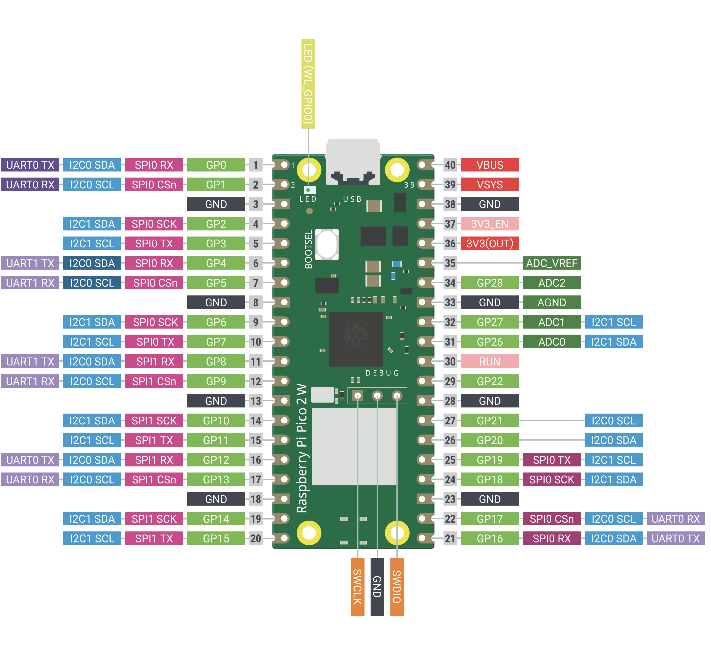

Die Abbildung \ref{fig:raspberry-pi-pico-2w-pinout} [@raspberry-pi-pico-2w-pinout] stellt die Pin-Belegungen eines Raspberry Pi Pico 2W dar.

### Vergleich der Optionen & Entscheidung

In diesem Teil folgt der direkte Vergleich sowie die Entscheidung für eine der Mikrocontroller-Optionen. Jegliche Diagramme und Berechnungen, welche zur Veranschaulichung und Ermittlung der Daten verwendet werden, wurden mithilfe von Microsoft Excel erstellt. Die Daten für den Vergleich der Preise werden durch einen Vergleich von mehreren Händlerangeboten pro Mikrocontroller ermittelt. Für die exakten Berechnungen und Händler-Daten wird an dieser Stelle auf die Tabellenberechnungen [@table-calculations-microcontrollers] im Anhang verwiesen.

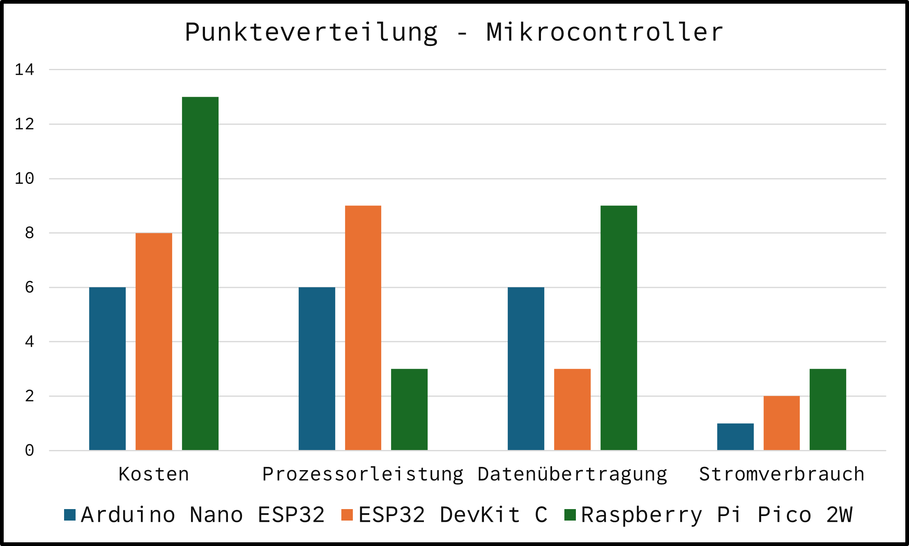

Die Punkteverteilung, wie sie in Abbildung \ref{fig:point-distribution} (siehe Anhang für Berechnungen) ersichtlich ist, ergibt sich aus:

**1. Kosten (~49% der möglichen Gesamtpunkte)**

**2. Prozessorleistung (~22% der möglichen Gesamtpunkte)**

**3. Datenübertragung (~22% der möglichen Gesamtpunkte)**

**4. Stromverbrauch (~7% der möglichen Gesamtpunkte)**

Für den genauen Vergleich der Prozessorleistung, Datenübertragung und dem Stromverbrauch wird hierbei wieder auf die Datenblätter im Anhang verwiesen.

Die durchschnittlichen Kosten (in €) und die sich daraus ergebenden Punkte jedes Mikrocontrollers belaufen sich nach dem Vergleich verschiedener Online-Händler auf die folgenden Beträge:

| Mikrocontroller | Preis H1 | Preis H2 | Preis H3 | **Durchschnittspreis** | **Punkte** |
|--|--|--|--|--|--|
| Arduino Nano ESP32 | 21,60€ | 16,60€ | 19,97€ | **19,39€** | **6** |
| ESP32 DevKit C V4 | 13,00€ | 13,99€ | 11,90€ | **12,96€** | **8** |
| Raspberry Pi Pico 2W | 7,60€ | 8,00€ | 8,57€ | **8,06€** | **13** |

: Kostenvergleich Mikrocontroller

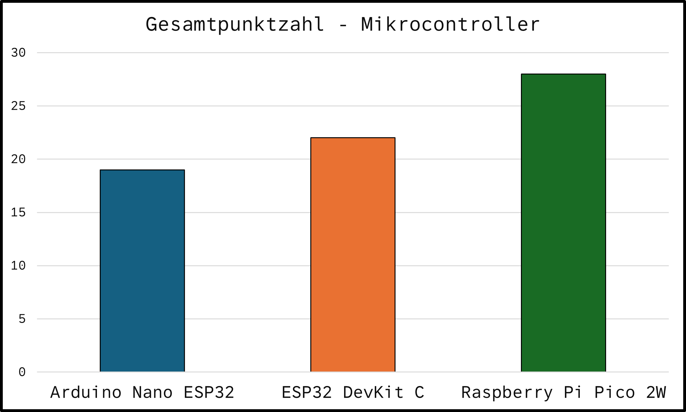

Nach dem Addieren aller Teilpunktzahlen der Kategorien ergibt sich für die Gesamtpunktzahl (siehe Abbildung \ref{fig:full-points-microcontroller}) und die finale Entscheidung dieses Ergebnis. Den ersten Platz belegt mit einem klaren Vorsprung der **Raspberry Pi Pico 2W** weshalb er für die finale Entscheidung für einen Mikrocontroller für den Bau eines Controllers ausgewählt wird. Das **ESP32 DevKit C** belegt den zweiten Platz, während der **Arduino Nano ESP32** insgesamt am schlechtesten abschneidet.

Der Raspberry Pi Pico 2W ist nicht nur anhand von diesem faktischen Vergleich für die Entwicklung sehr angenehm, sondern auch wegen der umfassenden Code-Library ```picozero```, welche die Entwicklung für diesen stark vereinfacht. Hiermit endet das Subkapitel über die Entscheidung für den Mikrocontroller, der für diese Diplomarbeit am Besten geeignet ist. Als nächstes werden die möglichen Sensoren zur Messung der Eingabesignale genauer beleuchtet.

### Sensorenauswahl

Da nun die Auswahl für den optimalen Mikrocontroller getroffen wurde, ist es an der Zeit, eine Entscheidung für den bzw. die verwendeten Sensor(-en) in dem zu bauenden Controller zu machen. Da jedoch jeder Sensor viele Eigenschaften besitzt und es für ein solches Projekt viele verschiedene Lösungsansätze gibt, werden in diesem Kapitel die Vor- und Nachteile der verschiedenen Optionen beleuchtet.

Am Ende soll wie im vorherigen Kapitel wieder eine Entscheidung getätigt werden, welche Sensorenauswahl im Endprodukt verbaut werden soll. Da die Sensoren sich in ihrer kompletten Funktionsweise nahezu überhaupt nicht ähneln, kann hierbei kein Vergleich gemeinsamer Eigenschaften durchgeführt werden. Deshalb wird die Entscheidung in diesem Kapitel eher nach persönlicher Expertise und logischer bzw. physikalischer Möglichkeit - statt wie zuvor nach messbaren Daten und Leistungsindikatoren - getroffen.

#### Entfernungssensor + IMU-Sensor oder Drehgeber

Für den ersten möglichen Ansatz wäre eine Kombination aus einem Entfernungssensor (Laser-/Ultraschallsensor) und einem IMU-Sensor oder Drehgeber gedacht. Mit einer Kombination dieser Sensoren sollte es möglich sein, alle rotatorischen und translatorischen Eingaben, die bei dem Stab eines Tischfußballtisches anfallen, korrekt zu digitalisieren. 

Bevor der Lösungsansatz erklärt werden kann, müssen die verschiedenen Sensoren mit ihren Funktionen erklärt werden. Hier folgt nun für jeden angesprochenen Sensor eine kurze Erklärung bzw. Veranschaulichung der jeweiligen Anwendungsbereiche.

**Laser-/Ultraschallsensor**

Laser- [@laser-sensors-all-types] [@how-laser-sensors-work] und Ultraschallsensoren [@what-is-ultrasonic-sensor] [@ultrasonic-with-arduino] werden in dieser Ausarbeitung zusammen erklärt, da die hier betrachteten Versionen dieser Sensoren demselben physikalischen Prinzip folgen. Auch wenn es verschiedene Lasersensoren gibt, sind die meisten herkömmlich zugänglichen - gleich wie die Ultraschallsensoren - nach dem ToF-Prinzip aufgebaut.

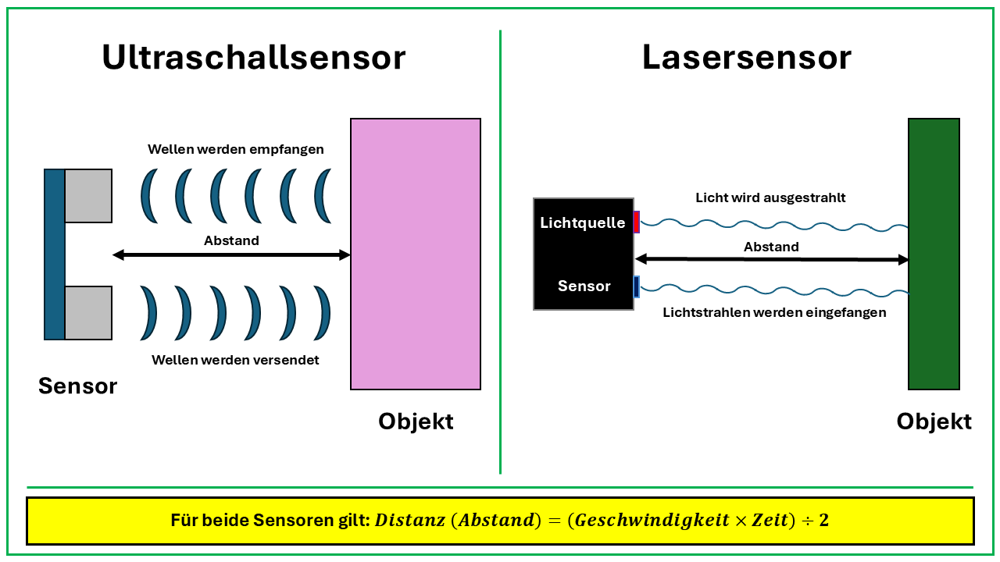

In Abbildung \ref{fig:tof-principle} wird dargestellt, wie sowohl der Ultraschallsensor als auch der Lasersensor nach demselben Prinzip funktionieren. Dieses Prinzip ist das vorher schon erwähnte ***Time-of-Flight-Prinzip***.

Die Messung mithilfe des Time-of-Flight-Prinzips funktioniert bei jedem Sensor gleich.

$Geschwindigkeit = \frac{Weg}{Zeit}$

Die allgemeine Formel für die Geschwindigkeit wird zu Beginn genommen und zur Formel für den Weg umgeformt.

$Weg = {Geschwindigkeit}\times{Zeit}$

Grundsätzlich würde der Weg, den die Ultraschallwellen bzw. die Lichtstrahlen zurücklegen der jeweiligen Geschwindigkeit (Schall-/Lichtgeschwindigkeit) mal der Zeit, die für die Überbrückung der Strecke benötigt wird, entsprechen. Da jedoch in diesem Fall für die Messung die Wellen/Strahlen zum Objekt hin- und wieder zurückfliegen müssen, würde laut der allgemeinen Weg-Formel bei jeder Messung der doppelte Weg herauskommen.

$Weg = \frac{({Geschwindigkeit}\times{Zeit})}{2}$

Um das Problem des doppelten Weges zu umgehen muss das Ergebnis der Multiplikation von Geschwindigkeit und Zeit einfach durch 2 dividiert werden. So ergibt sich die Formel, nach der jeder ToF-basierte Sensor den Abstand zu Objekten misst.

Auch wenn die beiden Sensoren das selbe Grundprinzip aufweisen unterscheiden sie sich in ihren Anwendungszwecken, Kosten und den physikalischen Vor- und Nachteilen, die sie mit sich bringen. [@laser-vs-ultrasonic]

*Ultraschallsensor*:

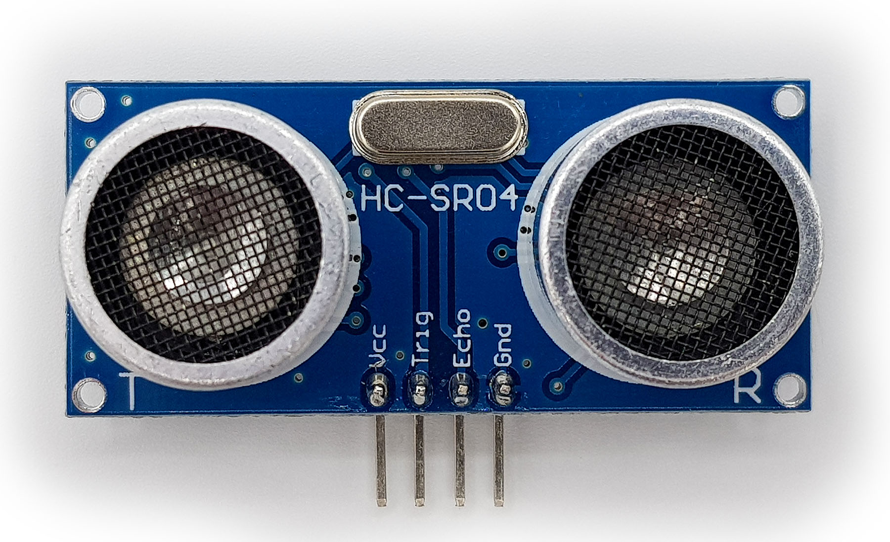

- Ultraschallsensoren (wie z. B. der HC-SR04 - siehe Abbildung \ref{fig:ultrasound-hc-sr04} [@hc-sr04-image]) werden gerne in Situationen verwendet, wo physikalische Störungen wie Staub, Luftfeuchtigkeit oder schlechte Lichtbedingungen (z. B. zu helles Umfeld) auftreten. Sie sind tendenziell weitaus leistbarer als viele Laser-Sensoren und werden deshalb auch im Hobby-Bereich öfter verwendet. Da Ultraschallsensoren billiger und robuster gegenüber physikalischen Gegebenheiten sind - auch reflektive Oberflächen verfälschen die Messung nicht - werden sie z. B. oft zur Messung von Füllständen von Flüssigkeiten oder Abständen zu anderen Fahrzeugen als Parkhilfe verwendet.

*Lasersensor*:

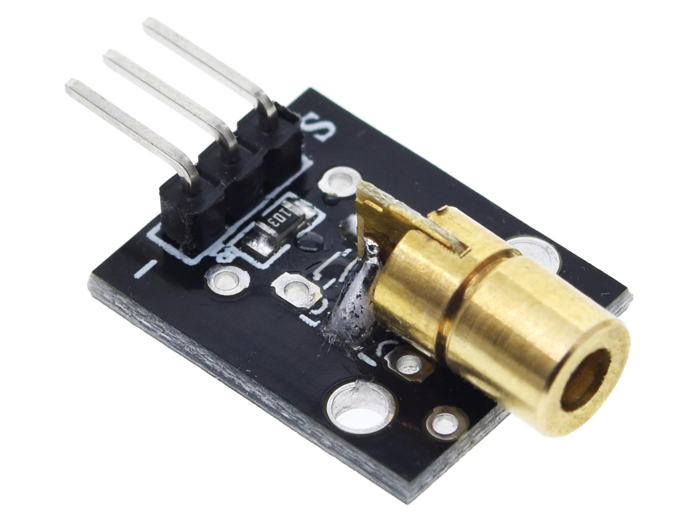

- Da Laser-Sensoren (wie z. B. der KY-008 - siehe Abbildung \ref{fig:laser-ky-008} [@ky-008-image]) üblicherweise teurer aber auch weitaus genauer sind (Wenige Milli- bis Mikrometer gegenüber Zentimeter bei US) werden sie in Systemen verwendet, die eine weitaus höhere Präzision benötigen. Auch für weite Entfernungen oder Messungen, bei denen die höchstmögliche Geschwindigkeit essenziell ist, werden sie verwendet. Dank diesen Eigenschaften werden Laser-Sensoren z. B. in der Herstellung von Autoteilen zur Qualitätssicherung, bei der Landschaftsvermessung oder auf der Zielgeraden beim Formel 1 - zusätzlich zu Induktionsschleifen (Timing Loops) in der Strecke - zur Zeitmessung verwendet.


**IMU-Sensor**

Eine IMU [@imu-and-robotics] ist eine inertiale Messeinheit (engl. **I**nertial **M**easurement **U**nit), mit der die Beschleunigung, die Winkelgeschwindigkeit sowie die Orientierung des Sensors gemessen wird. Dies funktioniert durch eine Kombination aus Gyroskopen, Beschleunigungsmessern und oft Magnetometern.

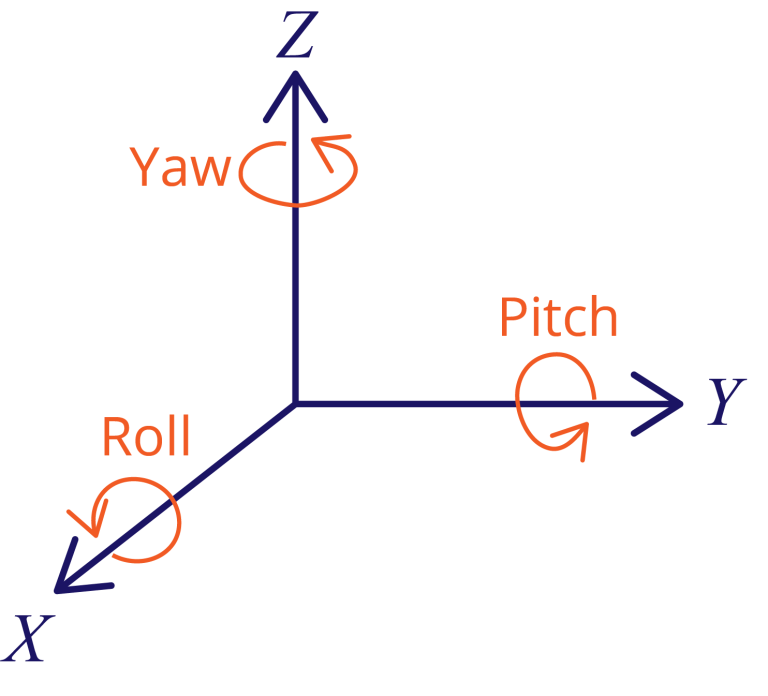

In Abbildung \ref{fig:roll-pitch-yaw} [@arduino-guide-mpu6050] sind die Winkel, welche bei einem IMU mithilfe seiner verschiedenen Sensoren erfasst werden, dargestellt. Die Winkel werden auf Deutsch als Roll-, Nick- und Gier-Winkel [@yaw-pitch-and-roll] bezeichnet. Diese Begriffe kommen ursprünglich aus der Luft- und Seefahrt und bezeichnen die Bewegungen, die ein Fahrzeug um die jeweilige Achse macht. Ein Flugzeug oder Schiff kann um die X-Achse "rollen", um die Y-Achse "nicken" - wie wenn man als Mensch den Kopf auf und ab bewegt - und um die Z-Achse "gieren". Auch wenn diese Winkeldarstellung ursprünglich also aus der (Aero-) Nautik kommt, wird sie heutzutage überall dort verwendet, wo die Lage eines Fahrzeugs oder Objekts im Raum beschrieben werden muss.

Da eine IMU aus mehreren Unterkomponenten besteht, werden diese im folgenden Abschnitt kurz erläutert. [@imu-and-robotics] [@arduino-guide-mpu6050]

*Beschleunigungsmesser*:

* Ein Beschleunigungsmesser ist ein elektromechanisches Gerät, welches zur Messung von Beschleunigungskräften verwendet wird. Diese Kräfte können entweder statisch sein - wie die Schwerkraft - oder dynamisch, wie Bewegungs- oder Schwingungskräfte. Wenn sich ein Objekt im Ruhezustand befindet entspricht die  Beschleunigung auf der Z-Achse normalerweise der Schwerkraft ($9.81 m/s^2$), während die Beschleunigungen auf der X- und Y-Achse null sein sollten. Mithilfe der Schwerkraft können über trigonometrische Berechnungen der Roll- und Nick-Winkel bestimmt werden.

*Gyroskop*:

* Um die Orientierung und Winkelgeschwindigkeit eines Objektes zu messen verwendet man ein Gyroskop. Es misst die Rotationsgeschwindigkeit - also die Änderung der Winkelposition über die Zeit - in rad/s entlang der X-, Y- und Z-Achse. Durch Kombination der Messwerte von Gyroskop und Beschleunigungsmesser lässt sich die Orientierung des Sensors besser bestimmen, als es mit nur einem der Sensoren möglich wäre.

*Magnetometer*:

- Mithilfe von einem Magnetometer lassen sich sowohl die Richtung als auch die Stärke von Magnetfeldern bestimmen. Einfach gesagt verhält es sich wie ein elektronischer Kompass, der die relative Änderung eines Magnetfeldes zu einem gegebenen Standort misst. Weil Beschleunigungsmesser und Gyroskop alleine den Gier-Winkel nicht bestimmen können, übernimmt genau hier das Magnetometer. Durch das Erdmagnetfeld ist - gleich wie für den Roll- und Nick-Winkel die Schwerkraft - eine konstante horizontale Kraft gegeben. Anhand von dieser lässt sich der Gier-Winkel bestimmen. Was jedoch zu beachten ist, ist, dass das Magnetometer durch äußere Magnetfelder, z. B. von Motoren oder metallischen Strukturen gestört werden kann, was möglicherweise zu Messfehlern führt.

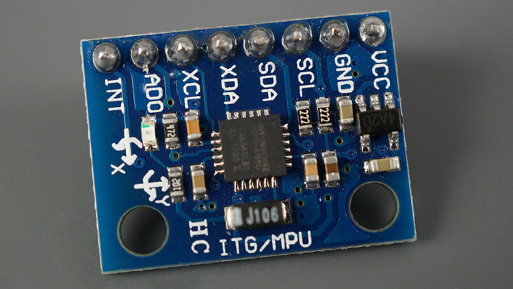

In Abbildung \ref{fig:imu-mpu6050} [@arduino-guide-mpu6050] ist ein typischer IMU-Sensor des Typs MPU-6050 dargestellt. Dieser weitverbreitete Sensor vereint einen Beschleunigungsmesser und ein Gyroskop mit jeweils 3 Achsen auf einem einzigen Chip und ist damit ein Beispiel für eine IMU vom Typ I. [@imu-and-robotics] Das bedeutet, dass es dem MPU6050 nicht möglich ist - ohne eine ungenaue und fehlerbehaftete Integrationsrechnung - den Gier-Winkel zu bestimmen. Eine IMU vom Typ II hat zusätzlich noch ein Magnetometer, welches mit 3 zusätzlichen Achsen den Freiheitsgrad des Sensors auf neun erhöht. Damit ist es dann auch möglich, den fehlenden Winkel zu messen.

Ein weiterer wichtiger Aspekt bei der Verwendung von IMU-Sensoren ist der sogenannte ***Drift-Fehler***. [@imu-and-robotics] Da jede Messung auf den vorherigen Werten aufbaut, häufen sich kleinste Messfehler mit der Zeit an und führen zu immer größeren Abweichungen. Dieses Problem lässt sich durch Filtermethoden wie dem Kalman-Filter abmildern. Er stellt auf Basis eines Modells Hypothesen für den nächsten Messwert auf, vergleicht diesen mit dem tatsächlich gemessenen Wert und passt sein Modell entsprechend an.


**Drehgeber**

Ein Drehgeber [@how-rotary-encoders-work] [@how-rotary-encoders-work-second-source] (engl. Rotary Encoder) ist ein elektromechanisches Bauteil. Er wandelt die Winkelposition und/oder Bewegung einer Achse in ein digitales Ausgangssignal um. Äußerlich sieht ein Drehgeber wie ein gewöhnliches Potentiometer aus, unterscheidet sich aber in einem wesentlichen Punkt. Während ein Potentiometer in beide Drehrichtungen einen mechanischen Endpunkt hat, kann ein Drehgeber endlos in beide Richtungen gedreht werden. Ohne diese Eigenschaft würde er für dieses Projekt überhaupt nicht infrage kommen.

Mit einem Drehgeber lassen sich drei Eigenschaften [@how-rotary-encoders-work] einer Achse erfassen:

* Die **Winkelposition** = Die aktuelle Drehung der Achse entlang des kreisförmigen Weges.
* Die **Drehrichtung** = Ob die Achse im oder gegen den Uhrzeigersinn gedreht wird (engl. *clockwise* / *counter clockwise*).
* Die **Winkelgeschwindigkeit** = Die Geschwindigkeit, mit der sich die Achse dreht.

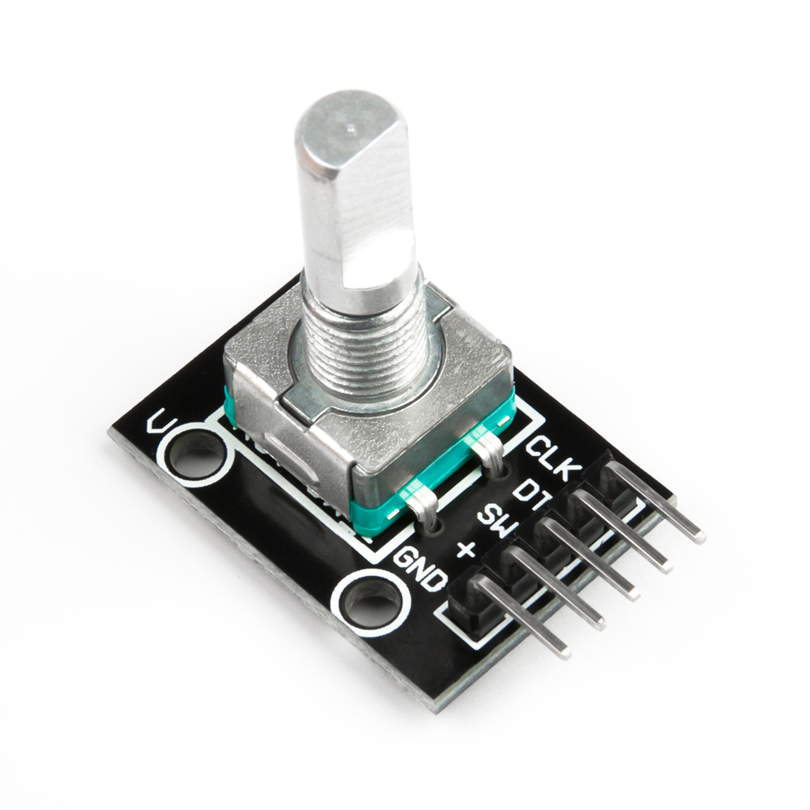

Wie diese Informationen gewonnen werden, lässt sich an der internen Funktionsweise des Sensors erkennen. Beim Drehen werden zwei Kontakte - beim KY-040-Drehgeber (siehe Abbildung \ref{fig:rotary-encoder-ky-040} [@ky-040-rotary-encoder]) die Signalausgänge CLK und DT - nacheinander geschlossen. Anhand von der Reihenfolge, in der diese beiden Kontakte Signale erhalten, lässt sich die Drehrichtung bestimmen. Durch den zeitlichen Abstand zwischen den Schaltvorgängen lässt sich die Winkelgeschwindigkeit ableiten. Weil die Auswertung des Sensors softwareseitig erfolgen muss, ist für die Verwendung zwingend ein Mikrocontroller notwendig.

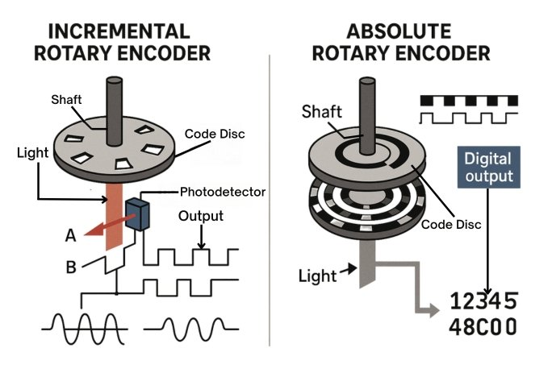

Es wird zwischen zwei Typen von Drehgebern unterschieden (siehe Abbildung \ref{fig:rotary-encoder-incremental-absolute} [@how-rotary-encoders-work-second-source]):  ***Absolute*** Drehgeber kennen ihre Position sofort nach dem Einschalten, sind aber aufwendiger gebaut und dadurch teurer in der Herstellung. ***Inkrementelle*** Drehgeber - die in der Praxis weitaus verbreiteter sind - melden sofort Geschwindigkeit und Drehrichtung, kennen ihre absolute Ausgangsposition aber nicht. Deswegen benötigen diese entweder einen Referenzpunkt oder setzen beim Einschalten eine Nullposition, von der aus gemessen wird.

---

Nachdem wir nun die Sensoren für den ersten möglichen Aufbau des Controllers kennengelernt haben, sehen wir uns den theoretischen Aufbau anhand von einer Skizze genauer an.

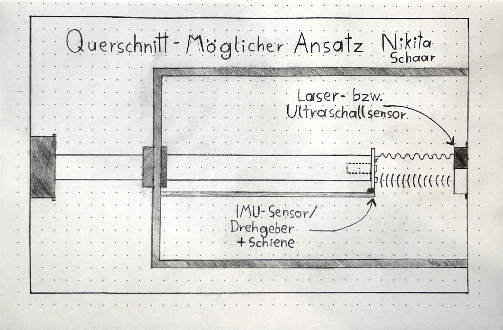

In Abbildung \ref{fig:side-view-possible-controller}, einer händisch angefertigten Skizze, ist ein möglicher Aufbau des Controllers zur Steuerung der Simulation dargestellt. Die Messung der translatorischen Eingaben - das Hineinschieben bzw. Herausziehen des Drehstabes - würde in diesem Entwurf mithilfe eines Laser- oder Ultraschallsensors gemessen werden. Grundsätzlich wäre es nicht weiter wichtig, welcher der beiden Sensoren hierfür verwendet werden würde, jedoch wäre hier die Tendenz eher bei einem Ultraschallsensor. Das liegt daran, dass wie bereits erwähnt der Kostenunterschied zwischen den beiden Sensorarten nicht unmerklich ist und für den Anwendungsbereich ein Ultraschallsensor auf jeden Fall reichen müsste. Zur verbesserten Abstandsmessung würde sich hier am Ende des Stabes eine größere Fläche eignen, um die Ultraschallwellen besser reflektieren zu können.

Die rotatorischen Eingaben (Drehen des Stabes) sollen hierbei entweder anhand von einem Drehgeber oder einem IMU-Sensor gemessen werden. Für beide dieser Sensoren bräuchte es zusätzliche Teile, die verbaut werden müssten, um ihre Verwendung zu ermöglichen.

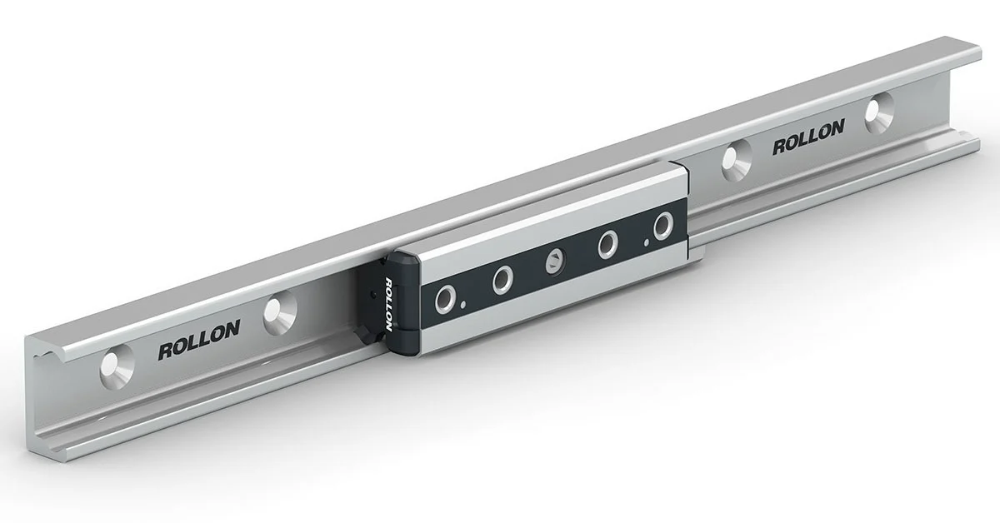

Im Falle, dass ein Drehgeber zur Messung der Rotation des Stabes verwendet wird, bräuchte dieser eine Schiene oder eine Art Führung (siehe Abbildung \ref{fig:linear-rail} [@roll-bearing-rail]), die unter dem Stab fest positioniert ist. An dieser Führung müsste der Drehgeber fest verbaut sein, sodass sich dieser nicht mit dem Stab mit dreht, sondern von einer stabilen Position aus die Drehung messen kann.

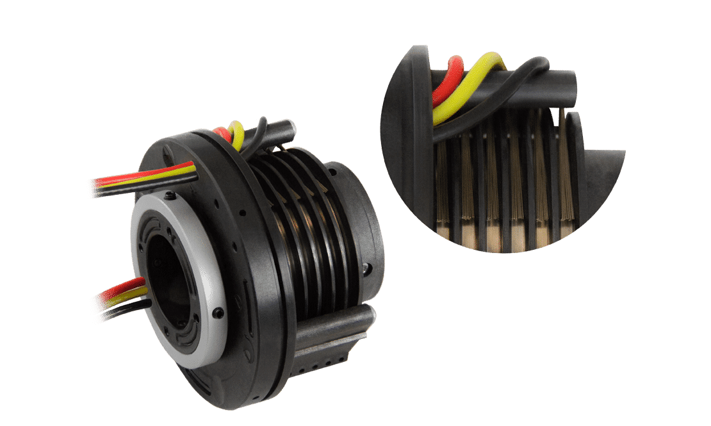

Für den Fall, dass für die Messung der Drehung ein IMU-Sensor verwendet wird, bräuchte man hierbei einen Schleifring (siehe Abbildung \ref{fig:electrical-slip-ring} [@electrical-slip-ring]) oder etwas Ähnliches. Da sich der IMU mit dem Stab mitdrehen würde, bräuchte man hier einen Schleifring, mithilfe dessen Stromversorgung auch bei drehenden Teilen möglich ist. Durch ihn würden sich Kabel nicht verdrehen, sondern die benötigte Spannung mithilfe der eingebauten Drahtbürsten - egal wie der Stab gedreht ist - bereitstellen.

Ein Problem, welches mit Schleifringen besteht, ist der Verschleiß. Da sie über mechanische Teile, die konstant aneinander gerieben werden, die Spannung übertragen, werden sie mit der Zeit automatisch "aufgebraucht". Auch wenn moderne Schleifringe zwar gut funktionieren, ist gerade bei diesem Projekt, wo der Drehstab oft sehr schnell gedreht wird, keine Sicherheit gegeben, dass es mit einem Schleifring zuverlässig funktioniert. 

Aus den genannten Gründen würde die Entscheidung für den Rotationssensor in diesem Fall auf den Drehgeber fallen. Dieser ist einerseits zuverlässiger und andererseits wäre ein IMU-Sensor voraussichtlich auch von den innewohnenden Funktionen her übertrieben, da nur die Drehung auf einer Achse gemessen werden muss. Falls dieser Ansatz also für die finale Konstruktion des Controllers herangezogen werden würde, läge die Wahl der Sensoren bei einem ***Drehgeber mit fest verbauter Schiene*** - für die Drehung des Stabes - sowie einem ***Ultraschallsensor*** zur Messung der Schiebebewegungen.

#### Maussensor / Maus

Die zweite mögliche Herangehensweise beim Controller-Aufbau ist weitaus simpler, sollte der ersten in puncto Funktionalität jedoch in nichts nachstehen. Hier wäre der einzige Sensor bzw. das einzige Eingabegerät eine schlichte Computermaus. Auch wenn dieser Ansatz zuerst möglicherweise unorthodox wirkt sollte es mithilfe einer Maus möglich sein, sowohl rotatorische als auch translatorische Bewegungen an die Simulation zu übertragen.

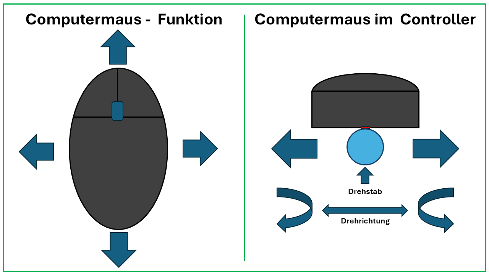

In Abbildung \ref{fig:computer-mouse-description} ist links die generelle Funktion einer Maus visualisiert. Mit ihr lassen sich Bewegungen in alle Richtungen an einen PC oder Laptop übertragen, mit denen dann alle möglichen Programme bedient werden können. Da bei dem Drehstab im Grunde genommen nichts anderes passiert als einfache Bewegungen nach links/rechts bzw. vor/zurück, kann eine standardmäßige Computermaus ganz einfach zu einem perfekten Sensor umfunktioniert werden.

Wenn die Maus direkt über dem Stab in einer festen Position platziert wird, können Schiebebewegungen nach vorne und hinten direkt über die USB-Schnittstelle an die Simulation gesendet werden. Für die Drehbewegungen funktioniert es im Grunde genommen gleich, nur ist zu beachten, dass eine Drehung des Stabes nach rechts - also im Uhrzeigersinn - in diesem Fall zu einer Bewegung des Maus-Cursors nach links verursacht. Das liegt daran, dass für die Maus der Untergrund, über dem sie sich befindet (in diesem Falle der Drehstab), sich nach rechts verschiebt, was für sie eine Bewegung nach links bedeutet. Bis auf diese simple Umkehrung der Bewegungsrichtung funktioniert die Erkennung aller Bewegungen jedoch extrem simpel.

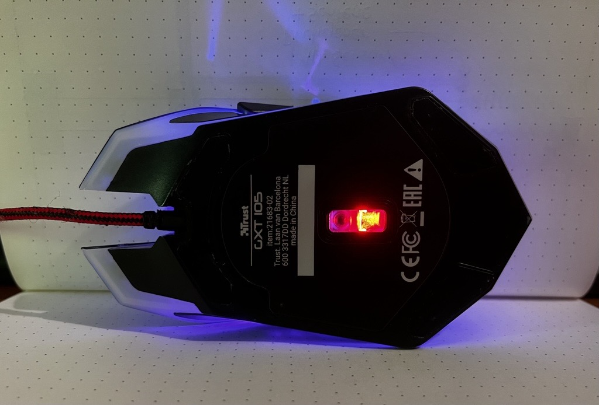

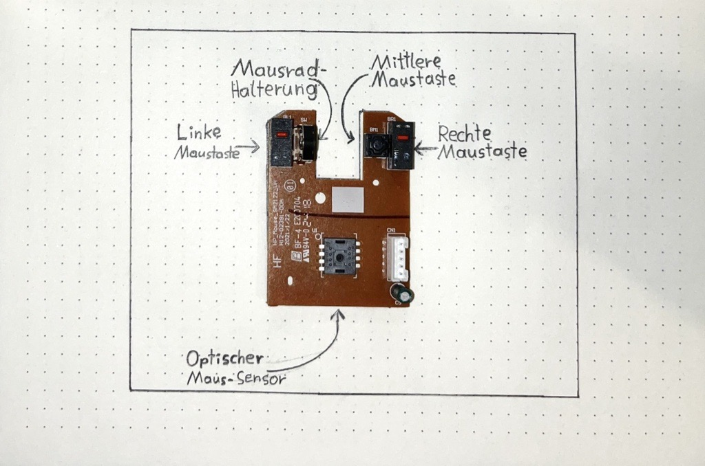

Auf den Abbildungen \ref{fig:computer-mouse-bottom} und \ref{fig:computer-mouse-sensor} lässt sich das Herzstück einer Computermaus - einmal ein- und einmal ausgebaut - erkennen: Der optische Sensor. Auch wenn es je nach Hersteller verschiedene Arten dieser Sensoren gibt, funktionieren alle prinzipiell ziemlich gleich. Um das Projekt für den Nachbau so simpel zu halten wie möglich, wird bei diesem Ansatz jedoch eher eine komplette Maus verwendet, sodass kein Sensor ausgebaut werden muss.

Um die Eingaben der Maus dann letztendlich in einem Format zu übertragen, welches einfach weiterzuverarbeiten ist, wird die Microsoft Raw Input API [@about-raw-input] [@windows-input] verwendet. Bei dieser handelt es sich um eine API, mit der die Eingaben von HIDs (Human Input Device) direkt an ein Programm weitergegeben werden können. Dies sollte man für den Fall von einem Spiel, bei dem es um Präzision geht, nicht über die Windows-Eingaben selbst erledigen. Das liegt daran, dass Windows auf den Cursor Funktionen wie Beschleunigung anwendet, sodass zwar die Nutzung als tatsächlicher Cursor verbessert wird, die Präzision jedoch maßgeblich beeinträchtigt wird.

---

Auch wenn für den finalen Controller beide Ansätze ausprobiert und verglichen werden, wäre der zweite Ansatz auf Basis einer Maus für den Nachbau weitaus nützlicher. Hierbei müsste sehr viel weniger Arbeit auf der Seite des/der Nachbauenden verrichtet werden, was es wahrscheinlicher machen würde, dass das Projekt nachgebaut wird. Mit dieser Analyse wird der Theoretische Teil der Arbeit am Controller konkludiert. Nun folgt der Praktische Teil.

## Praktischer Teil

Der folgende Teil befasst sich mit den praktischen Versuchen und Entwicklungen rund um diese Diplomarbeit. Beschrieben werden jegliche Bauteile und wichtige Hardware, welche verwendet bzw. in Betracht gezogen wurden. Hierbei wird auf Prototypen, Demos, Probleme und Lösungen eingegangen. Zum Abschluss wird das finale Controller-Modell, das Audio-Design sowie die Erstellung einer schriftlichen Nachbauanleitung beleuchtet.

### Demos und Softwareprototypen

In diesem Kapitel geht es um Software-Prototypen, Demos und andere Entwicklungsschritte, welche sich im Laufe der Arbeit am Controller ergeben haben. Anhand von ihnen werden der Entwicklungsprozess und verschiedene Iterationen dargestellt.

#### Arduino <-> Godot Kommunikations-Demo V1

Für die Erstpräsentation der Arbeit wurde eine Demo erstellt, anhand von der die Kommunikation zwischen einem Arduino und der Godot Engine^[https://godotengine.org/de/] veranschaulicht wird. Die Grundstruktur dieser Demo wurde aus einem Youtube-Video genommen [@connect-godot-arduino], in dem die serielle Übertragung der Daten erklärt und beispielhaft dargestellt wird.

Kommentare mit drei Punkten stellen hierbei zusätzlichen Code dar, welcher für die Erklärung des Kernprozesses keine Wichtigkeit hat und meist aus Variablendeklarationen besteht.

```{caption="Kommunikations-Demo Arduino <-> Godot - Arduino-Code" .c}
// ...

Adafruit_MPU6050 mpu;

void setup(void) {
  Serial.begin(9600);
  while (!Serial)
    delay(10);

  Serial.println("Adafruit MPU6050 test!");
  if (!mpu.begin()) {
    Serial.println("Failed to find MPU6050 chip");
    while (1) {
      delay(10);
    }
  }
  Serial.println("MPU6050 Found!");

  // ...
}

void loop() {
  sensors_event_t a, g, temp;
  mpu.getEvent(&a, &g, &temp);

  // ...

  Serial.print("Rotation X: ");
  Serial.print(g.gyro.x);
  Serial.print(", Y: ");
  Serial.print(g.gyro.y);
  Serial.print(", Z: ");
  Serial.print(g.gyro.z);
  Serial.println(" rad/s");

  // ...

  Serial.println("");
  delay(50);
}
```

Am Arduino wird zuerst versucht, den MPU6050-Sensor zu finden und codeseitig zu initialisieren. Bei Erfolg bzw. Fehler wird eine kurze Nachricht seriell ausgegeben. In der ```loop()```-Funktion - dem Teil von Arduino-/C-Code, der konstant wiederholt wird - werden die Rotationsbewegungen vom MPU6050 für jede Achse mittels ```Serial.println(<WERT>)``` über die serielle Schnittstelle an den PC geschickt. Dann pausiert die Funktion für 50ms und wiederholt sich.

```{caption="Kommunikations-Demo Arduino <-> Godot - C-Sharp-Code" .cs}
using Godot;
using System;
using System.IO.Ports;

public partial class Arduino : Node3D
{
    // ...
	public override void _Ready()
	{
        // ...
		serialPort = new SerialPort(
            "COM6", 9600, Parity.None, 8, StopBits.One
        );
		serialPort.DtrEnable = true;
		serialPort.RtsEnable = true;
		serialPort.Open();
	}

	public override void _Process(double delta)
	{
        // ...
		
		string serialMessage = serialPort.ReadLine().Replace('.', ',');
		
		coords = serialMessage.Split(' ');
		
		x = (float) (Convert.ToDouble(coords[2])*delta);
		y = (float) (Convert.ToDouble(coords[4])*delta);
		z = (float) (Convert.ToDouble(coords[6])*delta);
        
		cube.RotateX(x);
		cube.RotateY(y);
		cube.RotateZ(z);

        // ...
	}
}
```

In Godot wird das ganze über ein C#-Skript aufgenommen und ein 3D-Würfel wird anhand von den übernommenen Rotationswerten korrekt gedreht. Die Signale werden hierbei über den seriellen Port "COM6" mit einer Baud-Rate - einer Einheit, die aussagt wie viele Symbole pro Sekunde übertragen werden - von 9600 empfangen. Danach wird die empfangene Nachricht aufgespalten und jeder Drehungswert pro Achse auf den digitalen Würfel angewandt, was zu einer virtuellen Rotation führt.

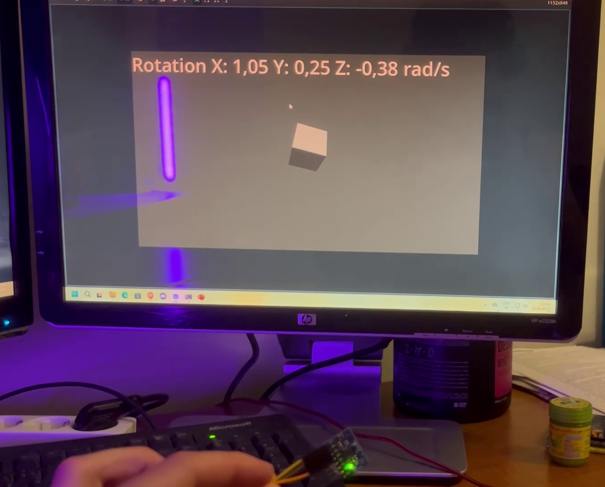

In der Abbildung \ref{fig:arduino-godot-comm-demo} ist die tatsächliche Simulation sowie der Sensor in einem Bild dargestellt. Über dem Würfel werden die aktuellen Winkelgeschwindigkeiten pro Achse angezeigt, anhand von denen die Drehung ermittelt wird. Visuell ist sie noch sehr minimalistisch, reichte jedoch um das generelle Konzept bei der Erstpräsentation darzustellen und den MPU6050 zu testen.

#### Controller V2 - Demo für Sensoreingaben\label{controller-demo-v2}

Nachdem die Erstversion des physischen Controllers fertiggestellt wurde war natürlich eine erweiterte Simulation vonnöten, um die Eingaben auf ihre Funktion zu überprüfen. Die erste rudimentäre digitale Darstellung des Controllers ist hierbei in Abbildung \ref{fig:simulation-v1} dargestellt.

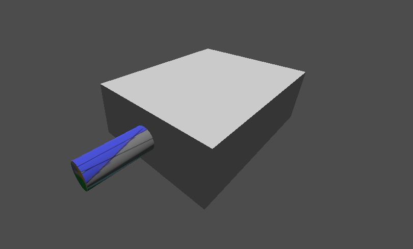

Auch wenn diese zweite Simulation visuell wieder relativ mager ausfiel, lässt sich an ihr die Form eines Drehstabes weitaus besser vorstellen als bei der ersten Demo. Bei dieser Demo ist, gleich wie bei der ersten Version, die Messung und Verarbeitung der Signale auf Arduino-Code und Godot-Code aufgeteilt.

```{caption="Sensor-Demo V2 - Arduino-Code" .c}
// ...

Adafruit_MPU6050 mpu;

int trigPin = 11;
int echoPin = 12;

void setup(void) {
  Serial.begin(9600);

  pinMode(trigPin, OUTPUT);
  pinMode(echoPin, INPUT);

  while (!Serial)
    delay(10);

  Serial.println("Adafruit MPU6050 test!");

  // Try to initialize!
  if (!mpu.begin()) {
    Serial.println("Failed to find MPU6050 chip");
    while (1) {
      delay(10);
    }
  }
  Serial.println("MPU6050 Found!");

  // ...
}

void loop() {
  sensors_event_t a, g, temp;
  mpu.getEvent(&a, &g, &temp);

  Serial.print("Rotation X: ");
  Serial.print(g.gyro.x);
  Serial.print(" Y: ");
  Serial.print(g.gyro.y);
  Serial.print(" Z: ");
  Serial.print(g.gyro.z);
  Serial.print(" rad/s ");

  digitalWrite(trigPin, LOW);
  delayMicroseconds(5);
  digitalWrite(trigPin, HIGH);
  delayMicroseconds(10);
  digitalWrite(trigPin, LOW);
 
  pinMode(echoPin, INPUT);
  duration = pulseIn(echoPin, HIGH);

  cm = (duration/2) / 29.1;

  Serial.print("Distance X: ");
  Serial.print(cm);
  Serial.println(" cm");
  
  delay(50);
}
```

Der Arduino-Code dieses Softwareprototypen sieht dem ersten Code teilweise sehr ähnlich, da die Logik des MPU6050-Sensors zur Messung der Rotationswerte übernommen wurde. Zu ihr kommt nun jedoch die Verwendung eines HC-SR04-Ultraschallsensors dazu, dessen Pins zu Beginn mithilfe von ```int trigPin = 11;``` und ```int echoPin = 12;``` initialisiert wurden. In der ```setup()```-Methode werden ihre Pinmodes dann auf Aus- bzw. Eingabe eingestellt.

In der ```loop()```-Methode werden, wie zuvor, die Gyrometer des MPU6050 ausgelesen und ihr Output wird an die serielle Schnittstelle gesendet. Außerdem werden die Pins des Ultraschallsensors angesteuert und die Dauer, die die Wellen für den Weg zum bestrahlten Objekt und zurück benötigen, wird mithilfe einer Formel zu der Distanz zur beschallten Fläche umgerechnet und verschickt. Danach pausiert das Programm für 50ms und wiederholt sich wieder.

```{caption="Sensor-Demo V2 - C-Sharp-Code" .cs}
using Godot;
using System;
using System.IO.Ports;

public partial class CommunicationInterface : Node3D
{

	// ...

	public override void _Ready()
	{
		text = GetNode<RichTextLabel>("RichTextLabel");
		turnStick = GetNode<MeshInstance3D>("TurnStick");
		serialPort = new SerialPort("COM6", 9600, Parity.None, 8, StopBits.One);
		serialPort.DtrEnable = true;
		serialPort.RtsEnable = true;
		serialPort.Open();
	}

	public override void _Process(double delta)
	{
		if (!serialPort.IsOpen) return;
		
		string serialMessage = serialPort.ReadLine().Replace('.', ',');
		
		coords = serialMessage.Split(' ');
		
		x = (float) (Convert.ToDouble(coords[2])*delta);
		y = (float) (Convert.ToDouble(coords[4])*delta);
		z = (float) (Convert.ToDouble(coords[6])*delta);
		
		turnStick.RotateZ(z);
		//turnStick.RotateY(y);
		//turnStick.RotateX(x);
		
		var pos = turnStick.Position;
		pos.X = (float) ((Convert.ToDouble(coords[10])-8)/15);
		turnStick.Position = pos;

		GD.Print(serialMessage);

		text.Text = serialMessage;
	}
}
```

Der C#-Code sieht, ebenso wie der Arduino-Code, zum Teil wieder sehr ähnlich aus wie bei der Erst-Demo. Hierbei wird zu Beginn alles initialisiert und ein ```RichTextLabel``` wird zum Logging der Sensorwerte erstellt. In der ```_Process()```-Methode - dem Godot-Äquivalent zur ```loop()```-Funktion beim Arduino - werden die empfangenen Werte wieder in Variablen gespeichert und anhand von ihnen wird die Position und Rotation des Drehstabes angepasst.

### Design des Controllers

Dieses Kapitel handelt von den verschiedenen Iterationen der Hülle des Controllers, sowie von den Entscheidungen, welche bei der Entwicklung getroffen worden sind.

Zu Beginn war die Zurechtfindung in der neu gewählten CAD-Umgebung "FreeCAD" ungewöhnlich, jedoch war es nicht schwierig sich daran anzupassen. Die Wahl für FreeCAD^[https://www.freecad.org/] entstand, da das ganze Projekt so gut es geht mit Open-Source-Software realisiert werden sollte.

#### Ein-Stab-Prototyp

Zuallererst wurde ein Prototyp entwickelt, der nur zur Bestimmung der grundlegenden Abmessungen des Controllers diente und deshalb nichts außer einer vagen Ähnlichkeit zu einer Drehstabhalterung hat (siehe Abbildung \ref{fig:controller-prototype-0.0}).


Für die ersten Prototypen ist das Design auf einen Drehstab reduziert, da dieser sich für Testzwecke besser eignet und das endgültige Design auf vier Stäbe hochskaliert werden kann.

Da diese rudimentäre Erstdarstellung jedoch selbst für Testzwecke noch unzureichend war, ist als nächstes eine erweiterte Version 1.0 designt worden, welche dem Bildnis eines Tischfußballtisches in mehreren Hinsichten ähnelt.

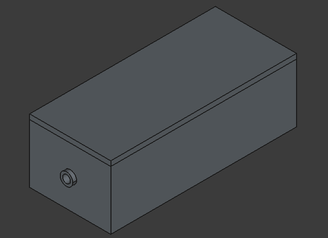 

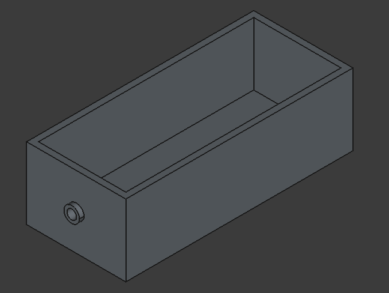

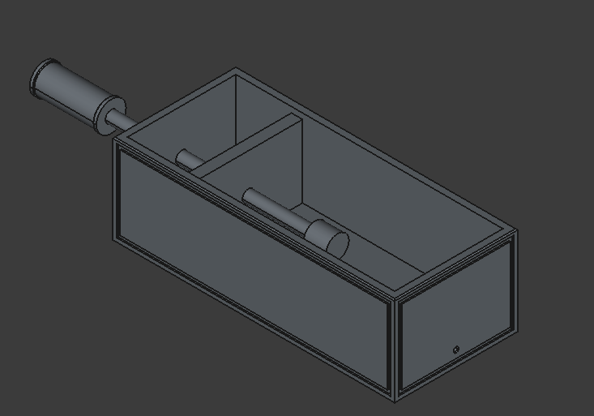

Diese Version (siehe Abbildungen \ref{fig:controller-prototype-1.0-closed}, \ref{fig:controller-prototype-1.0-open} und \ref{fig:controller-prototype-1.0-open-backside}) weist einen Drehstab, eine Plattform für elektronische Bauteile, eine Trennwand zur Stabilisierung des Stabes sowie ein Loch für Kabel auf, sodass die Stromversorgung mit geschlossenem Deckel ermöglicht wird. Das erweiterte Design wurde dann, zur Erleichterung des Designprozesses und der Darstellung der Grundidee mithilfe eines BambuLab X1C 3D-Druckers ausgedruckt.


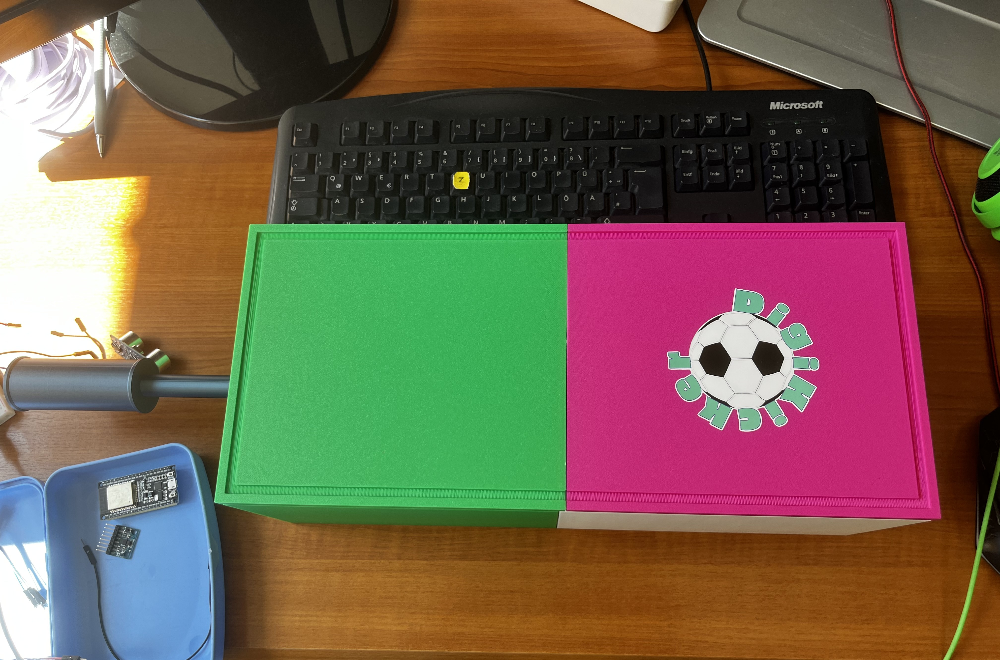

Der fertige 3D-Druck des ersten Prototypen ist hier auf den Abbildungen \ref{fig:controller-prototype-1.0-open-irl} und \ref{fig:controller-prototype-1.0-closed-irl} dargestellt. Um das visuelle Design attraktiver zu gestalten wurden Sticker in Form von dem DigiKicker-Logo auf dem Deckel und der Rückseite angebracht. Ein Problem, welches beim finalen Controller behoben wurde, hier jedoch noch auftaucht, ist das zu kleine Kabel-Loch. Grundsätzlich sollte ein Kabel zwar durch ein Loch mit 5mm Durchmesser passen, jedoch wurde bei der Entwicklung der Hülle nicht an den Stecker am Ende des Kabels gedacht, der leider nicht durchpasst.

Nachdem der Prototyp mit einer Demo, welche auf S. \pageref{controller-demo-v2} genauer beschrieben wurde, auf seine Funktion getestet wurde, wurde als nächstes eine Maus-Halterung entwickelt, welche sich über den Drehstab positionieren lässt.

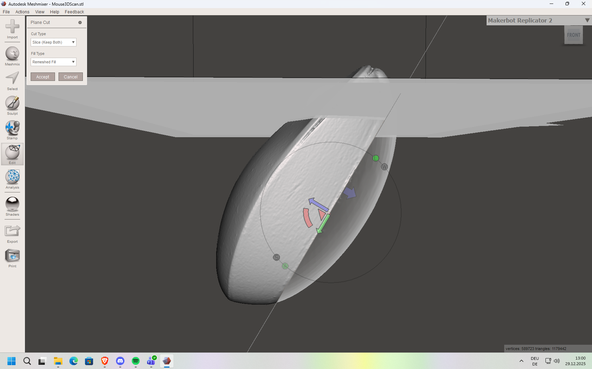

Die dafür verwendete Maus wurde zuallererst mithilfe eines 3D-Scanners, aus dem MakerLab in der Schule, eingescannt und ergab das rohe Modell, welches in Abbildung \ref{fig:mouse-3d-scan-raw} ersichtlich ist. Dieses Modell weist aufgrund von dem Fakt, dass der Scanner vermutet, dass die Maus unten - wo sie nicht abgescannt wurde - auch abgerundet ist, eine Art Ausbeulung auf der Unterseite auf.

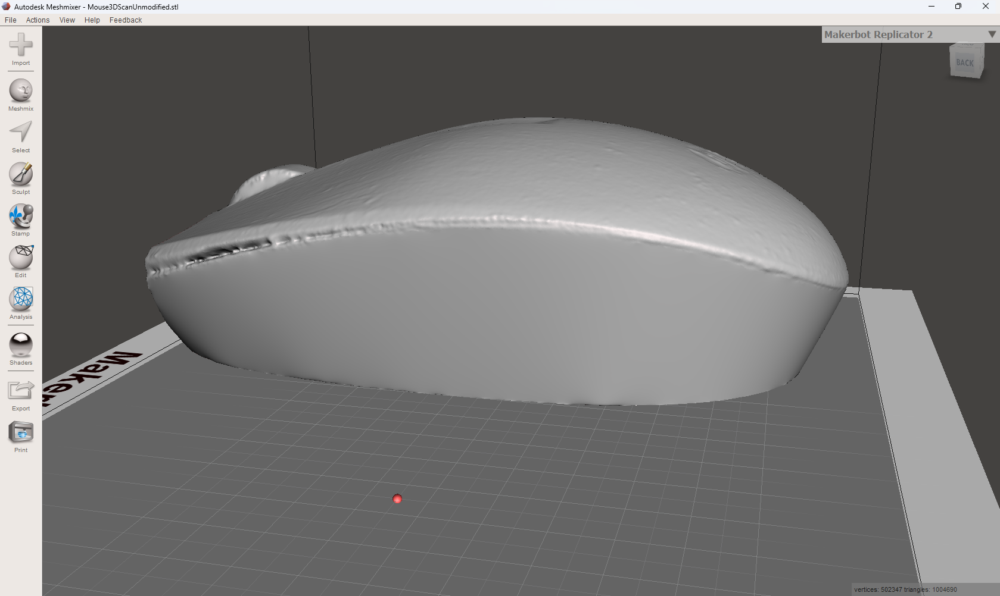

Danach wurde die Maus virtuell gedreht, sodass sie horizontal eben ist. Dann wurde die Beule unten abgeflacht und die Seiten wurden aufgesäubert. Alle Säuberungsarbeiten am 3D-Modell wurden in Meshmixer^[https://meshmixer.org/], einer kostenlosen Software von Autodesk^[https://www.autodesk.com/de] durchgeführt.

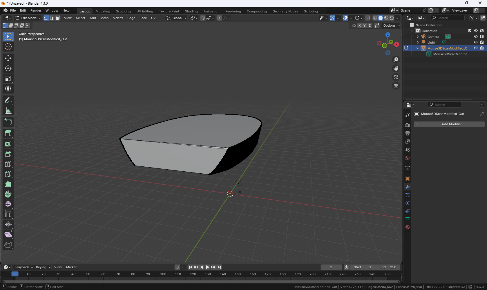

Nachdem die Maus aufgesäubert wurde, wurden unnötige Flächen entfernt, die zu einer höheren Komplexität des Modells geführt haben, als es nötig war. Diese Reduktion der Flächen und das Abschneiden der Oberseite wurden in Blender^[https://www.blender.org/] durchgeführt.

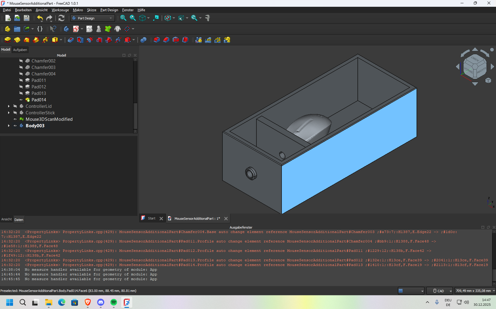

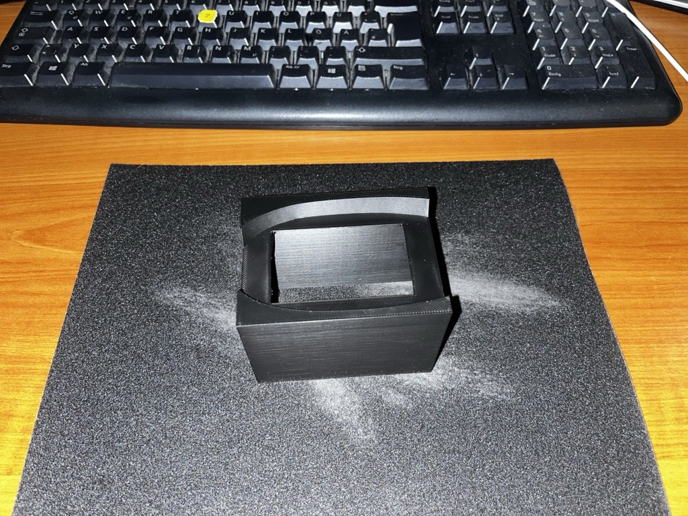

In den Abbildungen \ref{fig:mouse-3d-scan-in-model} und \ref{fig:3d-printed-mouse-mount} ist dargestellt, wie das Modell zuerst an die Größe des ersten Controller-Modells angepasst wurde und danach mit einer dreidimensionalen Formen-Subtraktion eine fertige Maushalterung modelliert und ausgedruckt wurde.

Diese Halterung fasst die gescannte Maus millimetergenau und lässt sich direkt im Controller-Modell über dem Drehstab festklemmen.

### Finaler Controller

Nachdem mit den Demos und zuvor entwickelten 3D-Modellen bereits viel Erfahrung rund um die Messung und Übertragung der Controller-Signale gesammelt wurde, ging es an die Erstellung und Entwicklung des fertigen Controller-Modells. Dieses wurde wie zuvor mithilfe von FreeCAD entwickelt.

Da durch alle Tests und Vergleiche klar wurde, dass für den finalen Controller eine Messung durch Computer-Mäuse verwendet werden sollte, war klar, dass eine Zweitversion der Maushalterung entwickelt werden müsste.

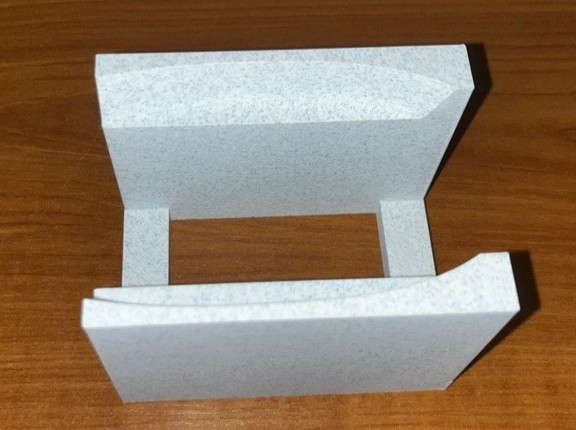

In der Abbildung \ref{fig:3d-printed-mouse-mount-final-version} ist die finale Version der Maushalterung dargestellt. Sie funktioniert nahezu identisch zur ersten Version, hat jedoch eine stabilere Zusammensetzung und passt besser auf das finale Controller-Modell. Außerdem ist bei ihr zwischen der Maus und dem Stab keine zusätzliche Filament-Schicht mehr, da diese bei der ersten Halterung zu Problemen bei der Messung geführt hat.

Um diese Halterung richtig zu verwenden wurden zwei Modelle für den finalen Controller geschaffen.

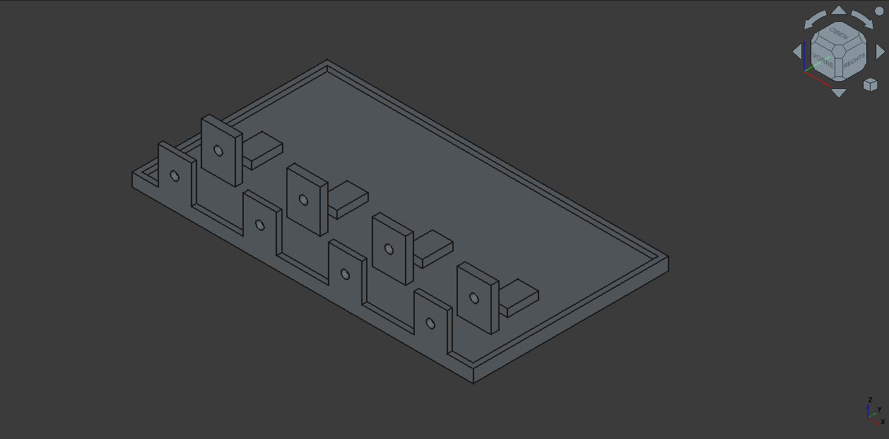

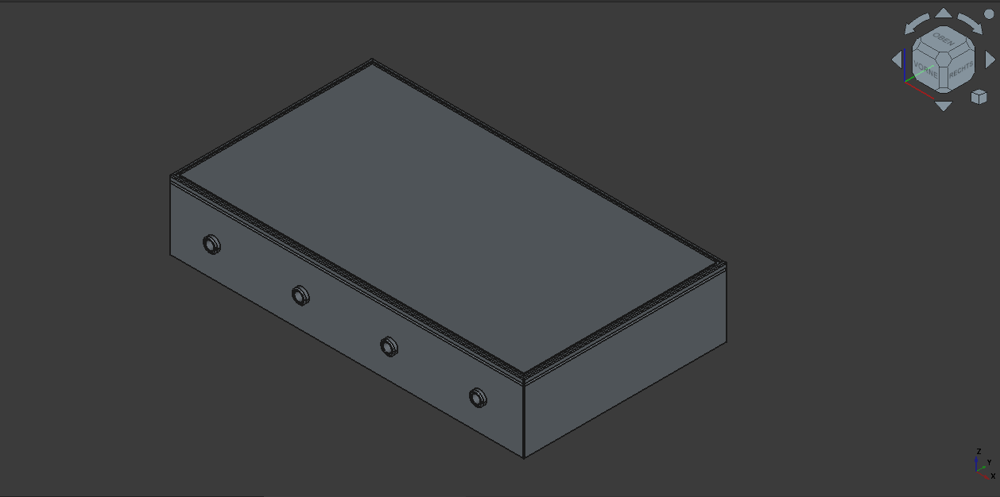

Die Abbildungen \ref{fig:final-fourstick-controller-open-freecad} und \{fig:final-fourstick-controller-closed-freecad} stellen die finale, undekorierte Version des Controllers dar. Sie haben die grundlegenden Eigenschaften des ersten Prototypen, jedoch sind einige Abmessungen aufgrund von Erfahrungswerten angepasst worden und das Kabel-Loch auf der Rückseite wurde erheblich vergrößert.

Die Zusammensetzung des fertigen Controllers basiert auf vier Drehstäben mit Maushalterungen darüber, in denen sich vier HP 125 Wired Mäuse befinden. Diese werden an einen Raspberry Pi 4 Model B angeschlossen, auf dem die Signale eingelesen und per MQTT an den PC versendet werden. MQTT wurde hierbei gewählt, da die serielle Übertragung bei einem PI 4B schwieriger zu realisieren ist und da MQTT eine schöne Entkoppelung der Eingaben zur Simulation mit sich bringt.

```{caption="Raspberry Pi Mauseingabe - Python-Code" .py}
# ...

MOUSE_PATHS = [
    "/dev/input/mouse0",
    "/dev/input/mouse1",
    "/dev/input/mouse2",
    "/dev/input/mouse3",
]

BROKER_HOST = "10.0.0.5"
BROKER_PORT = 1883
TOPIC_PREFIX = "digikicker/mouse"

# ...

def read_mice(files):
    """Mäuse per select() nicht-blockierend einlesen."""
    while True:
        readable, _, _ = select.select(files, [], [], 0.1)
        for f in readable:
            idx = files.index(f)
            data = f.read(3)
            if len(data) == 3:
                button, x, y = struct.unpack('BBB', data)
                with state_lock:
                    state[idx] = (button, x, y)
                    dirty.add(idx)
def report():
    """Nur geänderte Zustände publishen, danach State zurücksetzen."""
    while True:
        with state_lock:
            to_send = {idx: state[idx] for idx in dirty}
            dirty.clear()
            for idx in to_send:
                state[idx] = (0, 128, 128)

        for idx, (button, x, y) in to_send.items():
            payload = json.dumps({
                "id":     idx,
                "button": button,
                "x":      x,
                "y":      y
            })
            topic = f"{TOPIC_PREFIX}/{idx}"
            client.publish(topic, payload, qos=0)

        threading.Event().wait(0.02)

files = [open(p, "rb") for p in MOUSE_PATHS]
reader   = threading.Thread(target=read_mice, args=(files,), daemon=True)
reporter = threading.Thread(target=report,    daemon=True)
reader.start()
reporter.start()
reader.join()
```

Dieser Python-Code, welcher die Signale der vier Mäuse einliest und auf ein jeweils eigenes MQTT-Topic publisht, läuft auf dem Raspberry Pi als ein Service, welcher bei Fehlern automatisch neu startet und sofort nach Start des Gerätes angeht.

```{caption="Godot Signal-Empfang - C-Sharp-Code" .cs}
public partial class MqttInputManager : Node
{
	// Initialisierung von Methoden

	public override void _Ready()
	{
		for (int i = 0; i < 4; i++)
			_mouseInput[i] = Vector2.Zero;

		_cts = new CancellationTokenSource();
		// MQTT-Verbindung asynchron starten ohne den Hauptthread zu blockieren
		Task.Run(() => ConnectAsync(_cts.Token));
	}

	public override void _ExitTree()
	{
		_cts?.Cancel();
		if (_mqttClient?.IsConnected == true)
			_mqttClient.DisconnectAsync().Wait(1000);
		_mqttClient?.Dispose();
	}

	private async Task ConnectAsync(CancellationToken ct)
	{
		var factory = new MqttFactory();
		_mqttClient = factory.CreateMqttClient();

		var options = new MqttClientOptionsBuilder()
			.WithTcpServer(BrokerHost, BrokerPort)
			.WithClientId("godot-digikicker")
			.WithCleanSession()
			.Build();

		// Handler registrieren bevor Connect aufgerufen wird
		_mqttClient.ApplicationMessageReceivedAsync += OnMessageReceived;

		_mqttClient.DisconnectedAsync += async args =>
		{
			if (ct.IsCancellationRequested) return;
			GD.PrintErr("[MqttInputManager] Verbindung verloren – versuche Reconnect in 3s...");
			await Task.Delay(3000, ct);
			try { await _mqttClient.ConnectAsync(options, ct); }
			catch (Exception ex) { GD.PrintErr($"[MqttInputManager] Reconnect fehlgeschlagen: {ex.Message}"); }
		};

		try
		{
			await _mqttClient.ConnectAsync(options, ct);
			GD.Print($"[MqttInputManager] Verbunden mit Broker {BrokerHost}:{BrokerPort}");

			// Alle vier Maus-Topics abonnieren
			for (int i = 0; i < 4; i++)
			{
				string topic = $"{TopicPrefix}/{i}";
				await _mqttClient.SubscribeAsync(
					new MqttTopicFilterBuilder()
						.WithTopic(topic)
						.WithQualityOfServiceLevel(MqttQualityOfServiceLevel.AtMostOnce) // QoS 0 = niedrigste Latenz
						.Build(),
					ct
				);
				GD.Print($"[MqttInputManager] Topic abonniert: {topic}");
			}
		}
		catch (Exception ex)
		{
			GD.PrintErr($"[MqttInputManager] Verbindungsfehler: {ex.Message}");
		}
	}

	private Task OnMessageReceived(MqttApplicationMessageReceivedEventArgs args)
	{
		try
		{
			string payload = Encoding.UTF8.GetString(args.ApplicationMessage.PayloadSegment);
			var doc = JsonDocument.Parse(payload);
			var root = doc.RootElement;

			int  idx    = root.GetProperty("id").GetInt32();
			byte rawX   = (byte)root.GetProperty("x").GetInt32();
			byte rawY   = (byte)root.GetProperty("y").GetInt32();

			if (idx < 0 || idx > 3) return Task.CompletedTask;

			// Unsigned byte → vorzeichenbehaftetes Delta (Linux-PS/2-Protokoll)
			float dx = (rawX > 127) ? (rawX - 256) : rawX;
			float dy = (rawY > 127) ? (rawY - 256) : rawY;

			// Dead-Zone
			if (MathF.Abs(dx) < DeadZone) dx = 0f;
			if (MathF.Abs(dy) < DeadZone) dy = 0f;

			// Laut Diagramm:
			//   Maus X → Rotation  (Drehen des Stabs = Schuss/Block)
			//   Maus Y → Lateral   (Schieben = Position auf dem Tisch)
			// Y wird negiert: Maus vorwärts schieben = positiver Offset
			float rotation = dx * RotationSensitivity;
			float lateral  = -dy * LateralSensitivity;

			lock (_inputLock)
			{
				_mouseInput[idx] += new Vector2(lateral, rotation);
			}
		}
		catch (Exception ex)
		{
			GD.PrintErr($"[MqttInputManager] Fehler beim Parsen: {ex.Message}");
		}

		return Task.CompletedTask;
	}

	/// <summary>
	/// Gibt den gesammelten Input für eine Maus zurück und setzt ihn zurück.
	/// Rückgabe: Vector2(Lateral, Rotation)
	/// </summary>
	public Vector2 GetMouseInput(int mouseIndex)
	{
		if (mouseIndex < 0 || mouseIndex > 3) return Vector2.Zero;

		lock (_inputLock)
		{
			Vector2 val = _mouseInput[mouseIndex];
			_mouseInput[mouseIndex] = Vector2.Zero;
			return val;
		}
	}

	/// <summary>
	/// Kompatibilitäts-Wrapper mit gleicher Signatur wie InputManager.GetRodInput().
	/// Mapping:
	///   Spieler 1, Stange 0 → mouse0
	///   Spieler 1, Stange 1 → mouse1
	///   Spieler 2, Stange 0 → mouse2
	///   Spieler 2, Stange 1 → mouse3
	/// </summary>
	public Vector2 GetRodInput(int playerIndex, int rodIndex)
	{
		int mouseIdx = Mathf.Clamp(((playerIndex - 1) * 2) + rodIndex, 0, 3);
		return GetMouseInput(mouseIdx);
	}

	/// <summary>Gibt zurück ob der MQTT-Client aktuell verbunden ist.</summary>
	public new bool IsConnected => _mqttClient?.IsConnected ?? false;
}
```

Dieser Code stellt einen angepassten InputManager dar, der als MqttInputManager bezeichnet wurde. Mithilfe von ihm werden die übertragenen Eingaben über MQTT angenommen und die verschiedenen Drehstäbe werden durch ihn angesteuert.

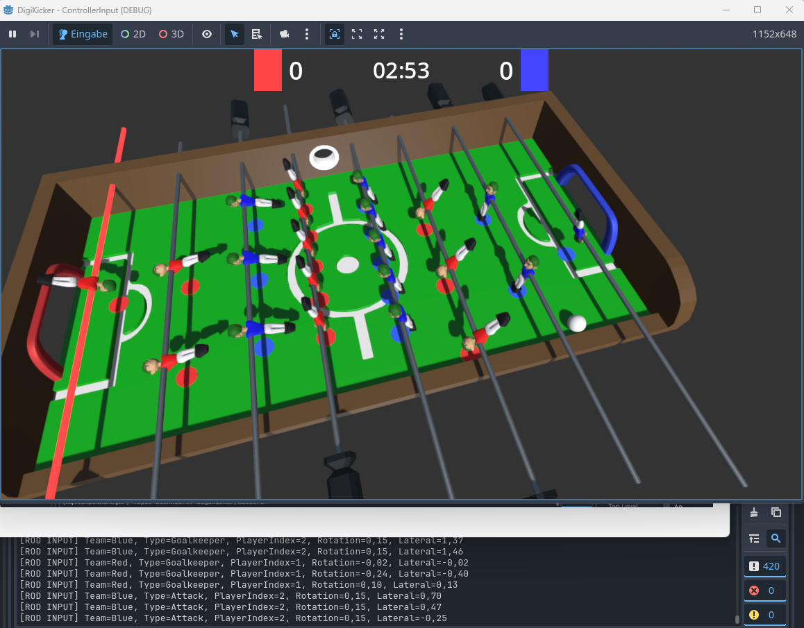

Die funktionierenden Eingaben sind hierbei in der Abbildung \ref{fig:final-fourstick-controller-simulation-controls} dargestellt. Die Stäbe lassen sich mit ihnen einwandfrei drehen und die vollständige Steuerung der Simulation ist möglich.

Da aufgrund von zeittechnischen Problemen der Ausdruck des fertigen Controller Modells nicht mehr möglich war, folgen hier zwei, mithilfe von Blender erstellte, Render der fertigen Controller-Modelle (siehe Abbildungen \ref{fig:final-fourstick-controller-render-open} und \ref{fig:final-fourstick-controller-render-closed}).

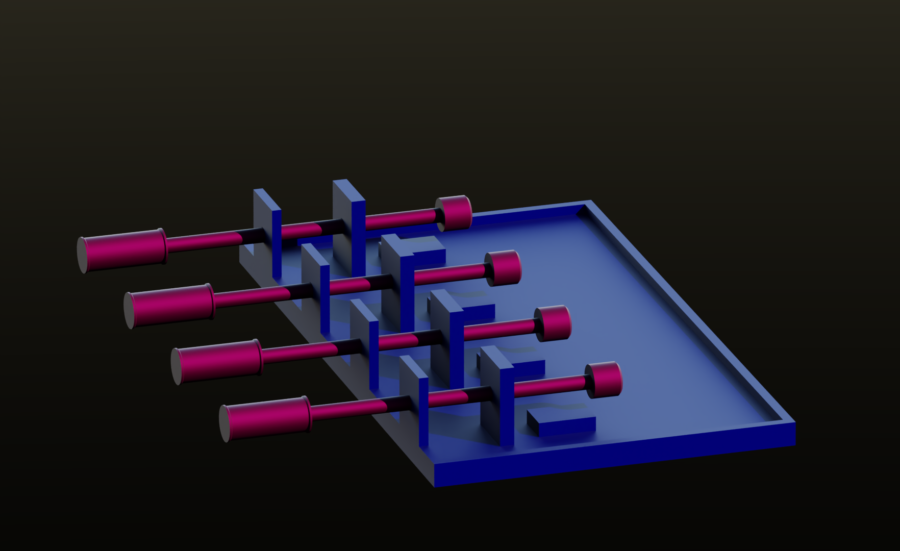

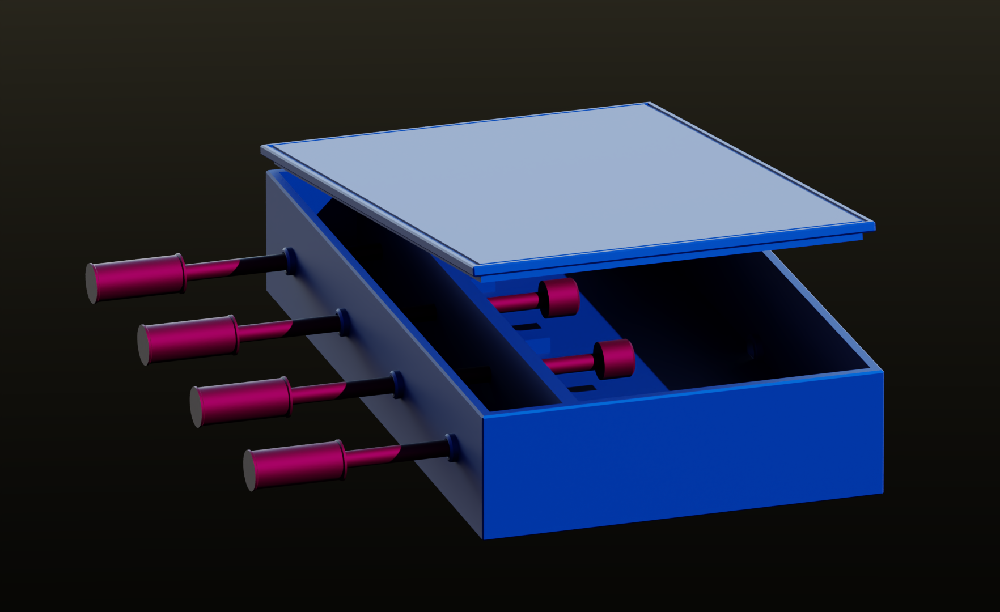

### Nachbauanleitung

Da das Projekt von Anfang an für den Open-Source-Release gedacht war, wurde zum einfachen Nachbau des Controllers sowie der Aufsetzung der Simulation eine Anleitung verfasst. Sie befindet sich wie die anderen Dateien des Projektes auf GitHub^[https://github.com/kiesewitz/DA-DigiKicker] und in ihr wird sowohl auf Deutsch als auch auf Englisch der Prozess zur Rekonstruierung des Projektes Schritt für Schritt erklärt.

Mit diesem Punkt wird der praktische Teil des Schülers Schaar konkludiert und der Teil des Schülers Rath folgt.

