# Teilaufgabe Schüler Lanzmaier
\textauthor{Luan Lanzmaier}

## Theorie

Kurzbeschreibung

### Auswahl eines Verbindungsmodells

#### P2P

Verwendung eines eigenen Servers nicht benötigt, aber Skalierbarkeit auf mehrere Teilnehmer immer schwieriger, da die einzelnen Netzwerkgeschwindigkeiten immer auf den Teilnehmer mit der geringsten Leistung "gedrosselt" werden => Spielfluss kann von einem/mehreren Teilnehmern stark verlangsamt werden.

#### Dedicated Server

Zusätzliche Serverkosten, dafür aber stabilerer Spielfluss, da er nicht vom Netzwerk einzelner abhängig ist.

### Entscheidungen für Multiplayer-Spielprinzipien

Jegliche Entscheidungen (und deren Hintergründe) hinsichtlich des Designs der Spielprinzipien für den Mehrspieler-Modus (eigene Minispiele, verschiedene Modi, etc.)

### Unterschied Offline Rendering vs Echtzeit-Rendering

#### Definition Rendering

Rendering ist im Grunde der Prozess, bei dem ein Computer 3D-Modelle in 2D-Bilder umwandelt, die man auf dem Bildschirm sieht. Grafikkarten (GPU) verwenden dafür ein Verfahren namens Rasterisierung. Dabei berechnet die GPU die Positionen der 3D-Objekte um und berechnet dann noch Farben, Texturen und Schatten dazu, um ein fertiges Bild zu bekommen.

Eine wichtige Rolle spielen dabei sogenannte Shaders – das sind kleine Programme, die festlegen, wie Licht, Reflektionen und Texturen aussehen. Es gibt auch noch fortgeschrittene Techniken wie Raytracing, die noch realistischere Ergebnisse liefern, indem sie den Weg von Lichtstrahlen nachbilden. Je nachdem, wofür man das Rendering braucht, muss man unterschiedliche Methoden wählen – manche Anwendungen brauchen schnelle Ergebnisse, andere können sich Zeit für bessere Qualität nehmen.

#### Offline Rendering (Vorrendern)

Offline Rendering ist darauf ausgelegt, Bilder mit maximaler Qualität darzustellen. Durch die hohe Qualität dauert das Offline Rendering länger. Ein Rechner kann sich beliebig viel Zeit nehmen, um ein einzelnes Bild zu berechnen – manchmal Stunden oder sogar Tage pro Frame. Dies ermöglicht eine extrem hohe visuelle Qualität mit maximalen Details, realistischen Lichtsimulationen und komplexen Effekten. Typische Anwendungsbereiche sind Filmproduktionen oder Animationen.

#### Echtzeit Rendering

Echtzeit Rendering bezeichnet die Berechnung und Darstellung von Bildern in der Interaktion mit einem Nutzer. Ein Computer muss dabei ein neues Bild in wenigen Millisekunden berechnen und anzeigen - typischerweise 30 bis 60 oder mehr Bilder pro Sekunde. Dies ist notwendig, damit eine Anwendung flüssig und reaktionsschnell wirkt. Beispiele dafür sind Computerspiele oder Virtual Reality.

#### Unterschiede und Auswirkungen auf die Asset-Erstellung

In Echtzeit-Anwendungen wie Computerspielen unterscheidet sich die Asset-Erstellung deshalb grundlegend von der für Offline-Renderings. Während bei vorgerenderten Szenen Rechenzeit eine untergeordnete Rolle spielt und maximale Detailgetreue priorisiert wird, müssen Spiel-Assets innerhalb weniger Millisekunden berechnet und dargestellt werden. Dies bedeutet, dass die visuellen Qualitätsansprüche den Performance-Anforderungen untergeordnet werden müssen. Daraus ergeben sich strenge Anforderungen an die Polygonanzahl (Geometrische Komplexität), die Materialanzahl (Draw Calls) und die Texturgröße – alle diese Faktoren beeinflussen direkt die Rechengeschwindigkeit der Engine und damit die erreichbare Bildrate (FPS).

#### High Poly vs. Low Poly

Bei der Erstellung von 3D-Assets für Spiele muss man immer einen Kompromiss zwischen visueller Qualität und Performance finden. High Poly Modelle haben viele Polygone und sehen sehr detailliert aus, brauchen aber viel Rechenleistung. Low Poly Modelle haben deutlich weniger Polygone und rendern schneller, sehen aber weniger detailliert aus. Da Echtzeit-Rendering wie in Spielen sehr schnell sein muss, kann man nicht einfach High Poly Modelle verwenden – das würde die Bildrate zu sehr senken.

Die Lösung ist, mit beiden Versionen zu arbeiten: Man erstellt zuerst ein High Poly Modell mit allen Details und berechnet davon eine Normal Map. Diese Normal Map wird dann auf ein Low Poly Modell angewendet. Für das Auge sieht das Low Poly Modell dann so aus, als wäre es High Poly, obwohl es viel weniger Polygone hat. Auf diese Weise kann man geometrische Details (Polygone) sparen und trotzdem visuell anspruchsvolle Ergebnisse erzielen. Dieser Prozess nennt sich Retopology und ist einer der wichtigsten Optimierungsschritte bei der Asset-Erstellung für Spiele.

#### Normal Mapping als Approximation

Normal Maps täuschen Details auf einer Oberfläche vor, ohne die Geometrie tatsächlich zu verändern. Mithilfe von Lichtrechnungen sieht ein einfaches Modell detailliert aus, obwohl es wenig Polygone hat. Das funktioniert, weil wir hauptsächlich Licht und Schatten wahrnehmen.

#### Retopology als Optimierungsstrategie

Retopology erstellt aus einem detaillierten High Poly Modell eine vereinfachte Low Poly Version mit deutlich weniger Polygonen. Kombiniert mit Normal Maps sieht das Ergebnis genauso gut aus, braucht aber viel weniger Rechenleistung. Das ist der Schlüssel zur Performance bei Game-Assets.

## Praktische Arbeit

Kurzbeschreibung

### Prototyping

Entwickelte Lösungsansätze für die Verbindung mehrerer Clients, Messung der verschiedenen Latenzen und Delays, Proof-of-Concept-Demos, etc.

### Modellierung/Design der Assets

Für alle Komponenten in unserer Tischfußball-Simulation werden selbst erstellte Assets verwendet.

Die Grafiksoftware "Blender" eignet sich für unser Szenario am besten, da sie als weltweiter "Standard" für Graphic Design bekannt ist und eine große Palette von Design-Funktionen mit sich bringt. Durch die große Community sind neue Lösungsansätze sowie Ideen schnell im Internet zu finden.

### Für die Simulation sind folgende zentrale Assets nötig:

#### Spielfiguren

#### Tischplatte

### Anforderungen an die 3D-Assets

Für die Tischfußball-Simulation müssen die erstellten Assets sowohl optischen als auch technischen Anforderungen gerecht werden. Da die Assets in einer interaktiven Simulation verwendet werden, ist eine Balance zwischen realistischer und performanter Darstellung notwendig.

### Zu den grundlegenden Anforderungen zählen:

### Designentscheidungen & Stilkonzept

Unser Ziel war von Beginn an, einen einheitlichen Stil aller Assets zu bewahren. Zuerst war geplant, dass wir alle Assets von einer realistischen Referenz nachgestalten. Das Problem hierbei war jedoch, dass reines nachbauen bereits existierender Gegenstände etwas langweilig ist. Wir haben uns schlussendlich für eine Mischung aus Realismus und Comic-Stil entschieden, um unsere Kreativität beim Designen freien Lauf zu lassen.

### Geringe Polygonanzahl zur Sicherstellung der Performance

In unserer Simulation ist Echtzeit-Performance extrem wichtig. Um das zu erreichen, darf die erforderliche Rechenleistung nicht zu hoch sein und das Rendern der Assets sollte während der Simulation sehr schnell erfolgen. Aus diesem Grund werden unsere Game-Assets so optimiert, dass ihre Polygonanzahl so gering wie nur möglich ist.

!Wichtig: Die GPU bzw CPU rechnet mit Triangles. 1 Polygon = 2 Tris.
Da wir stark auf die Performance achten und wollen, dass unsere Simulation auf jedem Rechner läuft, halten wir die Gesamtanzahl der Tris bei ca. 100.000.

### Korrekte Skalierung im Verhältnis zueinander

Damit die Simulation gut funktioniert, müssen die einzelnen Komponenten im Größenverhältnis zueinander passen.

### Kompatibilität mit der verwendeten Game-Engine

Unsere grafischen Komponenten werden vor der Fertigstellung häufig in der Godot-Engine getestet, um die Funktionalität sicherzustellen. Wenn es beispielsweise Probleme mit den Hitboxen gibt oder das Asset in der Engine nicht so aussieht wie erwünscht, werden Änderungen vorgenommen.

### Allgemeiner Workflow zur Asset-Erstellung

### Referenzanalyse

Zur realitätsnahen Umsetzung wurden reale Tischfußballtische sowie Spielfiguren analysiert. Dabei wurden insbesondere Proportionen, Farben und charakteristische Merkmale berücksichtigt.

### Grundmodellierung

Zu Beginn wird ein Grundmodell mit einer geringen Polygonanzahl erstellt, welches mit Sculpt-Tools so angerichtet wird, dass es der Form des Referenzmodells in etwa entspricht.

### Detailmodellierung

Durch den Einsatz des Subdivision Surface-Modifiers wird die Polygonanzahl des Grundmodells erhöht, wodurch eine feinere Geometrie entsteht. Diese bildet die Grundlage für die anschließende Detailausarbeitung mithilfe der Sculpting-Werkzeuge.

### Retopology

Um die Polygonanzahl zu minimieren, wird eine Low-Poly Kopie des bereits bestehenden Detailmodells erstellt. Bei sehr detailreichen Meshes (wie z.B. beim Kopf der Spielfigur) wird das Low-Poly Modell per Hand erstellt, damit keine wichtigen Details verloren gehen. Bei Komponenten mit wenigen Details reicht für die Retopology der Decimate Modifier.

### UV-Unwrapping

Damit man eine Mesh texturieren und Maps (Normal, Diffuse, Emition etc.) verwenden kann, muss man sie zuvor "unwrappen". Dies kann man entweder per Hand oder wie in unserem Fall mit dem Smart UV Project machen.

### Texturierung

Wenn externe Texturen benötigt werden, kann man sie jetzt mit einer Image-Texture-Node im Shader Editor hinzufügen.
Damit unsere Assets game-ready sind verwenden wir folgende Texture Maps:

#### Normal Map

Mit einer Normal Map können wir echte Oberflächendetails erzeugen, um den realistischen Look unseres Characters zu verstärken. Die geometrische Komplexität erhöht sich hierbei nicht und die Anzahl der Polygone bleiben gleich.

#### Diffuse Map

Mit einer Diffuse Map können wir die Base Color aller benutzten Materialien auf eine UV-Map projizieren. Statt für jede Farbe ein eigenes Material zu benutzen, können wir so ein Material mit allen benötigten Farben erstellen. Je weniger Materialien verwendet werden, desto geringer ist die Anzahl der Draw Calls, da jedes zusätzliche Material einen separaten Renderaufruf erfordert. Dadurch wird der Kommunikationsaufwand mit der Grafik-API reduziert, was die Performance verbessert.

#### Emission Map

Eine Emissive Map ist eine Textur, die in der 3D-Grafik bestimmt, welche Bereiche eines Modells selbst Licht aussenden, unabhängig von der Szene-Beleuchtung.
Weiße/helle Bereiche - leuchten stark.
Schwarze/dunkle Bereiche - senden kein Licht aus.
Das ist wichtig bei Materialien die beispielsweise unterschiedliche Alpha bzw. Metallic Values besitzen.

### Ausarbeitung der einzelnen Game-Assets

### Spielfigur

### Funktion

Die Spielfigur ist das zentrale visuelle Element des Spiels und trägt maßgeblich zur Wiedererkennbarkeit sowie zur Atmosphäre der Simulation bei. Sie sollte daher nicht nur optisch ansprechend und stilistisch konsistent gestaltet sein, sondern auch funktional den Anforderungen des Spiels gerecht werden.

Während der Simulation übernimmt die Spielfigur eine aktive Rolle im Spielgeschehen: Sie interagiert direkt mit dem Ball, beeinflusst dessen Bewegung und reagiert auf Spielerinputs. Aus diesem Grund ist eine saubere Geometrie essenziell, um ein realistisches und nachvollziehbares Spielverhalten zu gewährleisten.

Darüber hinaus muss die Spielfigur performant umgesetzt sein, da sie mehrfach im Spiel vorkommt. Eine optimierte Polygonanzahl in Kombination mit geeigneten Texture- und Normal Maps ermöglicht es, eine hohe visuelle Qualität beizubehalten, ohne die Performance der Simulation negativ zu beeinflussen.

### Design- und Stilentscheidung

Das Spielfiguren-Asset sollte auf den ersten Blick als klassisches „Tischfußballmännchen“ erkennbar sein, um eine klare visuelle Zuordnung zum bekannten Spielprinzip zu ermöglichen. Charakteristische Merkmale wie die vereinfachte Körperform, die aufrechte Haltung sowie die reduzierte Detailtiefe dienen dabei als grundlegende Orientierung.

Gleichzeitig wird bewusst auf direkte Referenzen realer Tischfußballfiguren verzichtet. Stattdessen wird das Design nach eigenen Vorstellungen entwickelt, um einen individuellen Stil zu schaffen und dem Asset einen eigenständigen Charakter zu verleihen. Die Formen und Proportionen sind leicht stilisiert, sodass die Spielfigur sowohl funktional als auch visuell ansprechend wirkt und sich harmonisch in das Gesamtbild der Simulation einfügt.

### Modellierung

Bei der Modellierung fängt man beim Kopf an. Die erste Aufgabe ist es eine neue Cube-Mesh mit "Shift+A" zu erstellen. Auf die Mesh wird ein Subdivision-Surface-Modifier verwendet, um die Polygon-Anzahl ein wenig zu erhöhen und man weiters grob die Form des Kopfes modellieren kann.

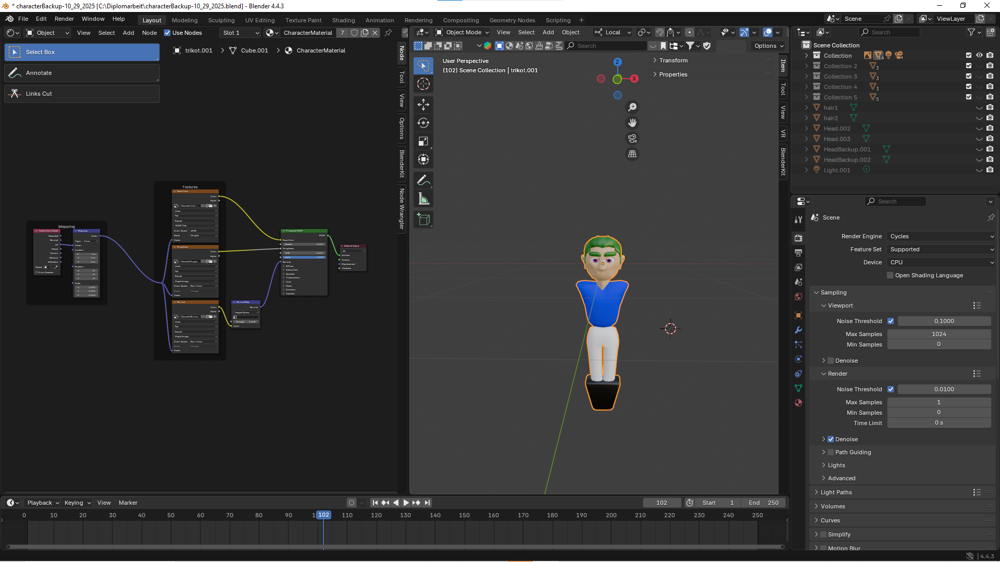

Als nächstes wird mit Sculpt Tools, wie beispielsweise dem Grab-Tool, die ungefähre Form des Kopfes geformt.

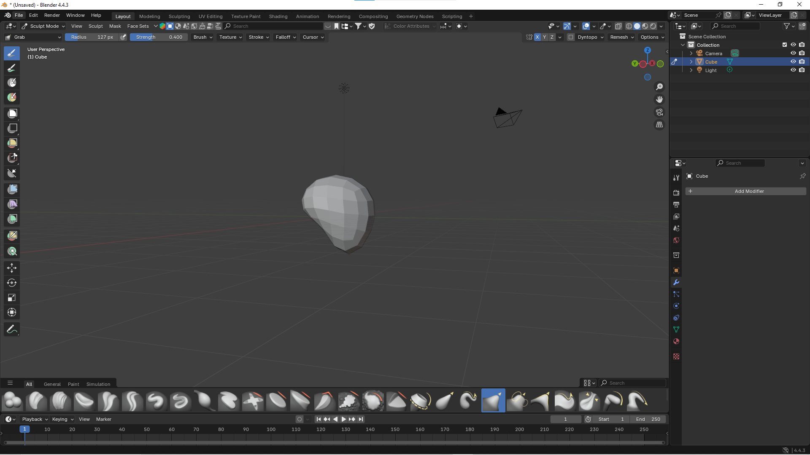
Hinweis: Bei der Grundmodellierung wählt man beim sculpten einen relativ großen Radius, da man nur die wichtigsten Merkmale hervorzuheben möchte. Um den Kopf gleichmäßig zu designen wird hier auch standardmäßig die Mesh-Symmetrie auf der X-Achse ausgewählt (rechts oben)

Für genauere Merkmale verwendet man nochmal einen Subdivision-Surface-Modifier und aktiviert Shade-Smooth. Dadurch kann man mit Sculpt-Tools, wie dem Draw-Tool oder dem Grab-Tool mit geringem Radius, mit der Detailmodellierung starten.

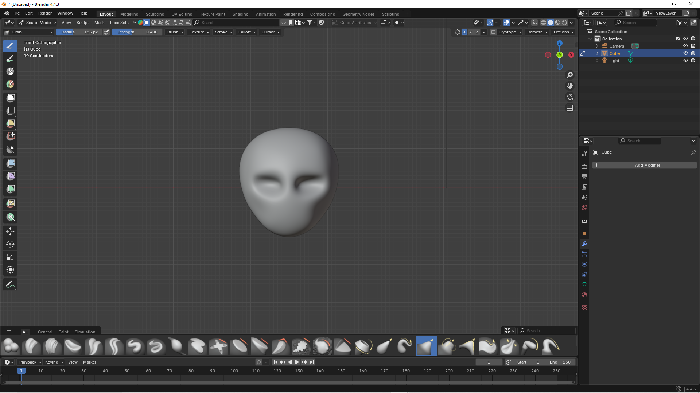

Hinweis: Nase, Augen, Ohren, Hals, Augenbrauen und Haare werden in diesem Fall als eigene Mesh designt und später mit der Haupt-Mesh (dem Kopf) mit "Ctrl+J" gejoint und "geremesht". Wenn beim "remeshen" unschöne Kanten entstehen, können diese ausgeglättet werden, in dem man mit dem Grab-Tool "Shift" gedrückt hält und damit an den Kanten entlang fährt.

Definition Remesh: Remesh in Blender ist ein Werkzeug, das die Geometrie eines 3D-Modells automatisch neu aufbaut, um eine gleichmäßigere Topologie zu erzeugen.

!Wichtig: Man sollte während diesem Prozess immer wieder Backups in Form von Collections in Blender oder als .blend-Files machen. Das ist hier besonders wichtig, da die Mesh beim Modellieren schnell vom einen auf den anderen Moment nicht so wie erwünscht aussehen kann.

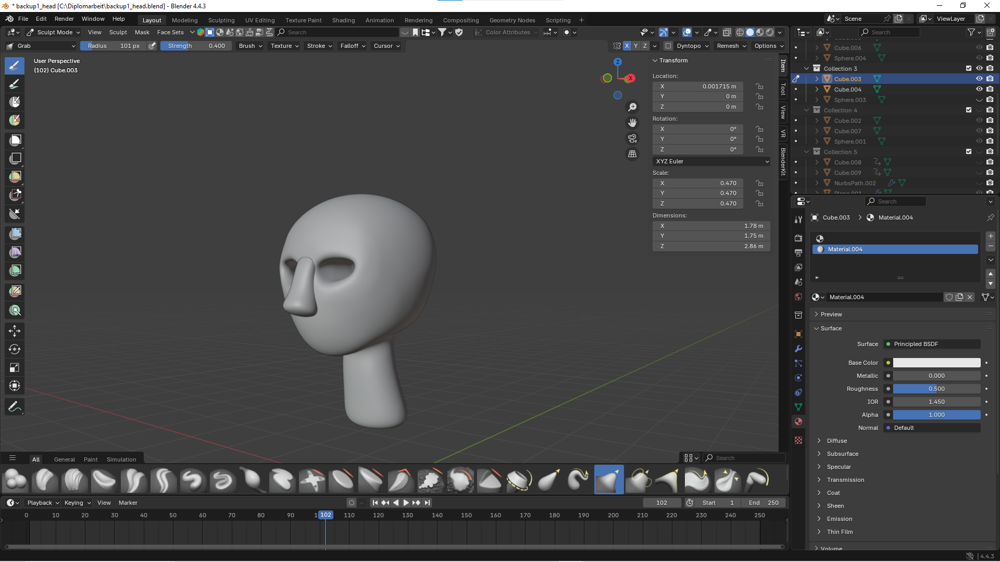

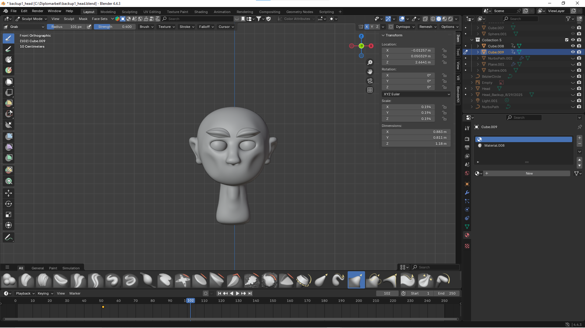

Jetzt ist es wichtig, die Anzahl der Tris zu senken. Da der Kopf ziemlich detailreich ist, verwendet man "Retopology", um eine Low-Poly-Kopie der High-Poly-Mesh zu erstellen.

Definition Retopology: Retopology ist der Prozess, in der man eine neue, saubere Low-Poly-Mesh auf der Oberfläche der High-Poly-Mesh erstellt, um das Modell performanter zu machen.

Zuerst wird eine Plane mit "Shift+A" erstellt und an der Oberfläche des High-Poly-Modells positioniert.

Zunächst aktivieren wir das Retopology Kontrollkästchen, damit man die Plane während dem Edit Mode im Vordergrund sehen kann.

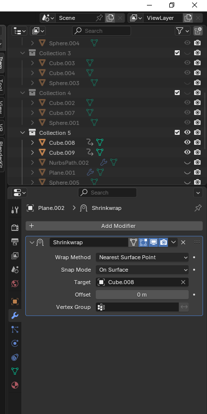

Damit die Plane genau auf dem High-Poly-Modell liegt, wird der Shrinkwrap-Modifier verwendet. Beim Target man die High-Poly-Mesh auswählen

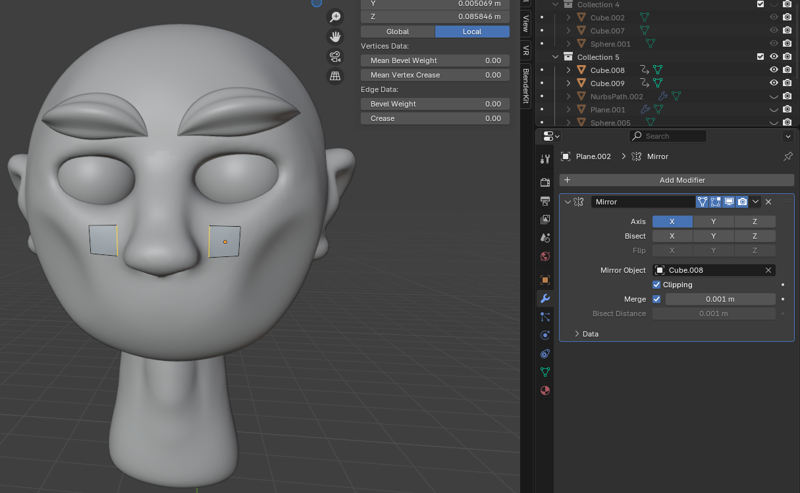

Jetzt wird der Mirror-Modifier verwendet, um die Plane an der x-Achse zu spiegeln. Das Target ist hier ebenfalls die High-Poly-Mesh.

!Wichtig: Clipping muss aktiviert sein, damit sich die beiden Planes beim späteren "Extruden" in der Mitte treffen. Bis man mit der Retopology fertig ist, darf man den Mirror-Modifier nicht anwenden.

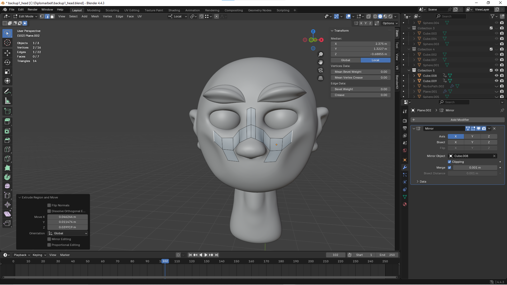

Im Edit Mode kann man die Kanten der Plane "extruden" und somit die High-Poly-Mesh nachbauen.

!Wichtig: Bei sehr detailreichen Stellen, wie in diesem Fall die Ohren bzw. die Nase, müssen wir mit "Ctrl+R" mehrere "Loop-Cuts" hinzufügen um am Ende eine saubere Kopie der Mesh zu erhalten. Die Retopology der Augen und Augenbrauen erfolgt extra, da sie einem anderen Material zugehören.

Definition Loop-Cuts: Loop-Cuts in Blender sind Werkzeuge, um neue Kanten (Loops) in ein Mesh einzufügen.

### Die fertige Low-Poly-Version
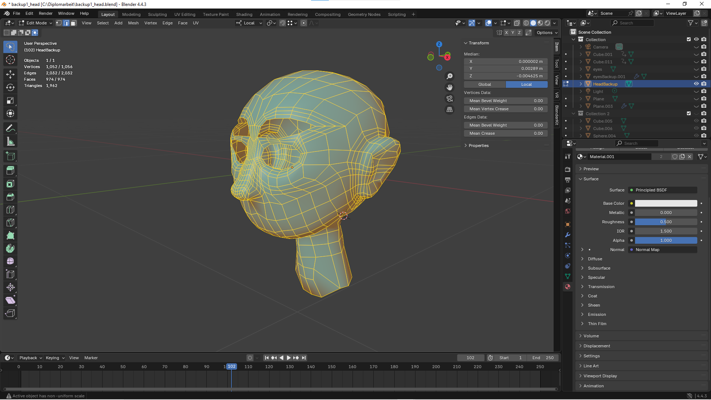

Mit einer Normal Map kann man die Low-Poly-Mesh so aussehen lassen, als wäre sie High-Poly. Dafür erstellen wir eine Normal Map der High-Poly-Version und wenden sie an der Low-Poly-Version an.

#### Normal Map erstellen
Der erste Schritt ist es, die Low-Poly-Version zu UV-Unwrappen. Dafür geht man in den "Edit-Mode", markiert alle Faces mit "A", drückt "U" und wählt "Smart UV Project" aus. Mit "Smart UV Project" versucht der Rechner so gut wie möglich aus der 3D-Mesh einzelne 2D-Parts zu machen und sie auf eine UV-Map zu projizieren. Der "Island Margin" sagt dem Rechner, wie groß der Abstand der einzelnen 2D-Parts sein soll. Ein guter Wert für den "Island Margin" ist 0.01, da er nicht zu klein ist, sodass sich die Texturen vermischen, aber auch nicht zu groß, sodass der Margin zu viel Platz auf der Map einnimmt.

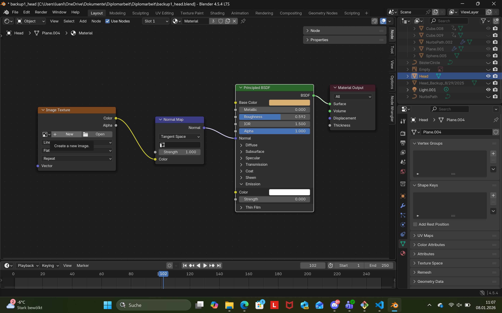
Als Nächstes wechselt man von dem 3D-Viewport in den Shader-Editor und erstellt ein neues Material für die Low-Poly-Version. Mit "Shift+A" kann man neue "Nodes" hinzufügen. Für eine Normal Map braucht man eine "Image Texture Node" und eine "Normal Map Node". Mit einer "Image Texture Node" kann man die erstellten "Texture Maps" auf ein Material abbilden. Da es sich um eine Normal Map handelt, benötigt man zusätzlich eine "Normal Map Node", um die "Image Texture" mit dem Material verbinden zu können. Auf der "Image Texture Node" klickt man auf "New", um eine neue Textur zu erstellen. Als Auflösung wählt man standardmäßig 4096px. Beim "Color Space" benötigen wir bei der Normal Map keine Farben, deshalb wählen wir "Non Color".

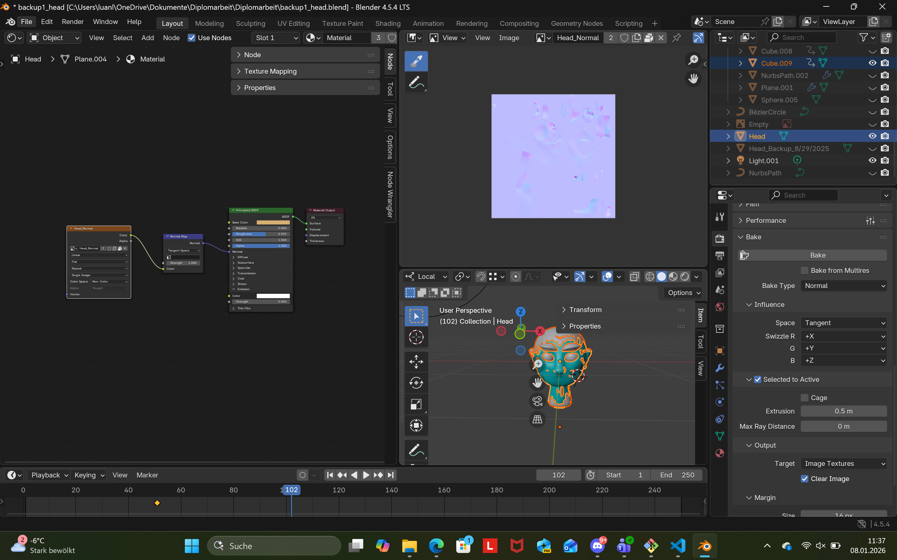
Die beiden Versionen, High-Poly und Low-Poly, müssen direkt aufeinander positioniert werden. Im Shader Editor muss die "Image Texture Node" ausgewählt werden, sodass man einen weißen Rand an der Node sehen kann. Oben rechts wählt man zuerst die High Poly-Version aus und dann die Low-Poly-Version indem man "Ctrl" gedrückt hält. Im "Render Tab" unter den "Mesh Properties" wählt man für die Render Engine "Cycles". Unter "Bake" wählt man "Bake Type Normal" und drückt auf Bake. In der "Image Editor Ansicht" kann man nun die fertige Normal Map der High-Poly-Mesh erkennen.

#### Der fertige Kopf nach Anwendung der Normal Map
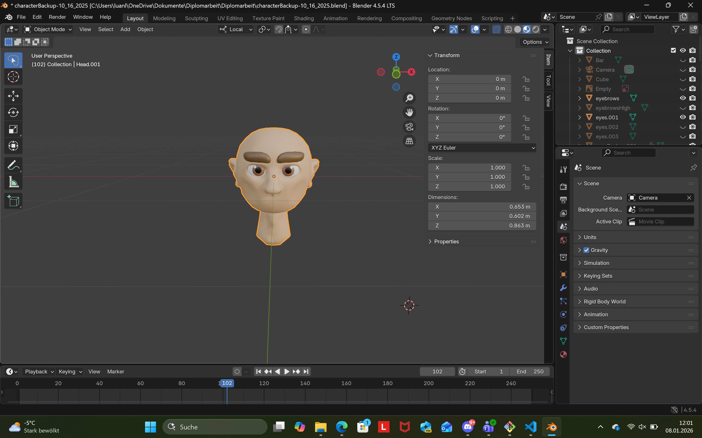

Oberkörper und Unterkörper werden nach dem gleichen Prinzip wie der Kopf designt. Da diese beiden Komponenten allerdings nicht so detailreich sind, werden die Low-Poly-Modelle nicht per Hand designt, sondern der "Decimate Modifier" wird benutzt.

#### Erstellung eines Texture Atlases für das Character-Asset
Sobald das Mesh komplett ist und die gewünschte Anzahl der Polygone erreicht wird, sollte man alle genutzten Materialien in ein Material zusammenfassen. Dadurch muss die Engine weniger Draw-Calls an die Graphic API machen, was die Performance eindeutig erhöht.

Zuerst muss man die Einzelteile des Assets in eine Mesh mit "Ctrl+J" zusammenführen. Dadurch kann man das Asset als eine Mesh UV-Unwrappen. Dass man alle Materials auf eine UV-Map bekommt, erstellt man in der "Shader Editor Ansicht" bei jedem Material ein "Image Texture Node". Am Einfachsten geht das, wenn man die Node in einem Material mit einer neuen Texture Map erstellt (4096px) und diese in die anderen Materials mit "Ctrl+C / Ctrl+V" kopiert.

Der erste Schritt ist es, die Farben aller Materials auf eine Texture Map zu projizieren. Dafür muss man bei den Mesh-Properties unter "Render" für die Render Engine "Cycles" auswählen. Die "Samples" unter "Sampling" kann man auf 1 stellen. Das verschnellert das Baken, hat aber keinen Einfluss auf das Endergebnis. Unter "Bake" wählt man für den Bake Type "Diffuse". Da wir nur die Farben projizieren wollen, können wir unter den "Contributions" "Direct" und "Indirect" weglassen und nur "Color" anklicken. Bevor man auf "Bake" klickt, sollte man sicherstellen, dass man die "Image Texture Node" bei jedem Material angeklickt hat und für "Color Space" "sRGB" ausgewählt hat. Derselbe Vorgang muss anschließend auch für die Bake Types „Normal“ und „Roughness“ durchgeführt werden, da das Character-Asset derzeit Normal Maps auf mehrere Materialien verteilt hat und zudem unterschiedliche Roughness-Werte verwendet.

!Wichtig: Unter der "Image Editor Ansicht" muss man jede neu erstellte Texture Map unter "Image -> Save As" abspeichern, weil das "Image Texture Node" nach jedem Baking-Vorgang die Texture Map überschreibt.

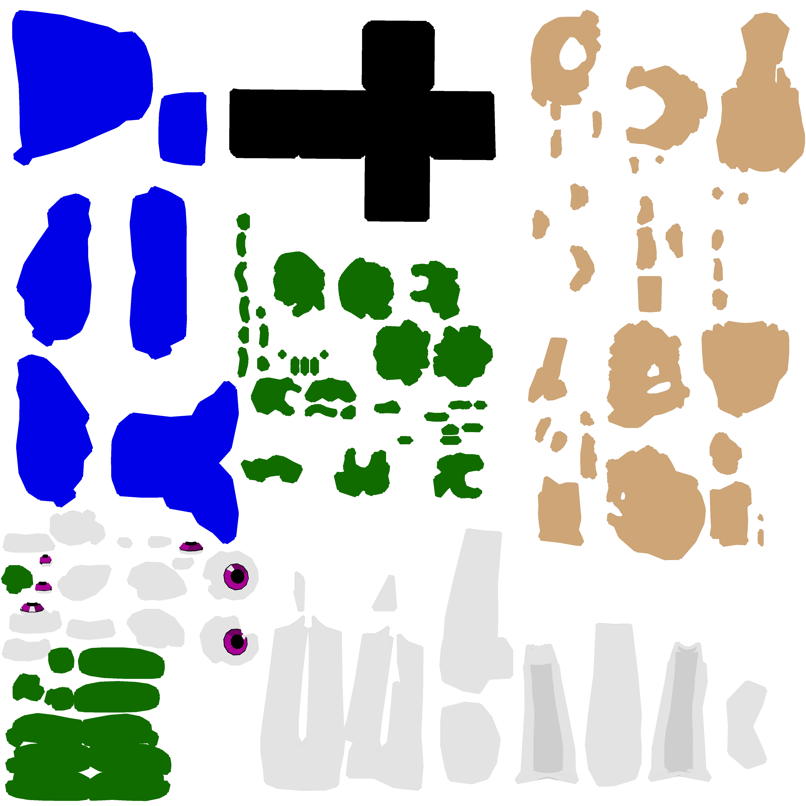
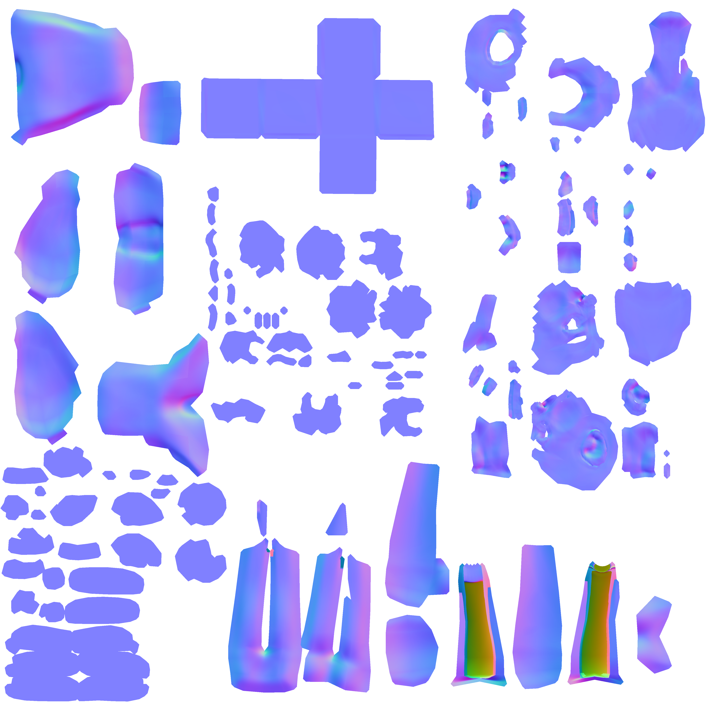
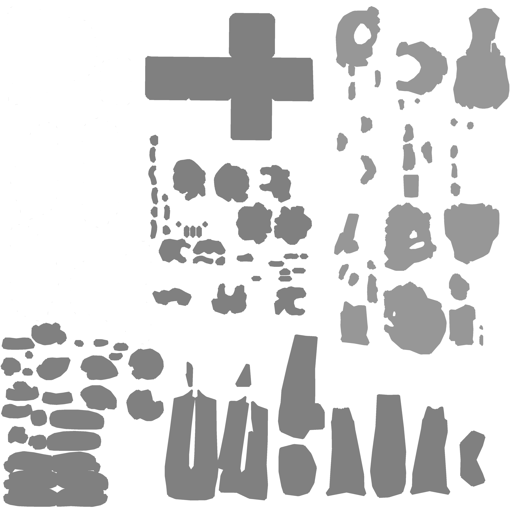
Nachdem man alle Texture Maps erstellt hat, muss man unter "Edit -> Preferences -> Add-ons" den "Node Wrangler" aktivieren, damit man gleich alle Texturen einfach in ein neues Material einbetten kann. In der "Shader Editor Ansicht" kann man nun ein neues Material erstellen. Um die Texture Maps einfach hinzufügen zu können, muss man die "Principled BSDF Node" anklicken und "Ctrl+Shift+T" drücken, um den Explorer aufzumachen. Nun wählt man alle abgespeicherten Maps aus und drückt "Enter".

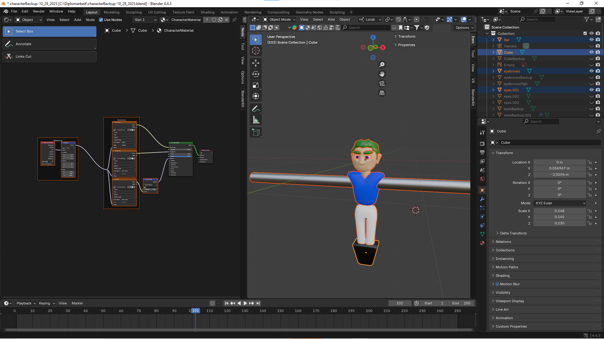

### Tischplatte

### Funktion

Die Tischplatte bildet die zentrale Spielfläche und stellt die Grundlage für die gesamte Spielsimulation dar. Auf ihr bewegen sich Ball und Spielfiguren, weshalb sie sowohl visuell klar strukturiert als auch funktional gut umgesetzt sein muss.

Neben der optischen Darstellung des Spielfeldes (z. B. Linienmarkierungen, Tore und Spielfeldbegrenzungen) erfüllt die Tischplatte eine wichtige technische Rolle: Sie definiert die Kollisionsfläche für den Bal und grenzt den Spielraum ab.

Darüber hinaus dient die Tischplatte als Referenzebene für die Positionierung weiterer Komponenten wie Spielfiguren, Stangen, Tore und Bande. Eine saubere Modellierung und korrekte Skalierung sind daher essenziell, um ein realistisches Spielgefühl sowie eine stabile und performante Simulation zu gewährleisten.

### Design- und Stilentscheidung

Die Tischplatte ist an ein klassisches Tischfußball-Spielfeld angelehnt und so gestaltet, dass sie eindeutig als Spielfläche erkennbar ist. Die grüne Grundfarbe in Kombination mit weißen Linienmarkierungen dient der klaren Darstellung des Spielfeldes und unterstützt die Orientierung während der Simulation. Zentrale Spielfeldmarkierungen wie Mittellinie, Mittelkreis, Strafräume und Torbereiche sind reduziert, aber eindeutig dargestellt.

Die seitlichen Banden sind farblich dunkler gehalten, um eine klare Abgrenzung zur Spielfläche zu schaffen. Die Tore sind farblich unterschiedlich (rot und blau) gestaltet, um die beiden Spielseiten eindeutig voneinander zu unterscheiden.

Insgesamt wurde ein funktionales und übersichtliches Design gewählt, das den Fokus auf Spielbarkeit und Lesbarkeit legt. Auf unnötige Details wurde bewusst verzichtet, um die Performance nicht zu beeinträchtigen und eine klare visuelle Struktur zu gewährleisten.

### Modellierung

Als Grundlage für die Tischplatte erstellt man mit "Shift+A" eine neue Cube-Mesh. Diese skaliert man mit "S+X" in Richtung der x-Achse, sodass die Größe verhältnismäßig mit einem Tischfußballtisch zusammenpasst. Um Eine Box, welche oben offen ist, zu erschaffen, wird der "Boolean Modifier" verwendet. Hierfür wird die bereits erstellte Mesh kopiert und ein wenig runterskaliert. Weiters postioniert man die kopierte Mesh so, dass sie an der größeren Cube-Mesh oben hinausschaut. Jetzt wendet man auf der größeren Cube-Mesh den "Boolean Modifier" an. Als Target wählt man die kleinere Mesh. Jetzt wurde die Grundlage für die Tischplatte erstellt.

Für die Tore und die Löcher, an denen der Ball reingeworfen wird, verwendet man die gleiche Methode. Zuerst werden die Formen als separate Meshes erstellt. Mit dem "Boolean Modifier" kann man jetzt die Löcher erschaffen, in dem man die separaten Meshes als Target auswählt. Auch für die Bodenmarkierungen werden zuerst dementsprechende Meshes erstellt und per "Boolean Modifier" hinzugefügt. Für ein schöneres Aussehen, werden die Bodenmarkierungen mit "E" nach unten "extrudet.

!Wichtig: Damit die Hitbox für das Spielfeld in der Engine richtig erstellt werden kann, muss über den Bodenmarkierungen, die jetzt weiter unten liegen, einen unsichtbaren Boden erstellen. Dafür erstellt man ein neues Material und stellt den "Alpha Value" auf 0.

Auch bei den Materials auf der Vorderseite wird der "Alpha Value" auf 0 gesetzt, sodass man während der Simulation alles sehen kann. Alle Materialien werden auch hier einer "Diffuse Map zugeordnet. Die verschiedenen "Alpha-Values" werden auf einer "Emission Map" dargestellt.

### Optisches Design/Arrangement des Spiels

Design der Assets im Spiel, Stilisierte Darstellung und Design-Iterationen

### Fine-Tuning der Assets

Änderungen für die finale Version, etc.

### Finalisiertes Spiel
