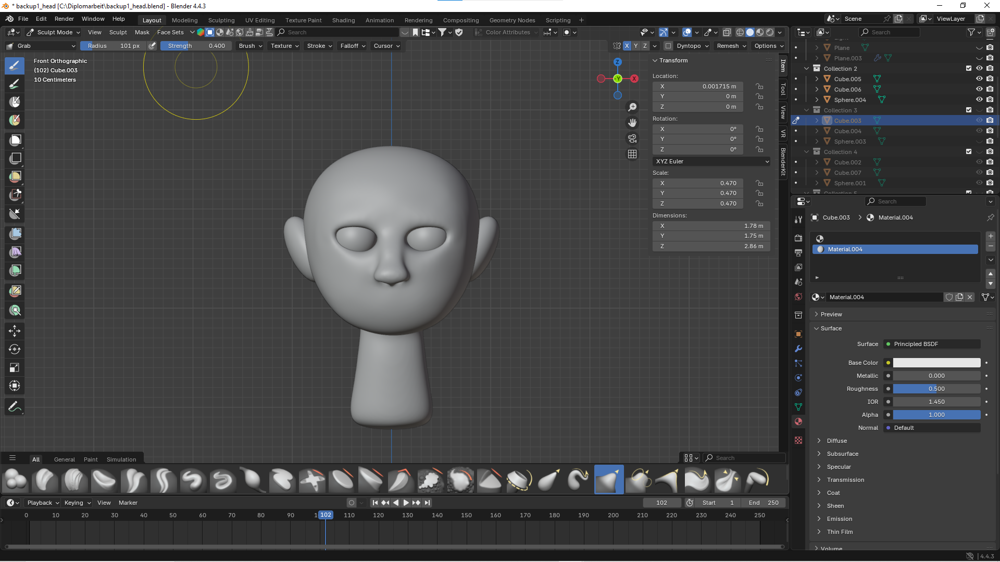
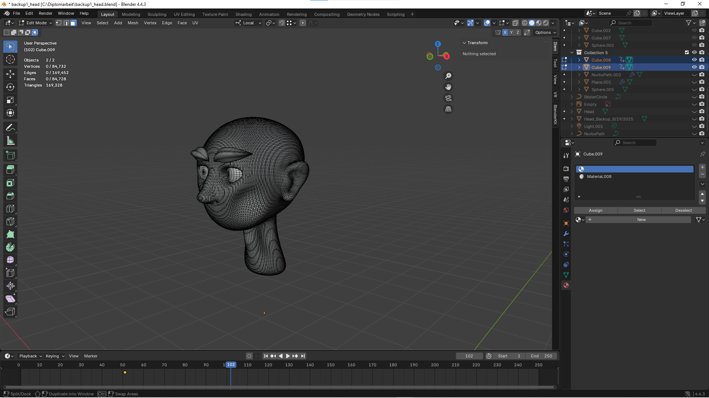
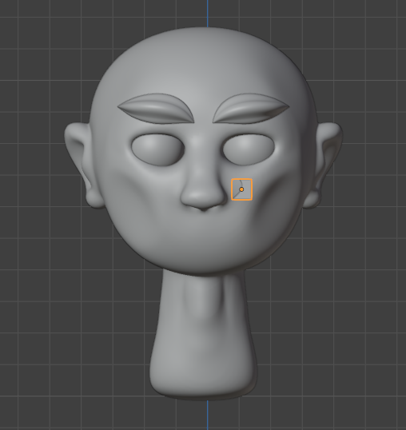
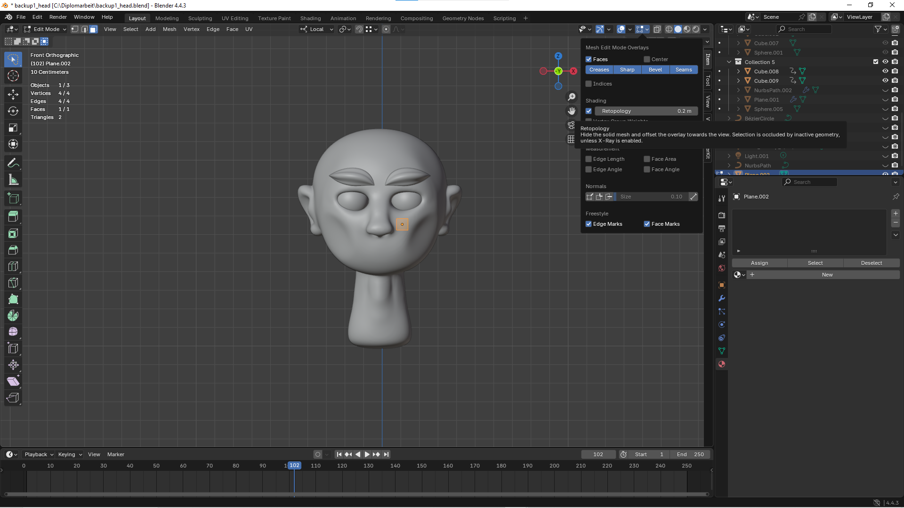
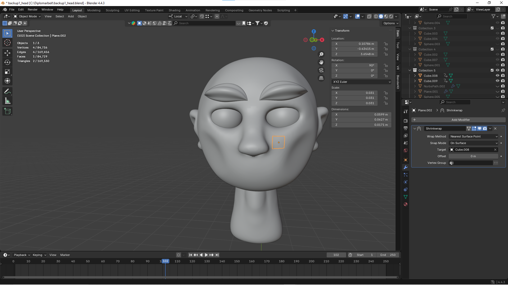
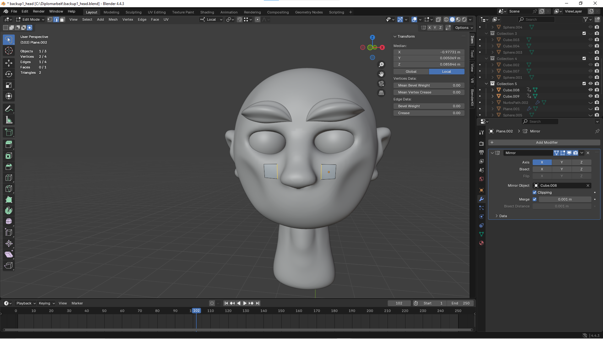

# Teilaufgabe Schüler Lanzmaier
\textauthor{Luan Lanzmaier}

## Theorie

Kurzbeschreibung

### Auswahl eines Verbindungsmodells

Kriterien

#### P2P

Verwendung eines eigenen Servers nicht benötigt, aber Skalierbarkeit auf mehrere Teilnehmer immer schwieriger, da die einzelnen Netzwerkgeschwindigkeiten immer auf den Teilnehmer mit der geringsten Leistung "gedrosselt" werden => Spielfluss kann von einem/mehreren Teilnehmern stark verlangsamt werden.

#### Dedicated Server

Zusätzliche Serverkosten, dafür aber stabilerer Spielfluss, da er nicht vom Netzwerk einzelner abhängig ist.

### Entscheidungen für Multiplayer-Spielprinzipien

Jegliche Entscheidungen (und deren Hintergründe) hinsichtlich des Designs der Spielprinzipien für den Mehrspieler-Modus (eigene Minispiele, verschiedene Modi, etc.)

## Praktische Arbeit

Kurzbeschreibung

### Prototyping

Entwickelte Lösungsansätze für die Verbindung mehrerer Clients, Messung der verschiedenen Latenzen und Delays, Proof-of-Concept-Demos, etc.

### Modellierung/Design der Assets

Für alle Komponenten in unserer Tischfußball-Simulation werden selbst erstellte Assets verwendet.

Die Grafiksoftware "Blender" eignet sich für unser Szenario am besten, da sie als weltweiter "Standard" für Graphic Design bekannt ist und eine große Palette von Design-Funktionen mit sich bringt. Durch die große Community sind neue Lösungsansätze sowie Ideen schnell im Internet zu finden.

### Für die Simulation sind folgende zentrale Assets nötig:

#### Spielfiguren

#### Tischplatte

#### Fußball

### Anforderungen an die 3D-Assets

Für die Tischfußball-Simulation müssen die erstellten Assets sowohl optischen als auch technischen Anforderungen gerecht werden. Da die Assets in einer interaktiven Simulation verwendet werden, ist eine Balance zwischen realistischer und performanter Darstellung notwendig.

### Zu den grundlegenden Anforderungen zählen:

### Designentscheidungen & Stilkonzept

Unser Ziel war von Beginn an, einen einheitlichen Stil aller Assets zu bewahren. Zuerst war geplant, dass wir alle Assets von einer realistischen Referenz nachgestalten. Das Problem hierbei war jedoch, dass reines nachbauen bereits existierender Gegenstände etwas langweilig ist. Wir haben uns schlussendlich für eine Mischung aus Realismus und Comic-Stil entschieden, um unsere Kreativität beim Designen freien Lauf zu lassen.

### Geringe Polygonanzahl zur Sicherstellung der Performance

In unserer Simulation ist Echtzeit-Performance extrem wichtig. Um das zu erreichen, darf die erforderliche Rechenleistung nicht zu hoch sein und das Rendern der Assets sollte während der Simulation sehr schnell erfolgen. Aus diesem Grund werden unsere Game-Assets so optimiert, dass ihre Polygonanzahl so gering wie nur möglich ist.

!Wichtig: Die GPU bzw CPU rechnet mit Triangles. 1 Polygon = 2 Tris.
Da wir stark auf die Performance achten und wollen, dass unsere Simulation auf jedem Rechner läuft, halten wir die Gesamtanzahl der Tris bei ca. 100.000.

### Korrekte Skalierung im Verhältnis zueinander

Damit die Simulation gut funktioniert, müssen die einzelnen Komponenten im Größenverhältnis zueinander passen.

### Kompatibilität mit der verwendeten Game-Engine

Unsere grafischen Komponenten werden vor der Fertigstellung häufig in der Godot-Engine getestet, um die Funktionalität sicherzustellen. Wenn es beispielsweise Probleme mit den Hitboxen gibt oder das Asset in der Engine nicht so aussieht wie erwünscht, werden Änderungen vorgenommen.

### Allgemeiner Workflow zur Asset-Erstellung

### Referenzanalyse

Zur realitätsnahen Umsetzung wurden reale Tischfußballtische sowie Spielfiguren analysiert. Dabei wurden insbesondere Proportionen, Farben und charakteristische Merkmale berücksichtigt.

### Grundmodellierung

Zu Beginn wird ein Grundmodell mit einer geringen Polygonanzahl erstellt, welches mit Sculpt-Tools so angerichtet wird, dass es der Form des Referenzmodells in etwa entspricht.

### Detailmodellierung

Durch den Einsatz des Subdivision Surface-Modifiers wird die Polygonanzahl des Grundmodells erhöht, wodurch eine feinere Geometrie entsteht. Diese bildet die Grundlage für die anschließende Detailausarbeitung mithilfe der Sculpting-Werkzeuge.

### Retopology

Um die Polygonanzahl zu minimieren, wird eine Low-Poly Kopie des bereits bestehenden Detailmodells erstellt. Bei sehr detailreichen Meshes (wie z.B. beim Kopf der Spielfigur) wird das Low-Poly Modell per Hand erstellt, damit keine wichtigen Details verloren gehen. Bei Komponenten mit wenigen Details reicht für die Retopology der Decimate Modifier.

### UV-Unwrapping

Damit man eine Mesh texturieren und Maps (Normal, Diffuse, Emition etc.) verwenden kann, muss man sie zuvor "unwrappen". Dies kann man entweder per Hand oder wie in unserem Fall mit dem Smart UV Project machen.

### Texturierung

Wenn externe Texturen benötigt werden, kann man sie jetzt mit einer Image-Texture-Node im Shader Editor hinzufügen.
Damit unsere Assets game-ready sind verwenden wir folgende Texture Maps:

#### Normal Map

Mit einer Normal Map können wir echte Oberflächendetails erzeugen, um den realistischen Look unseres Characters zu verstärken. Die geometrische Komplexität erhöht sich hierbei nicht und die Anzahl der Polygone bleiben gleich.

#### Diffuse Map

Mit einer Diffuse Map können wir die Base Color aller benutzten Materialien auf eine UV-Map projizieren. Statt für jede Farbe ein eigenes Material zu benutzen, können wir so ein Material mit allen benötigten Farben erstellen. Je weniger Materialien verwendet werden, desto geringer ist die Anzahl der Draw Calls, da jedes zusätzliche Material einen separaten Renderaufruf erfordert. Dadurch wird der Kommunikationsaufwand mit der Grafik-API reduziert, was die Performance verbessert.

#### Emission Map

Eine Emissive Map ist eine Textur, die in der 3D-Grafik bestimmt, welche Bereiche eines Modells selbst Licht aussenden, unabhängig von der Szene-Beleuchtung.
Weiße/helle Bereiche - leuchten stark.
Schwarze/dunkle Bereiche - senden kein Licht aus.
Das ist wichtig bei Materialien die beispielsweise unterschiedliche Alpha bzw. Metallic Values besitzen.

### Ausarbeitung der einzelnen Game-Assets

### Spielfigur

### Funktion

Die Spielfigur ist das zentrale, visuelle Element. Sie sollte optisch gut umgesetzt sein aber auch während der Simulation ihren Zweck erfüllen können.

### Design- und Stilentscheidung

Das Spielfiguren-Asset sollte oberflächlich als "Tischfußballmännchen" wiedererkennbar sein. Nichtsdestotrotz verwenden wir für die Details keine Referenzen, sondern designen ihn nach unseren eigenen Vorstellungen.

### Modellierung

Bei der Modellierung fangen wir beim Kopf an. Die erste Aufgabe ist es eine neue Cube-Mesh mit "Shift+A" zu erstellen. Auf die Mesh wird ein Subdivision-Surface-Modifier verwendet, um die Polygon-Anzahl ein wenig zu erhöhen und wir weiters grob die Form des Kopfes modellieren können.

Als nächstes wird mit Sculpt Tools, wie beispielsweise dem Grab-Tool, die ungefähre Form des Kopfes geformt.

Hinweis: Bei der Grundmodellierung wählt man beim sculpten einen relativ großen Radius, da man nur die wichtigsten Merkmale hervorzuheben möchte. Um den Kopf gleichmäßig zu designen wird hier auch standardmäßig die Mesh-Symmetrie auf der X-Achse ausgewählt (rechts oben)

Für genauere Merkmale verwenden wir nochmal einen Subdivision-Surface-Modifier und aktivieren Shade-Smooth. Dadurch können wir mit Sculpt-Tools, wie dem Draw-Tool oder dem Grab-Tool mit geringem Radius, mit der Detailmodellierung starten.

Hinweis: Nase, Augen, Ohren, Hals, Augenbrauen und Haare werden in diesem Fall als eigene Mesh designt und später mit der Haupt-Mesh (dem Kopf) mit "Ctrl+J" gejoint und "geremesht". Wenn beim "remeshen" unschöne Kanten entstehen, können diese ausgeglättet werden, in dem man mit dem Grab-Tool "Shift" gedrückt hält und damit an den Kanten entlang fährt.

Definition Remesh: Remesh in Blender ist ein Werkzeug, das die Geometrie eines 3D-Modells automatisch neu aufbaut, um eine gleichmäßigere Topologie zu erzeugen.

!Wichtig: Man sollte während diesem Prozess immer wieder Backups in Form von Collections in Blender oder als .blend-Files machen. Das ist hier besonders wichtig, da die Mesh beim Modellieren schnell vom einen auf den anderen Moment nicht so wie erwünscht aussehen kann.

Jetzt ist es wichtig, die Anzahl der Tris zu senken. Da der Kopf ziemlich detailreich ist, verwenden wir Retopology um eine Low-Poly-Kopie der High-Poly-Mesh zu erstellen.

Definition Retopology: Retopology ist der Prozess, in der man eine neue, saubere Low-Poly-Mesh auf der Oberfläche der High-Poly-Mesh erstellt, um das Modell performanter zu machen.

Zuerst wird eine Plane mit "Shift+A" erstellt und an der Oberfläche des High-Poly-Modells positioniert.

Zunächst aktivieren wir das Retopology Kontrollkästchen, damit man die Plane während dem Edit Mode im Vordergrund sehen kann.

Damit die Plane genau auf dem High-Poly-Modell liegt, wird der Shrinkwrap-Modifier verwendet. Beim Target man die High-Poly-Mesh auswählen

Jetzt wird der Mirror-Modifier verwendet, um die Plane an der x-Achse zu spiegeln. Das Target ist hier ebenfalls die High-Poly-Mesh.

!Wichtig: Clipping muss aktiviert sein, damit sich die beiden Planes beim späteren "Extruden" in der Mitte treffen. Bis man mit der Retopology fertig ist, darf man den Mirror-Modifier nicht anwenden.

Im Edit Mode kann man die Kanten der Plane "extruden" und somit die High-Poly-Mesh nachbauen.

!Wichtig: Bei sehr detailreichen Stellen, wie in diesem Fall die Ohren bzw. die Nase, müssen wir mit "Ctrl+R" mehrere "Loop-Cuts" hinzufügen um am Ende eine saubere Kopie der Mesh zu erhalten. Die Retopology der Augen und Augenbrauen erfolgt extra, da sie einem anderen Material zugehören.

Definition Loop-Cuts: Loop-Cuts in Blender sind Werkzeuge, um neue Kanten (Loops) in ein Mesh einzufügen.

### Die fertige Low-Poly-Version

Der nächste Schritt ist es, die Low-Poly-Mesh noch mehr so aussehen zu lassen, als wäre sie High-Poly. Dafür erstellen wir eine Normal Map der High-Poly-Version und wenden sie an der Low-Poly-Version an.

Der erste Schritt ist es, die Low-Poly-Version zu UV-Unwrappen. Dafür geht man in den "Edit-Mode", markiert alles mit "A", drückt "U" und wählt "Smart UV Project" aus. Mit "Smart UV Project" versucht der Rechner so gut wie möglich aus der 3D-Mesh einzelne 2D-Parts zu machen und sie auf eine UV-Map zu projizieren. Der "Island Margin" sagt dem Rechner, wie groß der Abstand der einzelnen 2D-Parts sein soll. Ein guter Wert für den "Island Margin" ist 0.01, da es nicht zu klein ist, sodass sich die Texturen vermischen, aber auch nicht zu groß, sodass der Margin zu viel Platz einnimmt.

### Optisches Design/Arrangement des Spiels

Design der Assets im Spiel, Stilisierte Darstellung und Design-Iterationen

### Fine-Tuning der Assets

Änderungen für die finale Version, etc.

### Finalisiertes Spiel
