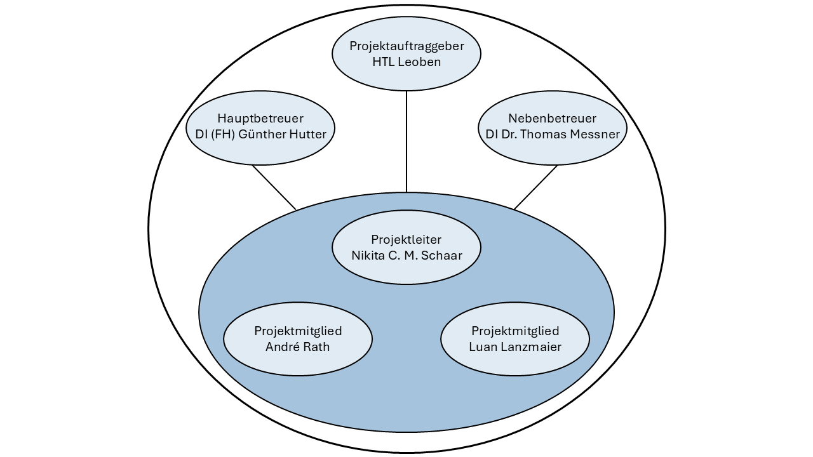

# Projekthandbuch
\textauthor{Nikita Schaar}

## Entwicklungsplan

### Projektauftrag

Die Digitalisierung eines Tischfußballtisches ist die grundlegende Aufgabenstellung dieser Diplomarbeit. Nach einigem Recherchieren haben wir festgestellt, dass technologisch-unterstützte Tischfußballtische mit eingebauter Gegner-KI existieren, ein Projekt nach unserer Idee jedoch noch von keinem entwickelt wurde. 

Die Hauptfrage der Arbeit ist dabei, ob solch ein virtueller Tisch zuverlässig funktionieren kann und in welchen Hinsichten er sich vom Original unterscheidet. Als Lösung ist es vorgesehen, eine digitale Simulation des Tischfußballtisches in Form eines Spiels zu entwickeln, welche über einen physischen Controller gesteuert wird. Dieser soll in einer eigens entwickelten Hülle gebaut werden, die einem echten Tisch in puncto Spielgefühl so nahekommen soll wie möglich. Das Design der Umhüllung soll nach eigenem Geschmack stilisiert, jedoch attraktiv gestaltet werden. Bei der Simulation wird ein größerer Fokus auf stilisierte Grafiken und eine nicht komplett realistische Darstellung der Spielwelt gelegt, damit sich das Endprodukt nicht wie ein bloßes digitales Abbild anfühlt.

#### Projektziele

* Entwicklung einer digitalen Simulation eines Tischfußballtisches in Form eines Spiels

* Entwicklung eines physischen Controllers zur Steuerung der Simulation auf Basis von  Sensoren und Mikrocontrollern, in einer eigens entwickelten Hülle, die einem echten Tischfußballtisch vom Spielgefühl und Aussehen ähneln soll

* Umsetzung eines Einzelspielermodus, sodass ein Spieler jederzeit alleine spielen bzw. trainieren kann

* Erstellung und Training eines KI-Modells, welches als künstlicher Gegner fungiert

* Implementierung eines Mehrspielermodus für das gemeinsame Spiel mit anderen Personen, sowohl lokal als auch über eine drahtlose Verbindung

* Gestaltung stilisierter Grafiken, Designs und visueller Assets für eine nicht komplett realistische Darstellung der Spielwelt

#### Nicht-Ziele

* Kein digitaler Klon eines Tischfußballtisches, der sich so realitätsnah wie möglich anfühlt, da der Fokus auf einer spielerischen Simulation mit stilisiertem Design liegt

#### Projektnutzen

Für die HTL Leoben entsteht ein Projekt, welches z. B. beim Tag der offenen Tür präsentiert werden kann. Damit könnte man Interessierten Einblicke in mögliche Ergebnisse einer Laufbahn an der Schule geben. Da es eine sehr themenübergreifende Arbeit ist, können Informationen zu Hardware- /Spieleentwicklung und Netzwerkkommunikation anhand von Beispielen in der Arbeit einfach erklärt werden. Außerdem könnte dieses Projekt von zukünftigen Klassen für eine Diplomarbeit erweitert werden und schafft so der Schule zusätzlichen Mehrwert.

Technisch gesehen wird durch die Entwicklung des physischen Controllers untersucht/demonstriert, inwieweit sich das Spielgefühl von einem echten Tischfußballtisch auf eine digitale Umgebung übertragen lässt. Diese Erkenntnisse sind auch über das Projekt hinaus von Interesse und möglicherweise ließen sich Teile davon in der tatsächlichen Industrie wiederverwenden. Da die Diplomarbeit Open-Source ist und sich dadurch jede:r Interessent:in daran probieren kann, es weiterzuentwickeln, ist es für den generellen technischen Fortschritt zusätzlich nützlich.

Für den Endnutzer bietet die Arbeit einen konkreten Vorteil im Vergleich zu einem klassischen Tischfußballtisch: Ein Spieler kann jederzeit und ohne weitere Mitspieler gegen eine KI trainieren, während gleichzeitig die Möglichkeit besteht, mit anderen Personen lokal oder drahtlos gegeneinander anzutreten.

#### Projektauftraggeber

Die Diplomarbeit "DigiKicker - Digitalisierung eines Tischfußballtisches" findet in Zusammenarbeit mit der HTL Leoben statt. Sie wird betreut von Ing. DI(FH) Günther Hutter, Msc. in der Rolle des Hauptbetreuers, sowie DI Dr. mont Thomas Messner als Zweitbetreuer.

#### Projekttermine

| Termin | Inhalt |
|--:|:--|
| 12.09.2025 | DA-Portal befüllt |
| 10.11.2025 | 1. DA-Präsentation |
| 09.01.2026 | DA-Erstversion elektronisch an Betreuer übermittelt |
| 26.02.2026 | 2. DA-Präsentation |
| 06.03.2026 | DA-Abgabe |
| 23.03.2026 | DA-Durchsicht mit Betreuer |
| 27.03.2026 | DA-Portal mit Hr. Messner abgeschlossen |
| 07.04.2026 | Abgabe – Bibliotheksversion der DA |
| 08.04.2026 | 3. DA-Präsentation |

: Projektterminübersicht

#### Projektkosten

Die Preise welche für die Gesamtkosten der Hardware herangezogen wurden entsprechen jenen, die im Kapitel "Vergleich der Optionen & Entscheidung" genauer aufgelistet sind. Für die 3D-Druck-Filamentkosten wird sich an aktuellen Preisen orientiert. Für eine genaue Aufschlüsselung der geplanten Projektkosten - in Form von einer Tabellenkalkulation [@table-calculations-total-cost] - wird wieder auf den Anhang verwiesen.

| Kostenstelle  | Kostenart | Menge  | Preis   | Gesamtkosten | Deckung durch |
|:-------------|:---------:|:------:|--------:|-------------:|---------------|
| Fertiger Controller | Hardware | 2 | 135.21€ | 270.42€ | Schüler |
| Gebundene DA-Abgabe | Druck | 4 | 27.90€ | 111.60€ | Schüler |
| Gebundene DA-Abgabe | Druck | 1 | 27.90€ | 27.90€ | Schulischen Betreuer |

: Geplante Projektkosten

**Das Projekt sollte in Summe ungefähr 409.92 € kosten.**

| Kostenstelle  | Kostenart | Menge  | Preis   | Gesamtkosten | Deckung durch |
|:-------------|:---------:|:------:|--------:|-------------:|---------------|
| Fertiger Controller | Hardware | 2 | xx.xx€ | xx.xx€ | Schüler |
| Gebundene DA-Abgabe | Druck | 4 | xx.xx€ | xx.xx€ | Schüler |
| Gebundene DA-Abgabe | Druck | 1 | xx.xx€ | xx.xx€ | Schulischen Betreuer |

: Tatsächliche Projektkosten

**Das Projekt kostet in Summe: xx.xx €**

#### Projektrisiken

| Risiko | EW | Auswirkungen | Maßnahmen |
|:--------------:|:---:|:----------------|:--------------|
| Verzögerungen bei KI-Entwicklung | 15% | KI-Gegner nicht rechtzeitig zur Präsentation fertig | Frühzeitig mit Training beginnen, Komplexität bei Bedarf reduzieren |
| Verbindungsprobleme bei Mehrspielermodus | 25% | Gegeneinanderspielen online nicht möglich | Lokalen Mehrspielermodus als Fallback sicherstellen |
| Schlechte Sensorgenauigkeit | 35% | Gefühl weicht stark von echtem Tischfußballtisch ab | Frühes Testen und Kalibrieren der Sensoren |
| Verzögerung durch Probleme im Team | 25% | Termine gefährdet | Regelmäßige Meetings und klare Aufgabenverteilung |

: Projektrisiken

### Projektorganisation

#### Projektbeteiligte
Diese Tabelle stellt alle Personen - mit ihrer dazugehörigen Organisation und ihren Kontaktdaten - dar, die an dieser Diplomarbeit beteiligt sind.

| Vorname     | Nachname     | Organisation | Kontaktinfos      |
|:------------|:-------------|:-------------|:------------------|
| Nikita Crain Mustafa | Schaar | HTL Leoben | 211wita20@o365.htl-leoben.at |
| André | Rath | HTL Leoben | 211wita19@o365.htl-leoben.at |
| Luan | Lanzmaier | HTL Leoben | 211witb14@o365.htl-leoben.at |
| Günther | Hutter | HTL Leoben | hg@o365.htl-leoben.at |
| Thomas | Messner | HTL Leoben | me@o365.htl-leoben.at |

: Projektbeteiligte

#### Projektrollen

Hier werden die konkreten Rollen im Projekt der Kontakte aus der oberen Tabelle aufgelistet.

| Projektrolle           | Rollenbeschreibung     | Name              |
|------------------------|------------------------|-------------------|
| Projektleiter | Verantwortlicher für Einhaltung des Projektrahmens / Erfüllung eigener Teilaufgabe | Nikita C. M. Schaar |
| Projektmitglied | Erfüllung eigener Teilaufgabe | André Rath |
| Projektmitglied | Erfüllung eigener Teilaufgabe | Luan Lanzmaier |
| Auftraggeber | Auftraggeber der internen Diplomarbeit | HTL Leoben |
| Betreuer | Schulischer Betreuer | Günther Hutter |
| Betreuer | Schulischer Betreuer | Thomas Messner |

: Projektrollen

### Vorgehen bei Änderungen

- Wer wird informiert
  - Alle Projektbeteiligten
- Wer muss zustimmen
  - Projektleiter od. Haupt- bzw. Nebenbetreuer bei möglicher Verhinderung
- Wo werden die Änderungen wie vermerkt?
  - Github Repository mittels Commits
  - Bei schwerwiegenden Änderungen in der Umsetzung des Projektes wird direkt in der Arbeit darauf eingegangen

## Meilensteine

### 12.09.2025: DA-Portal befüllt

- Projektbeschreibung und Teammitglieder im DA-Portal eingetragen
- Grundlegende Projektdaten vollständig erfasst

### 10.11.2025: 1. DA-Präsentation

- Aktueller Projektfortschritt wurde Schülern, Professoren, Hr. Hofer und Fr. Gmundtner präsentiert
- Bisherige Ergebnisse und Zwischenstände sind dokumentiert
- Feedback des Betreuers entgegengenommen

### 09.01.2026: DA-Erstversion elektronisch an Betreuer übermittelt

- Erste Zwischenabgabe der Diplomarbeit ist fertig
- Dokument wurde elektronisch an Prof. Hutter übermittelt

### 26.02.2026: 2. DA-Präsentation

- Nahezu fertige DA wurde Schülern, Professoren, Hr. Hofer und Fr. Gmundtner präsentiert
- Präsentation nach Feedback der 1. Präsentation geupdatet

### 06.03.2026: DA-Abgabe

- Diplomarbeit ist finalisiert und korrigiert
- Dokument liegt in abgabefertiger Form vor

### 23.03.2026: DA-Durchsicht mit Betreuer

- Diplomarbeit wurde gemeinsam mit Prof. Hutter durchgesehen
- Freigabe für die finale Einreichung wurde erteilt

### 27.03.2026: DA-Portal mit Hr. Messner abgeschlossen

- Alle Einträge im DA-Portal sind finalisiert
- Abschluss des Portals gemeinsam mit Prof. Messner durchgeführt

### 07.04.2026: Abgabe – Bibliotheksversion der DA

- Gebundene Bibliotheksversion der Diplomarbeit ist abgegeben

### 08.04.2026: 3. DA-Präsentation

- Finale Arbeit wurde Schülern, Professoren, Hr. Hofer und Fr. Gmundtner präsentiert
- Letztes Feedback für die Verteidigung der DA erhalten

