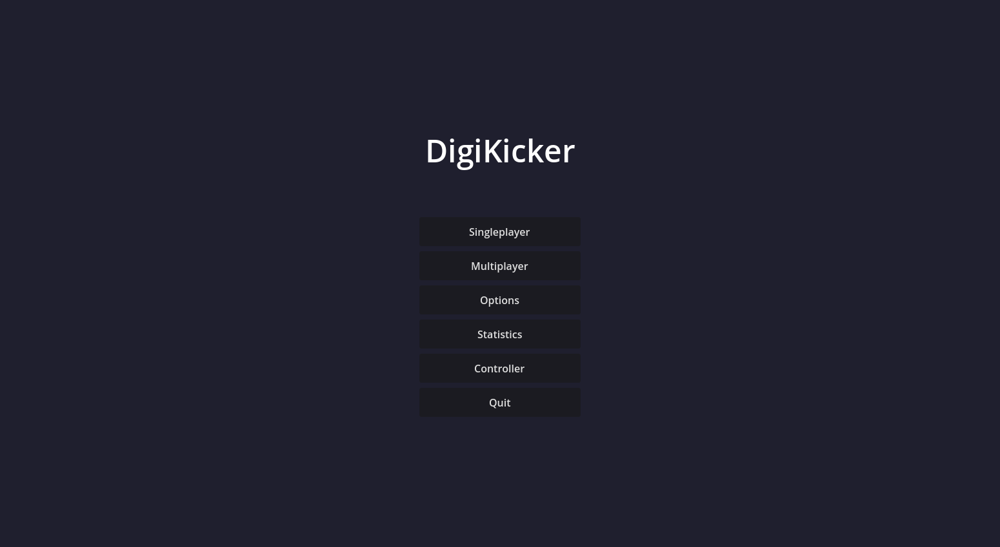
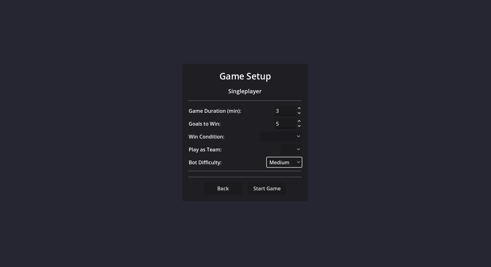
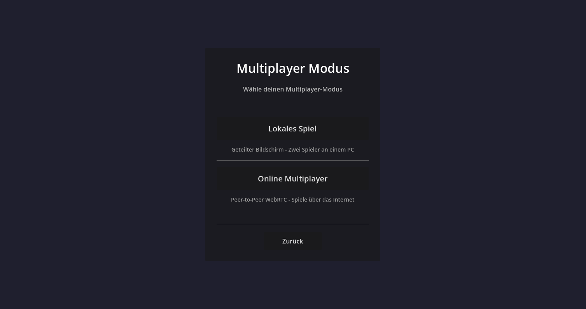
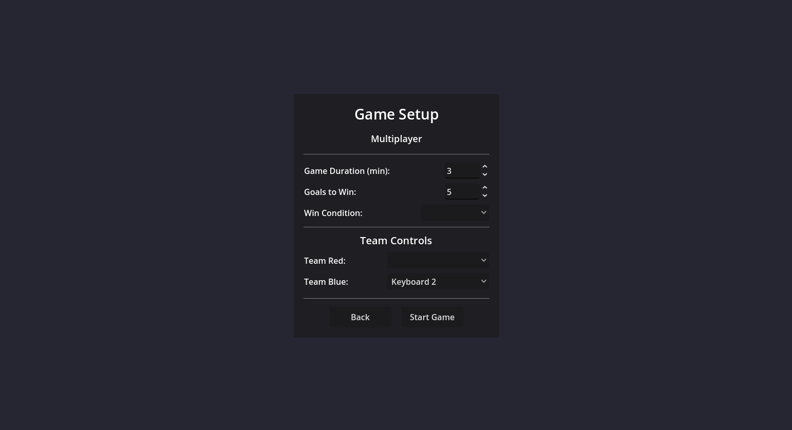
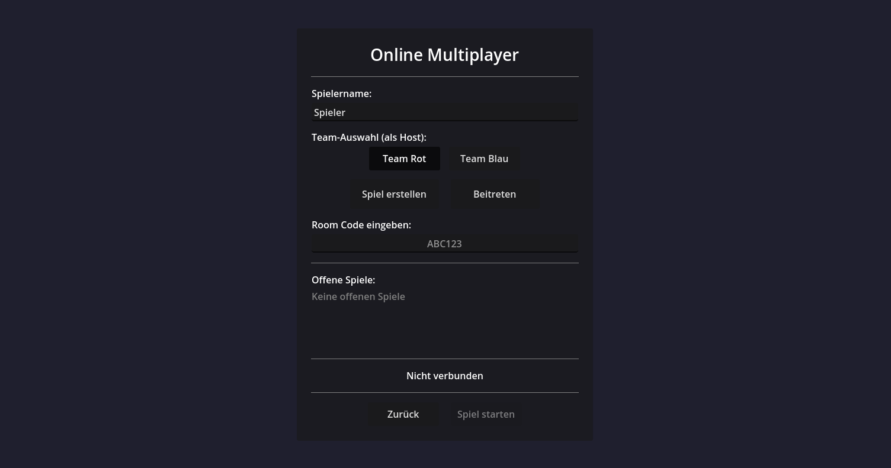
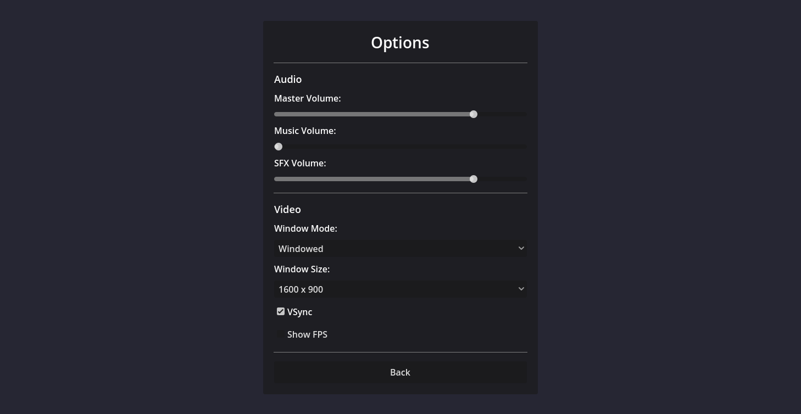
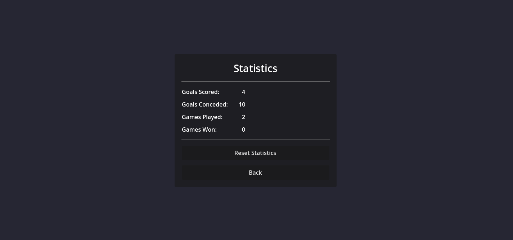
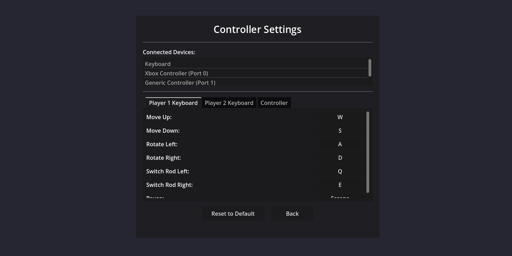
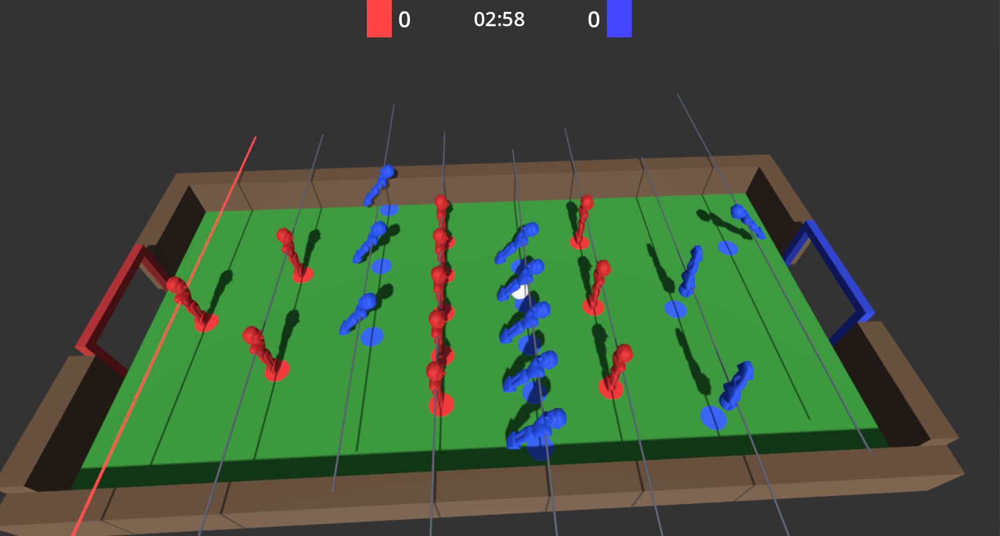

\newpage
\textauthor{Nikita Schaar}

## Dokumentation

### Use Cases

Für jeden Use Case wird zusätzlich zu der textuellen Beschreibung ein Screenshot des Anwendungsfalls angefügt, um ihn besser zu visualisieren. Alle Screenshots stammen aus der Simulation.

#### Menüpunkt wählen

**Beschreibung:** Der Benutzer wählt im Hauptmenü einen Menüpunkt aus.

**Trigger:** Benutzer startet die Anwendung

**Bedingungen:** Anwendung ist gestartet

**Ablauf:**

1. Benutzer öffnet die Anwendung und sieht das Hauptmenü
2. Benutzer wählt zwischen Singleplayer, Multiplayer, Options, Statistics, Controller oder Quit

**Alternative:** Keine Eingabe des Benutzers

**Ergebnis:** Benutzer gelangt in das gewählte Untermenü

#### Singleplayer-Spiel einstellen und starten

**Beschreibung:** Der Benutzer konfiguriert ein Singleplayer-Match im Menü und startet es.

**Trigger:** Benutzer wählt "Singleplayer" im Hauptmenü

**Bedingungen:** Anwendung ist gestartet

**Ablauf:**

1. Benutzer öffnet das Singleplayer-Menü
2. Benutzer legt die Spieldauer (in Minuten) fest
3. Benutzer legt die Toranzahl für einen Sieg fest
4. Benutzer wählt die Siegbedingung (meiste Tore bei Spielende, Spieler der zuerst x Tore hat oder eine Kombination aus beiden) sowie die gewünschte Teamfarbe (Rot/Blau)
5. Benutzer wählt den Schwierigkeitsgrad des COM-Gegners (Easy/Medium/Hard/Trainierte KI)
6. Benutzer klickt auf "Start Game"

**Alternative:** Benutzer klickt auf "Back" und kehrt zum Hauptmenü zurück

**Ergebnis:** Singleplayer-Match startet mit den gewählten Einstellungen gegen den COM-Gegner (algorithmisch oder trainierte KI)

#### Multiplayer-Modus auswählen

**Beschreibung:** Der Benutzer wählt zwischen lokalem oder Online-Multiplayer.

**Trigger:** Benutzer wählt "Multiplayer" im Hauptmenü

**Bedingungen:** Anwendung ist gestartet (bei Online-Mehrspieler zusätzlich Internetverbindung)

**Ablauf:**

1. Benutzer öffnet das Multiplayer-Menü
2. Benutzer wählt zwischen "Lokales Spiel" (ein Bildschirm, zwei Spieler an einem PC) und "Online Multiplayer" (Peer-to-Peer WebRTC über das Internet)

**Alternative:** Benutzer kehrt mit "Zurück" ins Hauptmenü zurück

**Ergebnis:** Benutzer gelangt in den gewählten Mehrspielermodus

#### Lokales Multiplayer-Spiel einstellen und starten

**Beschreibung:** Zwei Spieler konfigurieren ein lokales Multiplayer-Spiel und starten es.

**Trigger:** Benutzer wählt "Lokales Spiel" im Multiplayer-Menü

**Bedingungen:** Anwendung ist aktiv, mehr als ein Eingabegerät ist verbunden

**Ablauf:**

1. Benutzer öffnet das Menü für den lokalen Multiplayer
2. Benutzer legt die Spieldauer (in Minuten) fest
3. Benutzer legt die Toranzahl für einen Sieg fest
4. Benutzer wählt die Siegbedingung (wie bei Singleplayer)
5. Benutzer weist unter "Team Controls" jedem Team ein Eingabegerät zu
6. Benutzer klickt auf "Start Game"

**Alternative:** Benutzer klickt auf "Back" und kehrt zum Multiplayer-Menü zurück

**Ergebnis:** Lokales Multiplayer-Match startet mit den gewählten Einstellungen, beide Spieler steuern ihr Team über das jeweils zugewiesene Eingabegerät

#### Online Multiplayer-Spiel erstellen oder beitreten

**Beschreibung:** Der Benutzer erstellt ein Online-Match oder tritt einem bestehenden bei.

**Trigger:** Benutzer wählt "Online Multiplayer" im Multiplayer-Menü

**Bedingungen:** Internetverbindung ist verfügbar

**Ablauf:**

1. Benutzer gibt einen Spielernamen ein
2. Benutzer wählt eine Team-Farbe (insofern er ein spiel hostet)
3. Benutzer erstellt ein neues Spiel über "Spiel erstellen" oder tritt einem bestehenden über "Beitreten" und Eingabe eines Room Codes bzw. Auswahl eines offenen Spiels aus der Liste bei
5. Benutzer startet das Spiel mit "Spiel starten"

**Alternative:** Keine Verbindung möglich

**Ergebnis:** Beide Spieler sind verbunden und das Online-Spiel startet

#### Spieleinstellungen anpassen

**Beschreibung:** Der Benutzer passt Audio- und Videoeinstellungen der Anwendung an.

**Trigger:** Benutzer wählt "Options" im Hauptmenü

**Bedingungen:** Anwendung ist aktiv

**Ablauf:**

1. Benutzer öffnet das Options-Menü
2. Benutzer passt Master-, Music- oder SFX Volume über Schieberegler an
3. Benutzer wählt den Fenstermodus (Windowed/Fullscreen/Borderless) und die Fenstergröße (z. B. 1600x900)
4. Benutzer aktiviert oder deaktiviert VSync und die FPS-Anzeige
5. Benutzer kehrt mit "Back" ins Hauptmenü zurück

**Alternative:** Benutzer verlässt das Menü ohne Änderungen

**Ergebnis:** Einstellungen sind gespeichert und aktiv

#### Statistiken einsehen und zurücksetzen

**Beschreibung:** Der Benutzer sieht bisherige Spielstatistiken und kann diese zurücksetzen.

**Trigger:** Benutzer wählt "Statistics" im Hauptmenü

**Bedingungen:** Anwendung ist aktiv

**Ablauf:**

1. Benutzer öffnet das Statistics-Menü
2. System zeigt getroffene/kassierte Tore sowie gespielte/gewonnene Spiele an
3. Benutzer kann die Statistiken über "Reset Statistics" zurücksetzen

**Alternative:** Keine Statistiken vorhanden (alle Werte sind 0)

**Ergebnis:** Statistiken werden angezeigt oder erfolgreich zurückgesetzt

#### Eingabe-Einstellungen konfigurieren

**Beschreibung:** Der Benutzer konfiguriert die Steuerung für Tastatur oder Controller.

**Trigger:** Benutzer wählt "Controller" im Hauptmenü

**Bedingungen:** Anwendung ist aktiv, Eingabegeräte sind verbunden

**Ablauf:**

1. System zeigt verbundene Geräte an (z.B. Keyboard, Xbox Controller, Hardware-Kicker-Controller)
2. Benutzer wählt das zu konfigurierende Profil (Player 1 Keyboard, Player 2 Keyboard oder Controller)
3. Benutzer passt die Tastenbelegung an (z.B. Move Up/Down, Rotate Left/Right, Switch Rod Left/Right)
4. Benutzer kann die Einstellungen über "Reset to Default" zurücksetzen

**Alternative:** Kein Eingabegerät erkannt

**Ergebnis:** Steuerungskonfiguration ist gespeichert und aktiv

#### Single-/Multiplayer-Match spielen

**Beschreibung:** Der Benutzer spielt ein Match in der Tischfußball-Simulation.

**Trigger:** Benutzer startet ein Spiel über "Singleplayer" oder "Multiplayer"

**Bedingungen:** Spiel wurde konfiguriert und gestartet

**Ablauf:**

1. Spiel zeigt den 3D-Tisch mit roten und blauen Spielfiguren
2. Punktestand und verbleibende Spielzeit werden oben im HUD angezeigt
3. Benutzer steuert die Stäbe über Tastatur oder Controller
4. Spiel erkennt Tore und aktualisiert den Spielstand

**Alternative:** Spielabbruch durch User-Eingabe oder verlorene Verbindung

**Ergebnis:** Partie wird bis zum Erreichen der Siegbedingung gespielt und das Ergebnis wird angezeigt

### Projektfortschritt 23. Juni 2025 bis 11. November 2025

#### Gesamtstatus

* Das Projekt befindet sich derzeit im Plan.
* Erstpräsentation der Diplomarbeit ist abgeschlossen
    * Positive Reaktionen auf Idee und Projektplan
    * Kommunikations-Demo zwischen Arduino (mit MPU6050) und Godot Engine sorgt für positives Feedback
* Erster Prototyp der Hardware wurde entwickelt
    * Auf Basis von einem MPU6050 und einem HC-SR04 zur Messung von rotatorischen und translatorischen Eingaben
    * Noch eingeschränkt im Drehradius des Stabes und der Genauigkeit der Messung aufgrund von physikalischen Gegebenheiten
* Grundlegendes KI-Modell mit Python + Torch-Library und einer zweidimensionalen Tischfußballtisch-Demo trainiert
* Erste Character-Assets mit Blender gestaltet und überarbeitet, sodass sie leistungseffizienter sind

| Dimension | Status |  Maßnahmen             |
|:--------------------|:------------------|:-----------------------|
| Leistungsziele | Im Zeitplan | - |
| Terminziele | Alles erreicht | - |
| Kostenziele | Unter Budget | - |
| Teamarbeit | Optimal | - |

:Projektstatus am 2025-11-11

#### Notwendige Entscheidungen

Keine notwendigen Entscheidungen, da alles zeitnah erreicht wurde.

#### Nächste Schritte

* Prototypen weiterentwickeln.
* KI-Modelle verbessern und Simulation entwickeln
* Gestaltung von mehr Assets und HUD-Elementen
* Beginnen die schriftliche Arbeit zu verfassen

### Projektfortschritt 11. November 2025 bis 09. Jänner 2026

#### Gesamtstatus

* Das Projekt kommt der Endphase näher.
* Es wurde sich auf die Abgabe einer Korrekturversion vorbereitet.
* Die Entwicklung des Controller-Prototypen ist fortgeschritten, jedoch nicht zu 100% auf dem gewünschten Stand
    * Eine Halterung für eine Computer-Maus wurde entwickelt, um sie über dem Drehstab zur Messung seiner Bewegungen zu platzieren.
* Eine funktionierende Simulation wurde programmiert
    * Beinhaltet funktionierendes Gegner-KI-Modell
    * Single- und lokaler bzw. Online-Multiplayer funktionieren
    * Mit einigen 3D-Modellen (noch nicht alle, da hier nicht alles fertig ist)
* Weitere 3D-Modelle wurden entwickelt, jedoch nicht zum vollen gewünschten Ausmaß 
* Theoretische Ausarbeitung der Diplomarbeit bei allen fortgeschritten
* Theoretische + praktische Ausarbeitung von Hr. Rath nahezu fertig

| Dimension           | Status            |  Maßnahmen             |
|:--------------------|:------------------|:-----------------------|
| Leistungsziele | Leicht in Verzug | Mehr Arbeitsstunden in nächster Zeit |
| Terminziele | Erreicht | - |
| Kostenziele | Unter Budget | - |
| Teamarbeit | Leichte Schwierigkeiten | bessere Absprache bzw. Zusammenarbeit |

:Projektstatus am 2026-01-09

#### Notwendige Entscheidungen

* Die generelle Arbeitsmoral muss gesteigert werden, sodass sich zukünftige Ziele noch erreichen lassen.

#### Nächste Schritte

* Vollständige Verschriftlichung der Diplomarbeit.
* Fertigstellung Hard- und Software
    * Fertiger Controller
    * Alle Funktionen in der Simulation
    * Asset-Design so weit fertig wie geplant

### Projektfortschritt 09. Jänner 2026 bis 20. Februar 2026

#### Gesamtstatus

* Das Projekt neigt sich dem Ende zu => Abgabe der Finalversion am 06.03.2026
* Es wurde eine Korrekturversionen der Diplomarbeit abgeben.
* Die Entwicklung des Controllers neigt sich dem Ende zu
    * Eingaben werden korrekt an den Computer gesandt
* Simulation ist funktionell finalisiert
    * Spielen gegen KI oder echte Spieler on-/offline möglich
* Ein Großteil der Assets muss noch in die Simulation eingebaut werden
* Theorieteil bei nahezu allen fertig
* Praxisteil zu großen Teilen finalisiert

| Dimension           | Status            |  Maßnahmen             |
|:--------------------|:------------------|:-----------------------|
| Leistungsziele | Leicht in Verzug | Schnelle Finalisierung des Projektes |
| Terminziele | Erreicht | - |
| Kostenziele | Unter Budget | - |
| Teamarbeit | Leichte Schwierigkeiten | Termineinhaltung + Zusammenarbeit im Team |

:Projektstatus am 2026-02-20

#### Notwendige Entscheidungen

Keine notwendigen Entscheidungen; Ziel ist klar.

#### Nächste Schritte

* Vollständige Verschriftlichung der Diplomarbeit.
    * Korrektur der Grammatik, Rechtschreibung und Formulierung fertig
* Design und Bau des finalen Controller-Modells
* Einarbeitung der restlichen Assets in die Simulation zur vollständigen Fertigstellung dieser

