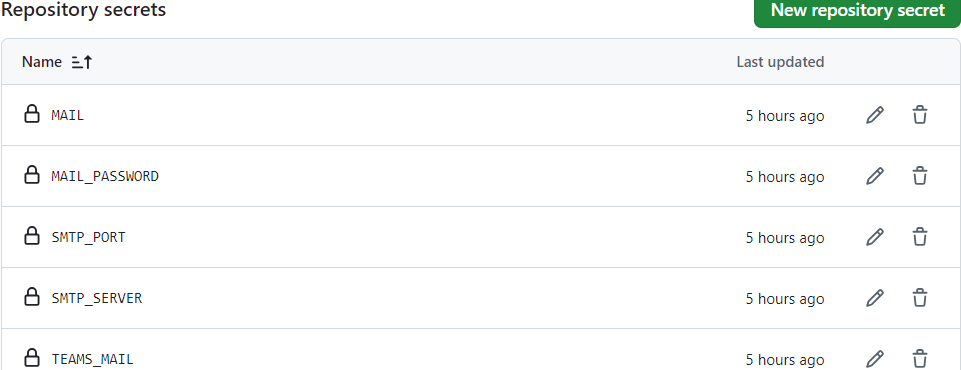

# Build and send diploma thesis

The workflow `Build and send diploma thesis` allows the user to build the diploma thesis via a GitHub workflow and send it to a Microsoft Teams channel. The built diploma thesis can also be downloaded as a [GitHub Action workflow artifact](https://docs.github.com/en/actions/managing-workflow-runs-and-deployments/managing-workflow-runs/downloading-workflow-artifacts).

## Microsoft Teams

1. [Create your own team](https://support.microsoft.com/en-us/office/create-and-organize-teams-ea9aa9c2-ae29-44ca-b838-4424b4daa44d) for the diploma thesis.
2. [Create a new channel](https://support.microsoft.com/en-us/office/create-a-standard-private-or-shared-channel-in-microsoft-teams-fda0b75e-5b90-4fb8-8857-7e102b014525) in your team preferably named `build`.
3. Get the channels [email address](https://support.microsoft.com/en-us/office/tip-send-email-to-a-channel-2c17dbae-acdf-4209-a761-b463bdaaa4ca).

## GitHub

### Repository

Create a folder `.github/workflows` in the root of your repository. You can now choose between `diploma-thesis-docker.yml`, `diploma-thesis-manual.yml` and `diploma-thesis-action.yml` to paste into the newly created folder. It is recommended to rename the chosen GitHub Action variant to `thesis.yml`.

- **-manual**
  - installs all the dependencies in the Action itself
  - runtime: ~10 minutes
- **-docker**
  - uses the Docker image
  - runtime: ~3 minutes
- **-action**
  - uses the published GitHub Action provided by the [`HTLLE-DA-Vorlage`](https://github.com/bitsneak/HTLLE-DA-Vorlage) repository
  - runtime: ~3 minutes

### Inputs

This section is only relevant if the file `diploma-thesis-action.yml` is used.

| Name | Required | Description | Default |
| - | - | - | - |
| mail-address | `true` | Your email address from which the diploma thesis should be sent from. See [notes](#notes). | - |
| mail-address-password | `true` | The password for your  email address. See [notes](#notes). | - |
| smtp-server | `true` | The SMTP server URL corresponding to your email address. | - |
| smtp-port | `true` | The SMTP port corresponding to your SMTP server. | - |
| teams-mail | `true` | The teams channel email address from the channel the diploma thesis should be sent to.  | - |
| thesis-path | `false` | Change the folder name where the template is located. | Diplomarbeit |
| mail-body | `false` | Change the email body and therefore the message in teams. | [`git log -1 --pretty=%B`](https://git-scm.com/docs/git-log) |
| dockerhub-username | `false` | Change the Docker Hub username from which the Docker image gets provided. | bytebang |
| dockerhub-repository | `false` | Change the Docker Hub repository name from which the Docker image gets provided. | htlle-da-env |
| manual-mode | `false` | If the repository should not be checked out automatically, specify the complete workspace path to `thesis-path`. | [actions/checkout](https://github.com/actions/checkout) |

### Usage

This section is only relevant if the file `diploma-thesis-action.yml` is used.

Minimal:

```yml
- name: Build And Send Diploma Thesis
  uses: bitsneak/HTLLE-DA-Vorlage@main
  with:
    mail-address: ${{ secrets.MAIL }}
    mail-address-password: ${{ secrets.MAIL_PASSWORD }}
    smtp-server: ${{ secrets.SMTP_SERVER }}
    smtp-port: ${{ secrets.SMTP_PORT }}
    teams-mail: ${{ secrets.TEAMS_MAIL }}
```

Override everything:

```yml
- name: Build And Send Diploma Thesis
  uses: bitsneak/HTLLE-DA-Vorlage@main
  with:
    mail-address: ${{ secrets.MAIL }}
    mail-address-password: ${{ secrets.MAIL_PASSWORD }}
    smtp-server: ${{ secrets.SMTP_SERVER }}
    smtp-port: ${{ secrets.SMTP_PORT }}
    teams-mail: ${{ secrets.TEAMS_MAIL }}
    thesis-path: Diplomarbeit
    mail-body: git log -1 --pretty=%B
    dockerhub-username: bytebang
    dockerhub-repository: htlle-da-env
    manual-mode: ${{ github.workspace }}
```

### Secrets

In your GitHub repository you need to [create the secrets](https://docs.github.com/en/actions/security-for-github-actions/security-guides/using-secrets-in-github-actions#creating-secrets-for-a-repository) the Action needs with the information from your corresponding accounts.

| Name | Usage |
| - | - |
| MAIL | Your email address from which the diploma thesis should be sent from.  |
| MAIL_PASSWORD | The password for MAIL. |
| SMTP_SERVER | The SMTP Server for your email address defined in MAIL. |
| SMTP_PORT | The SMTP port corresponding to SMTP_SERVER. |
| TEAMS_MAIL | The teams channel email from the channel the diploma thesis should be sent to. |

After creating the secrets it should look like this:



## Notes

- Sending the diploma thesis and thus automated emails using a school email address (Microsoft 365) is not supported. Therefore, use an email address, that does not correspond to your school email address.
- If you use Gmail as a sending email address, you have to generate an [app password](https://support.google.com/accounts/answer/185833) and use this instead of your normal password.
- You can only then see the teams channel email, if the creater of the team already viewed it once before.

**Author:** Marko Schrempf
